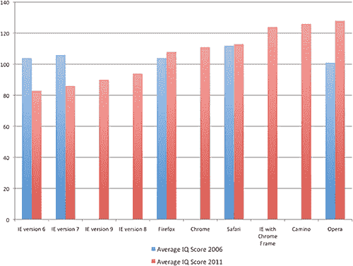

# 简直是骗局:IE 用户智商更低！

> 原文：<https://www.sitepoint.com/ie-users-low-iq/>

这篇文章发表四天后，AptiQuant 调查被报道为一场精心策划的骗局。该公司和网站在过去几周内出现在网络上，似乎从一家合法的研究公司[拍摄了](http://www.centraltest.co.uk/ct_gb/team-central-test.php)[员工的照片](http://www.aptiquant.com/about-us/our-team/)。

在调查数据和声明发布后，另一个帖子称 [AptiQuant 受到了 IE 忠实用户的诉讼威胁](http://www.aptiquant.com/news/aptiquant-threatened-with-a-lawsuit-by-loyal-internet-explorer-users/)。他们愚弄了我。羞耻——这是一个伟大的想法和一个似是而非的故事。也许现在有人会进行一次真正的调查？…

* * *

这将会取悦许多网络开发者。加拿大心理测量咨询公司 AptiQuant 最近的一项调查得出结论，Internet Explorer 用户的智商低于其他浏览器用户。那些 IE6 的分数略高于 80。火狐浏览器、Chrome 浏览器和 Safari 浏览器的用户得分较高，为 110 分。最聪明的人——平均智商为 125——使用 Opera *(这会取悦他们的营销部门！)*

2011 年的评估对来自美国、加拿大、英国、澳大利亚和新西兰的 101326 名 16 岁以上的人进行了抽样调查。该公司提供了一个免费的智商测试，大多数参与者通过有机搜索结果或 PPC 广告活动找到这个测试。受试者并不知道他们的浏览器偏好被监控。

研究人员观察到:

*   IE 用户的智商明显较低。
*   火狐、Chrome 和 Safari 用户的智商几乎没有差别。
*   使用 Opera、Camino 和带有 Chrome 框架的 IE 的个人平均智商最高。

将结果与 2006 年的一项调查进行比较，该报告表明，在过去五年中，智商较高的人已经远离了 Internet Explorer。那些智商水平较低的人倾向于抵制变化和浏览器升级(也可能抵制任何软件升级)。

结果并不令人惊讶。那些 IT 知识水平较低的人不知道什么是浏览器，只会使用他们电脑上安装的任何应用程序。在大多数情况下，这将是互联网浏览器。

类似地，高级用户和开发人员将研究不同的选项，并积极地使他们的软件保持最新。Opera——一个不太知名、学习曲线更陡的浏览器——吸引了智商更高的用户，这是合乎逻辑的。

看看这个简单的调查是否比所有的*【废除 IE6】*营销活动有更大的效果，这将是很有趣的。但愿如此。

有关更多信息:

*   [阅读 AptiQuant 新闻稿](http://www.aptiquant.com/news/is-internet-explorer-for-the-dumb-a-new-study-suggests-exactly-that/)
*   [下载 AptiQuant IQ-Browser 2011 年调查报告(PDF)](http://www.aptiquant.com/IQ-Browser-AptiQuant-2011.pdf)

显然，您会希望在 Opera 中查看这些链接！

## 分享这篇文章