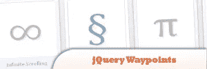
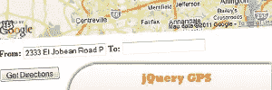

# 2011 年 6 月最热门的 10 个 jQuery 插件

> 原文：<https://www.sitepoint.com/10-hottest-jquery-plugins-june-2011/>

2011 年年中到了，在过去的 6 个月里，jQuery 的受欢迎程度有了巨大的提升！似乎没有人会厌倦创建新的、令人敬畏的 jQuery 插件来让你的网站看起来很酷。在这里，我们收集了另外 10 个最热门的 jQuery 插件，你可能想把它们放到你的站点上。尽情享受吧！

## 1.roundy jQuery Gallery–jQuery Roundrr

了解如何使用 jQuery 创建圆形图库。

[来源](http://addyosmani.com/blog/jquery-roundrr/)

## 2.拉皮条的标志

用几种配色方案为一个特殊的公司活动设计一个标志。在网站上，当有人访问网站时，徽标需要微妙地改变颜色。

[来源](http://blogs.perficient.com/spark/2011/06/25/pimp-your-logo-with-jquery/)

## 3.传播

需要 jQuery 库和 Easing 插件。

[来源](http://css-tricks.com/examples/Circulate/)

**更新:** [3。jQuery EasIng v1.1.2](http://plugins.jquery.com/files/jquery.easing.1.2.js.txt) 已移除。

## 5.CC 图像库

功能无限的类别支持在画廊，单个图像类别可以使用，如果需要的话，幻灯片播放延迟和自动播放选项，拇指翻转比例选项，自动鼠标平移，图像缩放大图像，缩略图大小可定制的每类，自动缩略图水平滚动。

来源

## 6.盖流 II

它是高度可扩展的，支持点击、键盘和鼠标滚轮交互，并与最新版本的 jQuery 和 jQuery UI 一起工作。

[来源](http://addyosmani.com/blog/jqueryuicoverflow/)

## 7.智能推车

一个灵活且功能丰富的购物车 jQuery 插件。它使得在线购物的添加到购物车部分变得更加容易和用户友好。它设计紧凑，非常容易实现，只需要最少的 HTML。

来源

## 8.jQuery 航点

一个小的 jQuery 插件，当你滚动到一个元素时，可以很容易地执行一个函数。

## 9.-plax

一个 jQuery 插件，使得基于鼠标位置在你的站点中视差元素变得非常容易。

[来源](http://blogfreakz.com/jquery/plax-parallax-effect-plugin-for-jquery/)

## 10.jQuery GPS

一个 jQuery 插件，面向那些想在自己的网站上添加谷歌地图，但又不希望自己的网站因为不需要的功能而停滞不前的人。

[来源](http://www.birdwingfx.com/jQuery_gps/index.html)

## 分享这篇文章