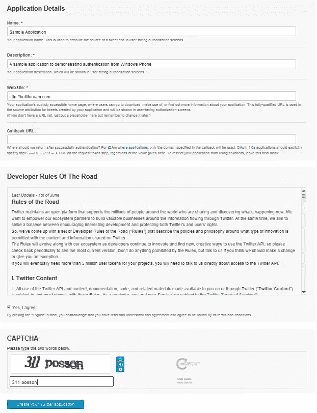
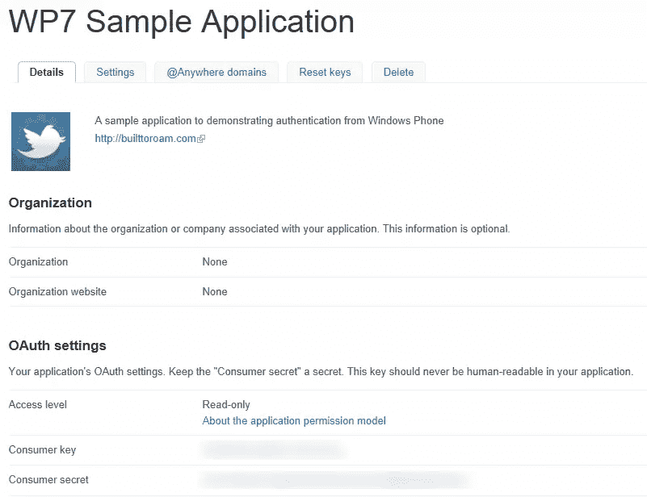
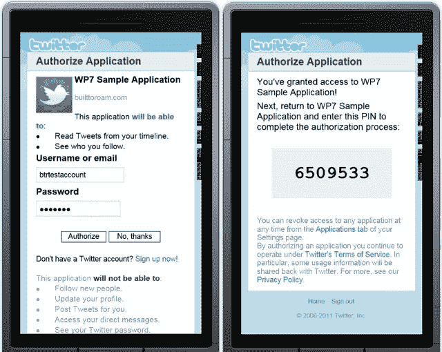

# Windows Phone 7 应用程序中的 Twitter

> 原文：<https://www.sitepoint.com/twitter-in-a-windows-phone-7-app/>

在本系列的前两篇文章[中，脸书在 Windows Phone 7 应用程序中](https://www.facebook.com/sitepoint/)和[在 Windows Phone 应用程序中使用 Windows Live ID](https://www.sitepoint.com/using-windows-live-id-in-a-windows-phone-7-app/)中，您看到了如何使用“OAuth 2”通过脸书和 Windows Live ID 进行身份验证。其他社交网络平台使用“OAuth 1 ”,正如你将在这篇文章中看到的，我们使用 Twitter 进行认证。一旦用户通过身份验证，您的应用程序将拥有一个访问令牌，用于访问任何 Twitter APIs。

在我们开始编写应用程序之前，我认为有必要了解一下“OAuth 1”的基础知识。在之前的文章中，我们没有用“OAuth 2”来做这件事，因为这个过程相对简单:创建登录 URL，让用户进行身份验证并检索访问令牌。对于“OAuth 1 ”,这个过程要复杂得多，除非你知道我们要做什么，否则很难理解大量的代码片段。

用“OAuth 1”认证的过程是这样的(全部细节通过 [Twitter OAuth](https://dev.twitter.com/docs/auth/oauth) 文档):

*   获取请求令牌(以及相关联的请求令牌秘密)
*   使用请求令牌创建登录 URL
*   显示 web 浏览器控件并导航到用户的登录 URL 以输入他们的凭据
*   一旦用户验证了一个 Pin(称为验证者 Pin)将会显示，用户应该剪切并粘贴到应用程序中。
*   解析 HTML 并提取验证者 Pin
*   使用请求令牌、请求令牌秘密和验证者 Pin 获取访问令牌
*   在调用 Twitter API 时使用访问令牌

### 步骤 1:创建 Twitter 应用程序

打开网络浏览器，进入 [Twitter 开发者页面](https://dev.twitter.com/)。为了创建一个应用程序，你需要用一组 Twitter 凭证登录。同样，我们建议创建一个专门的 Twitter 帐户来管理您的应用程序。

单击“我的应用程序”链接(将鼠标悬停在您的个人资料上即可看到此链接)，然后单击“创建新应用程序”按钮。系统会提示您输入关于您正在创建的应用程序的信息(图 1)。请记住，当用户授权您的应用程序访问他们的 Twitter 帐户时，他们会看到这些信息中的大部分。



[](https://www.sitepoint.com/wp-content/uploads/2011/07/sp0010_01.png)

图 1

一旦您点击“创建您的 Twitter 应用程序”按钮，您将被分配一个消费密钥和消费密码(图 2)。


[](https://www.sitepoint.com/wp-content/uploads/2011/07/sp0010_02.png)

图 2

### 步骤 2:创建外壳 Windows Phone 应用程序

为了说明针对 Twitter 的认证过程，我们将使用一个类似于我们在上一篇文章中使用的应用程序。同样，我们有一个`WebBrowser`控件、一个用于触发认证过程的`Button`控件和两个用于显示用户信息的`TextBlock`控件。

```
<phone:PhoneApplicationPage x:Class="TwitterSampleApp.MainPage"

    xmlns:x="http://schemas.microsoft.com/winfx/2006/xaml"
    xmlns:phone="clr-namespace:Microsoft.Phone.Controls;assembly=Microsoft.Phone">
    <Grid>
        <StackPanel x:Name="LayoutRoot" Background="Transparent">
            <Button Content="Authenticate" Click="AuthenticateClick" />
            <TextBlock x:Name="UserNameText" />
            <TextBlock x:Name="UserIdText" />
        </StackPanel>
        <phone:WebBrowser x:Name="AuthenticationBrowser" Visibility="Collapsed"  
                                                Navigated="BrowserNavigated" IsScriptEnabled="True" />
    </Grid>
</phone:PhoneApplicationPage>
```

### 步骤 3:获取请求令牌

为了获得用于 Twitter APIs 的访问令牌，您首先需要获得一个请求令牌。这将用于准备登录 URL，您将用户发送到该 URL，以便 Twitter 对用户进行身份验证，并授权您的应用程序访问用户的 Twitter 帐户。获取一个请求令牌只是一个制作适当格式的`HttpWebRequest`的问题。我提前道歉，因为有相当多的代码来做这样一个简单的任务！

我们将从用户单击 Authenticate 按钮时调用的`AuthenticateClick`方法开始。我把这个方法写得很短，以便您可以看到主要步骤:创建`HttpWebRequest`(为了获取请求令牌)，解析请求令牌和请求令牌秘密的响应，使用令牌创建登录 URL，最后将`WebBrowser`控件导航到登录 URL。

```
private const string OAuthConsumerKeyKey = "oauth_consumer_key";
private const string OAuthVersionKey = "oauth_version";
private const string OAuthSignatureMethodKey = "oauth_signature_method";
private const string OAuthSignatureKey = "oauth_signature";
private const string OAuthTimestampKey = "oauth_timestamp";
private const string OAuthNonceKey = "oauth_nonce";
private const string OAuthTokenKey = "oauth_token";
private const string OAuthTokenSecretKey = "oauth_token_secret";
private const string OAuthVerifierKey = "oauth_verifier";
private const string OAuthPostBodyKey = "post_body";

private const string RequestUrl = "http://api.twitter.com/oauth/request_token";
private const string AuthorizeUrl = "http://api.twitter.com/oauth/authorize";
private const string AccessUrl = "http://api.twitter.com/oauth/access_token";

private string token;
private string tokenSecret;
private string pin;

private void AuthenticateClick(object sender, RoutedEventArgs e) {
    // Create the Request
    var request = CreateRequest("POST", RequestUrl);
    request.BeginGetResponse(result => {
        try {
            var req = result.AsyncState as HttpWebRequest;
            if (req == null) throw new ArgumentNullException("result", "Request parameter is null");
            using (var resp = req.EndGetResponse(result))
            using (var strm = resp.GetResponseStream())
            using (var reader = new StreamReader(strm)) {
                var responseText = reader.ReadToEnd();

                // Parse out the request token
                ExtractTokenInfo(responseText);

                // Navigate to the authorization Url
                var loginUrl = new Uri(AuthorizeUrl + "?" + OAuthTokenKey + "=" + token);
                Dispatcher.BeginInvoke(() => AuthenticationBrowser.Navigate(loginUrl));
            }
        }
        catch {
            Dispatcher.BeginInvoke(() => MessageBox.Show("Unable to retrieve request token"));
        }
    }, request);
}
```

让我们进一步分解这些步骤，从`CreateRequest`方法开始。这些参数是 web 请求的方法，在本例中是“POST”和请求的 URL。不幸的是，这不像简单地创建一个`HttpWebRequest`并设置“方法”那么简单。在此之前，我们需要生成一个签名(本质上是被发送参数的散列)，用于设置“授权”头。

```
private WebRequest CreateRequest(string httpMethod, string requestUrl) {
    var requestParameters = new Dictionary<string, string>();
    var secret = "";
    if (!string.IsNullOrEmpty(token)) {
        requestParameters[OAuthTokenKey] = token;
        secret = tokenSecret;
    }

    if (!string.IsNullOrEmpty(pin)) {
        requestParameters[OAuthVerifierKey] = pin;
    }

    var url = new Uri(requestUrl);
    var normalizedUrl = requestUrl;
    if (!string.IsNullOrEmpty(url.Query)) {
        normalizedUrl = requestUrl.Replace(url.Query, "");
    }

    var signature = GenerateSignature(httpMethod, normalizedUrl, url.Query, requestParameters, secret);
    requestParameters[OAuthSignatureKey] = UrlEncode(signature);

    var request = WebRequest.CreateHttp(normalizedUrl);
    request.Method = httpMethod;
    request.Headers[HttpRequestHeader.Authorization] = GenerateAuthorizationHeader(requestParameters);
    return request;
}
```

深入研究`GenerateSignature`方法，你会注意到它同时使用了`ConsumerKey`和`ConsumerSecret`常量。确保你用 Twitter 发布的“消费者密钥”和“消费者秘密”替换了`和`(包括尖括号)。在这一点上，我要重申，你不应该硬编码这些或者在生产应用程序中暴露它们；相反，将它们放在安全的 web 服务后面，并在需要时检索它们。``

 ```GenerateSignature`方法包括创建签名库(实际上是请求参数的串联),然后使用“HMACSHA1”算法计算签名。

```
private const string OAuthVersion = "1.0";
private const string Hmacsha1SignatureType = "HMAC-SHA1";
private const string ConsumerKey = "<consumer_key>";
private const string ConsumerSecret = "<consumer_secret>";

public string GenerateSignature(string httpMethod, string normalizedUrl, string queryString, 
                                                           IDictionary<string, string> requestParameters, string secret = null) {
    requestParameters[OAuthConsumerKeyKey] = ConsumerKey;
    requestParameters[OAuthVersionKey] = OAuthVersion;
    requestParameters[OAuthNonceKey] = GenerateNonce();
    requestParameters[OAuthTimestampKey] = GenerateTimeStamp();
    requestParameters[OAuthSignatureMethodKey] = Hmacsha1SignatureType;

    string signatureBase = GenerateSignatureBase(httpMethod, normalizedUrl, 
                                                                                         queryString, requestParameters);

    var hmacsha1 = new HMACSHA1();
    var key = string.Format("{0}&amp;{1}", UrlEncode(ConsumerSecret),
                            string.IsNullOrEmpty(secret) ? "" : UrlEncode(secret));
    hmacsha1.Key = Encoding.UTF8.GetBytes(key);

    var signature = ComputeHash(signatureBase, hmacsha1);
    return signature;
}

private static readonly Random Random = new Random();
public static string GenerateNonce()  {
    // Random number between 123456 and 9999999
    return Random.Next(123456, 9999999).ToString();
}

public static string GenerateTimeStamp() {
    var now = DateTime.UtcNow;
    TimeSpan ts = now - new DateTime(1970, 1, 1, 0, 0, 0, 0);
    return Convert.ToInt64(ts.TotalSeconds).ToString();
}

public static string GenerateSignatureBase(string httpMethod, string normalizedUrl, 
                                                                              string queryString, 
                                                                              IDictionary<string, string> requestParameters) {
    var parameters = new List<KeyValuePair<string, string>>(GetQueryParameters(queryString)) {
        new KeyValuePair<string, string>(OAuthVersionKey, requestParameters[OAuthVersionKey]),
        new KeyValuePair<string, string>(OAuthNonceKey, requestParameters[OAuthNonceKey]),
        new KeyValuePair<string, string>(OAuthTimestampKey,                                                                      
                                                                     requestParameters[OAuthTimestampKey]),
        new KeyValuePair<string, string>(OAuthSignatureMethodKey,
                                                                     requestParameters[OAuthSignatureMethodKey]),
        new KeyValuePair<string, string>(OAuthConsumerKeyKey,
                                                                     requestParameters[OAuthConsumerKeyKey]) };
    if (requestParameters.ContainsKey(OAuthVerifierKey)) {
        parameters.Add(new KeyValuePair<string, string>(OAuthVerifierKey, 
                                       requestParameters[OAuthVerifierKey]));
    }

    if (requestParameters.ContainsKey(OAuthTokenKey)) {
        parameters.Add(new KeyValuePair<string, string>(OAuthTokenKey, 
                                       requestParameters[OAuthTokenKey]));
    }

    parameters.Sort((kvp1, kvp2) => {
                            if (kvp1.Key == kvp2.Key) {
                                return string.Compare(kvp1.Value, kvp2.Value);
                            }
                            return string.Compare(kvp1.Key, kvp2.Key);
                        });

    var parameterString = BuildParameterString(parameters);

    if (requestParameters.ContainsKey(OAuthPostBodyKey)) {
        parameterString += "&amp;" + requestParameters[OAuthPostBodyKey];
    }

    var signatureBase = new StringBuilder();
    signatureBase.AppendFormat("{0}&amp;", httpMethod);
    signatureBase.AppendFormat("{0}&amp;", UrlEncode(normalizedUrl));
    signatureBase.AppendFormat("{0}", UrlEncode(parameterString));

    return signatureBase.ToString();
}

private static IEnumerable<KeyValuePair<string, string>> GetQueryParameters(string queryString) {
    var parameters = new List<KeyValuePair<string, string>>();
    if (string.IsNullOrEmpty(queryString)) return parameters;

    queryString = queryString.Trim('?');

    return (from pair in queryString.Split('&amp;')
            let bits = pair.Split('=')
            where bits.Length == 2
            select new KeyValuePair<string, string>(bits[0], bits[1])).ToArray();
}

private static string BuildParameterString(IEnumerable<KeyValuePair<string, string>> parameters) {
    var sb = new StringBuilder();
    foreach (var parameter in parameters) {
        if (sb.Length > 0) sb.Append('&amp;');
        sb.AppendFormat("{0}={1}", parameter.Key, parameter.Value);
    }
    return sb.ToString();
}

/// <summary>
/// The set of characters that are unreserved in RFC 2396 but are NOT unreserved in RFC 3986.
/// </summary>
private static readonly string[] UriRfc3986CharsToEscape = new[] { "!", "*", "'", "(", ")" };
private static readonly char[] HexUpperChars = 
                         new[] { '0', '1', '2', '3', '4', '5', '6', '7', '8', '9', 'A', 'B', 'C', 'D', 'E', 'F' };

public static string UrlEncode(string value) {
    // Start with RFC 2396 escaping by calling the .NET method to do the work.
    // This MAY sometimes exhibit RFC 3986 behavior (according to the documentation).
    // If it does, the escaping we do that follows it will be a no-op since the
    // characters we search for to replace can't possibly exist in the string.
    var escaped = new StringBuilder(Uri.EscapeDataString(value));

    foreach (string t in UriRfc3986CharsToEscape) {
        escaped.Replace(t, HexEscape(t[0]));
    }
    return escaped.ToString();
}

public static string HexEscape(char character) {
    var to = new char[3];
    int pos = 0;
    EscapeAsciiChar(character, to, ref pos);
    return new string(to);
}

private static void EscapeAsciiChar(char ch, char[] to, ref int pos) {
    to[pos++] = '%';
    to[pos++] = HexUpperChars[(ch &amp; 240) >> 4];
    to[pos++] = HexUpperChars[ch &amp; 'x000f'];
}

private static string ComputeHash(string data, HashAlgorithm hashAlgorithm) {
    byte[] dataBuffer = Encoding.UTF8.GetBytes(data);
    byte[] hashBytes = hashAlgorithm.ComputeHash(dataBuffer);

    return Convert.ToBase64String(hashBytes);
}
```

回到`CreateRequest`方法，剩下的步骤是生成“授权”头。`GenerateAuthorizationHeader`方法将请求参数(包括我们刚刚创建的签名)与 OAuth 前缀连接起来。回到`CreateRequest`方法，这被分配给‘授权’头。

```
public static string GenerateAuthorizationHeader(IDictionary<string, string> requestParameters) {
    var paras = new StringBuilder();
    foreach (var param in requestParameters) {
        if (paras.Length > 0) paras.Append(",");
        paras.Append(param.Key + "="" + param.Value + """);
    }
    return "OAuth " + paras;
}
```

返回到`AuthorizeClick`方法，一旦 web 请求返回，就可以通过`ExtractTokenInfo`方法从返回的字符串中提取请求令牌和请求令牌秘密。响应字符串是由“&”分隔的一系列“键=值”对，这使得提取对相对简单。

```
private IEnumerable<KeyValuePair<string, string>> ExtractTokenInfo(string responseText) {
    if (string.IsNullOrEmpty(responseText)) return null;

    var responsePairs = (from pair in responseText.Split('&amp;')
                            let bits = pair.Split('=')
                            where bits.Length == 2
                            select new KeyValuePair<string, string>(bits[0], bits[1])).ToArray();

    token = responsePairs
                  .Where(kvp => kvp.Key == OAuthTokenKey)
                  .Select(kvp => kvp.Value).FirstOrDefault();
    tokenSecret = responsePairs
                              .Where(kvp => kvp.Key == OAuthTokenSecretKey)
                              .Select(kvp => kvp.Value).FirstOrDefault();

    return responsePairs;
}
```

这包括获取请求令牌的代码。在`AuthorizeClick`方法中，这个令牌被用来创建`loginUrl`。为了让用户登录，您所要做的就是将`WebBrowser`控件导航到`loginUrl`，这也是在`AuthorizeClick`方法中完成的。

### 步骤 4:用户登录并批准应用程序

用户将被提示输入他们的凭证，然后出现一个包含 Pin(验证者 PIN)的屏幕，他们必须剪切并粘贴到应用程序中(图 3)。


[](https://www.sitepoint.com/wp-content/uploads/2011/07/sp0010_031.png)

图 3

### 步骤 5:提取验证者 Pin

一旦用户输入了他们的凭证，`WebBrowser`就被导航回`AuthorizeUrl`。请注意，当你用 Twitter 注册一个应用程序时，你**并没有**指定一个回调 URL 在这种情况下，Twitter 假设您希望将用户重定向回`AuthorizeUrl`(参见前面代码中定义的常量)，并向用户显示验证者 Pin。

您的应用程序可以简单地解析 HTML 并提取验证者 Pin，而不是让用户将 Pin 复制到应用程序中。请注意，在下面的代码中，我们使用正则表达式来定位 Pin。如果 Twitter 改变了这个页面的结构，你可能需要改变这个正则表达式。因此，您可能希望将正则表达式放在某个服务器上，并让应用程序定期检索它。如果需要更改正则表达式，可以在服务器上进行，而不必修改和重新发布应用程序。

```
private void BrowserNavigated(object sender, NavigationEventArgs e){
    if (AuthenticationBrowser.Visibility == Visibility.Collapsed) {
        AuthenticationBrowser.Visibility = Visibility.Visible;
    }

    if (e.Uri.AbsoluteUri.ToLower().Replace("https://", "http://") == AuthorizeUrl) {
        var htmlString = AuthenticationBrowser.SaveToString();

        var pinFinder = new Regex(@"<DIV id=oauth_pin>(?<pin>[A-Za-z0-9_]+)</DIV>", RegexOptions.IgnoreCase);
        var match = pinFinder.Match(htmlString);
        if (match.Length > 0) {
            var group = match.Groups["pin"];
            if (group.Length > 0) {
                pin = group.Captures[0].Value;
                if (!string.IsNullOrEmpty(pin)) {
                    RetrieveAccessToken();
                }
            }
        }
        if (string.IsNullOrEmpty(pin)){
            Dispatcher.BeginInvoke(() => MessageBox.Show("Authorization denied by user"));
        }
        // Make sure pin is reset to null
        pin = null;

        AuthenticationBrowser.Visibility = Visibility.Collapsed;
    }
}
```

### 步骤 6:提取访问令牌

在前面的代码中，一旦提取了 Pin，就会调用`RetrieveAccessToken`方法。这对 Twitter 执行另一个`HttpWebRequest`操作，将请求令牌交换为访问令牌。这遵循了以前使用的相同模式，尽管如果您浏览创建“授权”头的代码，您会看到它现在包括了验证者 Pin。解析响应，以便检索访问令牌和相应的访问令牌秘密，以及被认证的用户的 Id 和名称。

```
public void RetrieveAccessToken() {
    var request = CreateRequest("POST", AccessUrl);
    request.BeginGetResponse( result => {
        try {
            var req = result.AsyncState as HttpWebRequest;
            if (req == null) throw new ArgumentNullException("result", "Request is null");
            using (var resp = req.EndGetResponse(result))
            using (var strm = resp.GetResponseStream())
            using (var reader = new StreamReader(strm)) {
                var responseText = reader.ReadToEnd();

                var userInfo = ExtractTokenInfo(responseText);
                Dispatcher.BeginInvoke(() => {
                                                    MessageBox.Show("Access granted");
                                                    UserIdText.Text =
                                                        userInfo.Where(kvp => kvp.Key == "user_id")
                                                                       .Select(kvp => kvp.Value).FirstOrDefault();
                                                    UserNameText.Text =
                                                        userInfo.Where(kvp => kvp.Key == "screen_name")
                                                                       .Select(kvp => kvp.Value).FirstOrDefault();
                                                });
            }
        }
        catch {
            Dispatcher.BeginInvoke(() => MessageBox.Show("Unable to retrieve Access Token"));
        }
    }, request);
}
```

在这篇文章中，你已经看到了如何通过 Twitter 认证。您可以使用在这个过程中检索到的访问令牌向 Twitter 发出请求或发布更新。更多信息可通过 [Twitter 开发者门户](http://dev.twitter.com/)获得。`` 

## ``分享这篇文章``