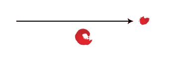
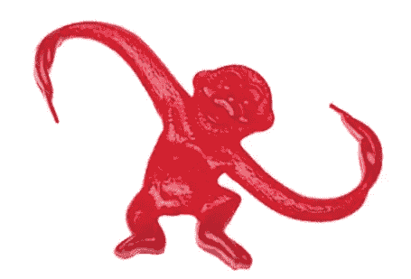
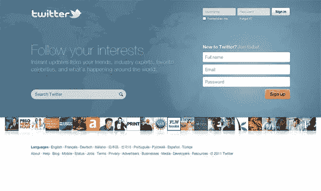
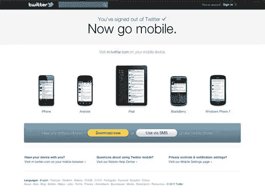
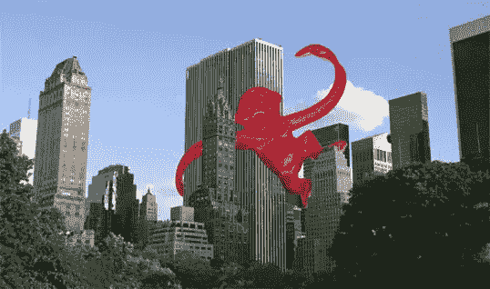
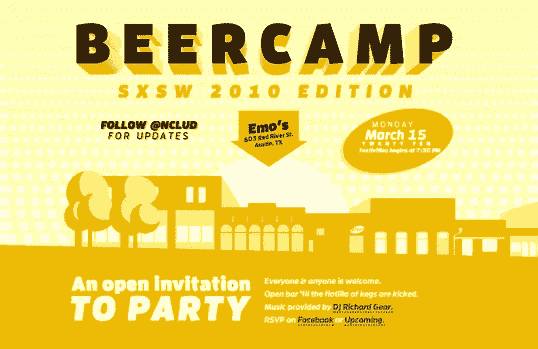

# 设计重点

> 原文：<https://www.sitepoint.com/emphasis-in-design/>

与统一的概念密切相关的是强调或支配的概念。重点不在于将设计的各种元素组合在一起，而是让一个特定的特征吸引观众的注意力。当你设计一个网页布局时，通常你会在内容中确定一个项目，或者布局本身，你想突出。也许这是一个供用户按下的按钮，或者是一个供他们阅读的错误信息。实现这种强调的一种方法是将该元素变成一个*焦点*。焦点是页面上吸引浏览者眼球的任何元素，而不仅仅是整个页面的一部分或者与周围环境融为一体。和 unity 一样，有一些可靠的方法可以达到一个焦点。

## 安置

尽管实际网页设计的限制通常不允许这样做，但作品的直接中心是用户首先看到的地方，通常也是产生强调的最强位置。离中心越远的元素，越不可能首先被注意到。在网络上，页面的左上角也往往需要我们这些从左到右阅读(记住，许多语言，如希伯来语和阿拉伯语，是从右到左阅读)并从上到下浏览页面的人的大量注意力。

## 继续

持续或 T2 流背后的想法是，当我们的眼睛开始向一个方向移动时，它们往往会继续沿着这条路径移动，直到一个更重要的特征出现。下图展示了这种效果。尽管底部的污点更大，所以更容易首先吸引你的眼球，但你的大脑还是会情不自禁地发出“嘿，看那儿，一个箭头！”很快，你会发现自己盯着更小的物体。

延续是网页设计者统一布局最常用的方法之一。默认情况下，在应用任何样式之前，放置在网页上的标题、文本和图像的左边缘在页面左侧形成一条垂直线。利用这一概念的一个简单方法是将元素与网格线对齐。这就为你的访问者的视线创造了多条延续线。

## 隔离

就像接近有助于我们在设计中创造统一性一样，隔离有助于强调重点。从周围环境中脱颖而出的物品往往会引起注意。尽管与伙伴们分开让它很难过，但下图中这只孤立的猴子却是页面上的一个焦点。

## 对比

对比被定义为不同图形元素的并置，是在布局中用来强调的最常用的方法。这个概念很简单:图形元素与其周围环境的差异越大，该元素就越突出。可以利用颜色、大小和形状的不同来形成对比。看看 Twitter 主页:

…以及使用桌面浏览器浏览时的注销页面:

如果你希望你的访问者在页面上点击一个单独的链接或按钮，这就是所谓的*行动号召*。当你看前面的布局时，首先吸引你注意的是什么？对我来说，这是“注册”和“立即下载”按钮。这是页面上唯一使用亮橙色和黄色的地方，文本比其他元素大得多，比如搜索栏或“登录”按钮。在这两种情况下，行动号召元素都有足够的*延续*、*隔离*和*对比*。Twitter 真的希望你点击这些按钮，所以它尽可能地强调，以确保其行动呼吁是有效的。

## 比例

另一种在作品中强调重点的有趣方法是使用比例。比例是设计的一个原则，与物体比例的不同有关。如果我们把一个物体放在一个比它本身小的环境中，这个物体看起来会比它在现实生活中要大，反之亦然。这种比例上的差异将观众的注意力吸引到这个物体上，因为它在那个背景下似乎不合适。

在下面的图片中，我把我们悲伤、孤独的猴子放在曼哈顿的天际线上来证明我的观点。在颜色的强烈对比和比例的差异之间，你的大脑会立即说，“嘿，这不太对，”然后你会一直盯着猴子，直到你强迫自己看向别处。

这个原理也适用于小型化。看看 BeerCamp 活动网站(如下图)，由 David DeSandro 设计。你可能注意到的第一个元素是巨大的啤酒营标题。不过，从这里开始，我的视线直接跳到箭头处，进入那排建筑。这是由于连续性和引人注目的使用比例。对于那些对 <acronym title="Cascading Style Sheets 3">CSS3</acronym> 的可能性感兴趣的人，我应该指出，没有图像被用来创建你在这里看到的东西。

在你的设计中强调重点不仅仅是让你的行动号召脱颖而出的关键。这也是我们如何在页面上移动观众的眼睛。通过给元素一个递减的强调级别，你可以建议访问者遵循的顺序。如果你在创建网站时牢记这一点，你就可以用语义 <acronym title="HyperText Markup Language">HTML</acronym> 标记和 <acronym title="Cascading Style Sheets">CSS</acronym> 来呼应你创建的重点。例如，通过将`h1`和`h6`标题标签与各自的视觉强调级别相匹配，你可以向搜索引擎和视力受损的访问者提供页面中视觉重要内容的相似视图。

在下一篇文章中，我们将看看一些经过充分测试的设计示例，您可以从中进行工作。

## 美丽网页设计的原则

这篇文章来自杰森·比厄德的 [*美丽网页设计的原则*一书](https://www.sitepoint.com/books/design2/ "SitePoint.com: The Principles of Beautiful Web Design, 2nd Edition")(第二版现已出版)。这是第一章的第七部分。

整个色彩章节已经被数字化了，所以如果你更喜欢色彩，请在设计节上点击[查看色彩章节。](https://www.sitepoint.com/design-ux/color/ "DesignFestival.com: Everything on Color")

## 分享这篇文章