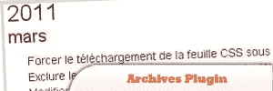

# 10 个基于 jQuery 的 WordPress 插件

> 原文：<https://www.sitepoint.com/10-jquery-based-wordpress-plugins/>

Remember the first days of WordPress and how simple the system was? especially there were not many jQuery based WordPess plugins around. But, **WordPress developers bring us heaps of jQuery plugins these days** improving this wonderful CMS! So we bring you 10 jQuery-based WordPress Plugins! Enjoy!

相关帖子:

*   [**如何在你的 WordPress 博客中显示 jQuery 代码**](http://www.jquery4u.com/plugins/show-jquery-source-code-wordpress-blog/)
*   
***   [**10 插件替换教程**](http://www.jquery4u.com/plugins/10-plugin-replacing-tutorials-wordpress/)**

 **## 1.WP 选定的文本共享者

这个插件允许分享/搜索站点的选定文本。用户可以发推特、发电子邮件、挖掘(+96 个网站)选定的文本。增加网站使用率和共享。当用户选择你网站的“报价”时，会显示一个弹出窗口。当引用被发布时，选中的引用和博客文章的链接也会在 Twitter 上发布。

[来源](http://www.aakashweb.com/wordpress-plugins/wp-selected-text-sharer/)

## 2.促销滑块

一个 jQuery 滑块，使得在网页上插入一个简单的幻灯片或实现多个旋转广告区变得容易。因为它是高度可定制的，你可以完全控制滑块上显示什么，你的推广页面上显示什么，以及它是如何工作的。

[来源](http://wordpress.org/extend/plugins/promotion-slider/)

## 3.弹出你的笔记

这个插件使用 jQuery 简单模态插件显示模态窗口。当它被激活时，一个必要的 JS 和样式表已经被插入 WordPress 的部分。

[来源](http://wordpress.org/extend/plugins/pop-your-notes/)

## 4.折叠档案

提供一个侧边栏小部件，在一个小而简单的 jQuery 下拉菜单中显示文档。这个小部件允许您选择显示多远以前的档案(以天为单位)，一个自定义标题和一个包含 jQuery 的选项。

[来源](http://wordpress.org/extend/plugins/folding-archives/)

## 5.Kau-Boy 自动完成器

将类似谷歌建议的搜索整合到您的博客中。Kau-Boy 的自动完成器使用 Ajax。script.aculo.us 或 jQuery Au 的自动完成功能。

[来源](http://wordpress.org/extend/plugins/kau-boys-autocompleter/installation/)

## 6.Scrollarama

这个插件创建了一个小部件，它可以循环十篇最近的文章，并使用你选择的 jQuery 循环效果来循环。

[来源](http://wordpress.org/extend/plugins/scrollarama/)

## 7.“Easy Speak”Widget 联系人表单

这个插件利用一个 WordPress 小部件和 jQuery 创建一个 widget 化的联系表单，访问者可以用它向网站所有者或你决定的任何人发送电子邮件，而不需要刷新或导航页面。该插件已被更新，以检查电子邮件地址的格式是否正确，以尝试拒绝垃圾邮件！

[来源](http://wordpress.org/extend/plugins/easy-speak-widget-contact-form/)

## 8.jQuery 档案插件

允许你按时间顺序(从最新到最老)显示你的文章，以一种很酷的类似手风琴的方式，按月或按年显示。

[来源](http://itx-technologies.com/blog/jquery-archives-plugin)

## 9.jQuery 发布预览

使用 jQuery 在 WordPress 管理区的“写/编辑文章”页面上进行实时文章预览。如果你不喜欢 WordPress 内置的可视化编辑器(因为它放了很多不必要的标签或任何其他原因)，但你想拥有像在可视化编辑器中一样的 live post 预览。

[来源](http://wordpress.org/extend/plugins/jquery-post-preview/)

## 10.jQuery 注释预览

无需重启页面的实时评论预览。使用 jQuery。

[来源](http://wordpress.org/extend/plugins/jquery-comment-preview/)

**参见:** [10 个基于滑块的 WordPress 插件](http://www.jquery4u.com/plugins/10-slider-based-wordpress-plugins/)

## 分享这篇文章**