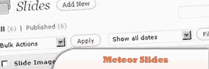

# 10 个基于滑块的 WordPress 插件

> 原文：<https://www.sitepoint.com/10-slider-based-wordpress-plugins/>

10 slider based WordPress Plugins that use jQuery for image slider animations. Every day new plugins are developed for WordPress, it’s growing out of control. Using content sliders or integrating dynamic navigation menus or even using sliding social bookmark icons make our blogs stand out from the crowd. Today’s post is the collection of slider-based WordPress plugins which will make your blog more dynamic. jQuery developers also [show jQuery code in WordPress](http://www.jquery4u.com/plugins/show-jquery-source-code-wordpress-blog/) (like this one!).

## 1.动态内容库

该插件使用 mootools 的 JonDesign SmoothGallery 脚本或自定义 jQuery 脚本为最新和/或特色内容创建动态图库。

[来源](http://www.studiograsshopper.ch/dynamic-content-gallery/)

## 2.Lazyest 堆栈

该插件将相册显示为滑块，当选择一个相册时，它将该相册的图像显示为照片堆栈。在照片堆栈视图中，您可以浏览图像，方法是将最上面的图像放在整个堆栈的后面，并带有流畅的动画。

[来源](http://wordpress.org/extend/plugins/lazyest-stack/)

## 3.立方体 3D，图像库，菜单，滑块

一个有着令人期待的圆形设计的 flash 真实 3D。Cube3d Gallery 非常适合创建:3d 照片库、3D 作品集、3D 菜单、3D 幻灯片和 3D 目录。

[来源](http://www.pluginswp.com/cube3d-gallery/)

## 4.iSlidex

这不是一个图库插件。它确实是一个幻灯片插件，一旦你设置了你想要展示的幻灯片的数量，大小和 iSlidex 将从中提取图像的类别，它就完全自动化了。你也可以决定是否为每张幻灯片添加漂亮的半透明标题。

[来源](http://www.shambix.com/en/news/wordpress-plugin-islidex/)

## 5.WordPress 文章/页面的标签/滑块

标签和幻灯片(在文章/页面中)插件使您能够轻松地添加内容标签和/或内容幻灯片。

## 6.jQuery 可访问滑块

滑块控制你的博客最近文章的数量，并使用 jQuery WAI-ARIA 支持的手风琴和滑块。

[来源](http://wordpress.org/extend/plugins/jquery-accessible-slider/)

## 7.Rekt 幻灯片

一个 wordpress 插件，它将使在 WordPress 站点的任何地方插入基于 jQuery 的图片幻灯片变得简单。该插件提供了一个选项页面，用户可以选择幻灯片大小、图片数量和幻灯片过渡持续时间，也可以使用 WordPress 内置的媒体上传对话框选择图片。

[来源](http://www.rektproductions.com/rektslideshow/)

## 8.特色文章精简版

将特色帖子或页面放入一个别致的 JavaScript 滑块中，该滑块可以设置为显示在任何类别页面、页面或主页上。

## 9.流星滑道

使用简短代码或小工具轻松创建幻灯片并发布它们。这些幻灯片由 jQuery Cycle 提供支持，有二十多种过渡风格可供选择。

[来源](http://www.jleuze.com/plugins/meteor-slides/)

## 10.取消零点滑块

是一个为你的新闻或页面显示幻灯片的插件！它完全可以用 CSS 定制，并自动缩放图像到合适的大小。

[来源](http://wordpress.org/extend/plugins/unpointzero-slider/)

**参见:** [10 个基于 jQuery 的 WordPress 插件](http://www.jquery4u.com/plugins/10-jquery-based-wordpress-plugins/)

## 分享这篇文章