# 使用 CoreData 管理信息

> 原文：<https://www.sitepoint.com/managing-information-with-coredata/>

在这个系列中，我们已经创建了一个名为[或 ny](https://www.sitepoint.com/mobile/ios/) 的应用程序。该应用程序(假设)将被鸟类学家用来记录鸟类的目击事件，这些目击事件发生的地点，甚至可能存储用户拍摄的照片。

目前，我们在一个数组中列出了一些鸟类物种。在不久的将来，我们将希望存储数据，因此我们将让我们的应用程序使用 CoreData。在本教程中，我们将介绍 CoreData 的基础知识，如何创建默认数据库，以及如何从中检索信息。在下一篇文章中，我们将讨论如何在数据库中存储观测数据——这将使我们接近拥有一个有用的应用程序。

## 创建模式

我们要做的第一件事是为我们的应用程序创建一个模式。如果您以前使用过数据库，这应该相当熟悉。

模式是“实体”的集合(在 web 开发领域中通常称为“表”)。每个实体都有描述它的属性，并且可以与其他实体有关系。例如，“椅子”实体可能有四个称为“腿”的相关实体。您可以使用一个*访问器*方法来访问椅子实体的特定腿，比如:`chair.legs`(可能会返回一个数组)。

我们现在将避免进入实体关系的本质，但是它们并不太复杂。

当我们第一次创建我们的项目时，我们告诉 Xcode 我们想要使用托管的 CoreData 实体，所以我们已经有了一个数据模型。

[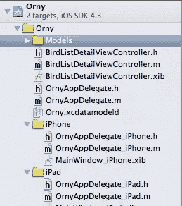](https://www.sitepoint.com/wp-content/uploads/2011/07/Figure-1.png)

图 1

点击`Orny.xcdatamodeld`(这是数据模型定义文件)。

您应该会看到以下两个屏幕之一:

[](https://www.sitepoint.com/wp-content/uploads/2011/07/Figure-2.png)

图 1

[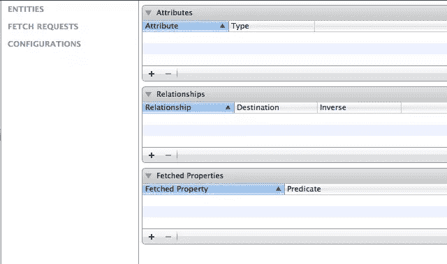](https://www.sitepoint.com/wp-content/uploads/2011/07/Figure-3.png)

图 3

你可以使用右下角的“编辑器风格”在它们之间切换。

要添加实体，请单击“添加实体”按钮。

[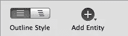](https://www.sitepoint.com/wp-content/uploads/2011/07/Figure-4.png)

图 4

根据您之前添加的内容，该按钮有时会被标记为“添加获取请求”或“添加配置”,在这种情况下，长按该按钮，您会看到“添加实体”选项

创建一个名为物种的实体。

[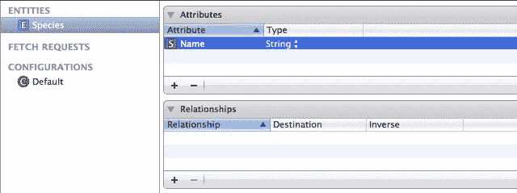](https://www.sitepoint.com/wp-content/uploads/2011/07/Figure-5.png)

图 5

单击“属性”下的“+”按钮添加一些属性-名称、文件名和文本描述。

[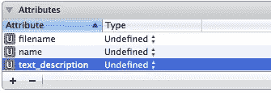](https://www.sitepoint.com/wp-content/uploads/2011/07/Figure-6.png)

图 6

我们需要指定这些属性的类型——它们都应该是字符串。在每个属性旁边，选择“类型”下拉列表，并相应地更改它们。

[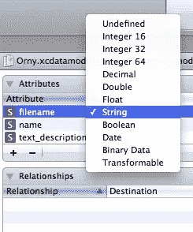](https://www.sitepoint.com/wp-content/uploads/2011/07/Figure-7.png)

图 7

## 添加托管模型类

我们现在已经创建了我们的模式，但是我们需要创建我们所管理的实体的代码表示。iOS 将这些称为“模型”(如“模型、视图、控制器”)。我们使用 fetch 请求来请求数据库中的数据子集，这将返回模型数组。模型类的每个实例代表数据库中的一行(或者至少，在我们将它保存到数据库中后，它就代表了数据库中的一行)。)

CoreData 提供给我们的模型通常是“托管的”,如果我们对它们进行更改，然后告诉相关的持久存储控制器进行“保存”,它将保存我们对任何模型实例所做的任何更改。(它本质上是[活动记录模式](http://en.wikipedia.org/wiki/Active_record_pattern)，有它的优点和缺点，但还是很好理解的。)

如果你还没有的话，在你的项目中创建一个“模型”文件夹(在文件浏览器中右键点击“Orny ”,点击“新建组”。)

右键单击您的新模型组，然后单击“新建文件”。

选择“核心数据”和“NSManagedObject 子类”。

[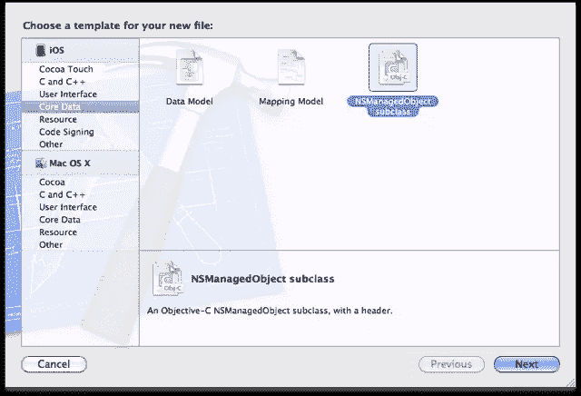](https://www.sitepoint.com/wp-content/uploads/2011/07/Figure-8.png)

图 8

点击“下一步”，并选择“或任何”数据模型。

[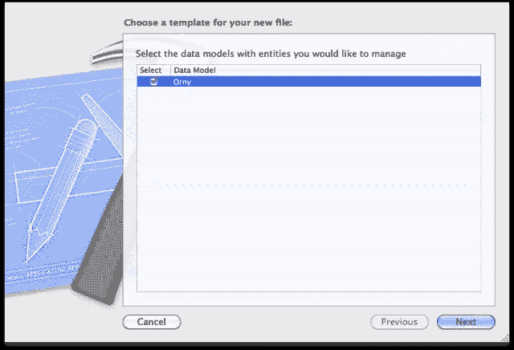](https://www.sitepoint.com/wp-content/uploads/2011/07/Figure-9.png)

图 9

点击“下一步”，选择“物种”

[](https://www.sitepoint.com/wp-content/uploads/2011/07/Figure-10.png)

图 10

命名文件种类，就大功告成了。这创建了一个模型类–`Species.m`,其标题如下所示:

```
@interface Species : NSManagedObject {
    @private
}

@property (nonatomic, retain) NSString * name;
@property (nonatomic, retain) NSString * text_description;
@property (nonatomic, retain) NSString * filename;

@end
```

如果愿意，您可以提供自己的 getters 和 setters，以在您的模型上实施业务逻辑。通常最好将大量逻辑放入模型中，并让控制器尽可能“瘦”——但这是一个非常简单的类，我们还不打算修改它。

## 查询和获取结果

我们的 appDelegate 已经有了我们访问数据库所需的大多数方法。看看`OrnyAppDelegate.m`，具体方法`managedObjectContext`、`managedObjectModel`、`persistentStoreCoordinator`、`saveContext`。

`persistentStoreCoordinator`从一个. sqlite 文件实例化我们的数据库，并通过`managedObjectModel`将该文件的内容与我们的托管对象模型相关联。如果在发布时不存在，我们将在以后修改它以复制到我们的数据库中(见下文)。

`managedObjectContext`获取被管理对象的上下文(嗯惊喜惊喜！)，它是数据库文件、托管对象模型和用于获取结果和保存数据的控制器之间的关联。`NSManagedObjectContext`是我们接触最多的班级。

我们的目的是在数据库中存储关于鸟类的数据，并向用户显示这些数据。显示数据发生在我们的`BirdListViewController`中，所以让我们将这里的`loadData`方法修改如下:

```
-(void)loadBirdData {

    // The context is, roughly, the "database schema"
    NSManagedObjectContext *context = [(OrnyAppDelegate*)[[UIApplication sharedApplication] delegate] managedObjectContext];

    // A request is like an SQL select statement; we're retrieving some set of objects
    NSFetchRequest *request = [[NSFetchRequest alloc] init];

    // An entity description is used to specify which entit(y|ies) we want to pull from the context
    NSEntityDescription *description = [NSEntityDescription entityForName:@"Species" inManagedObjectContext:context];
    [request setEntity:description];

    // A sort descriptor lets us order the results
    NSSortDescriptor *sortDescriptor = [[NSSortDescriptor alloc] initWithKey:@"name" ascending:NO];
    [request setSortDescriptors:[NSArray arrayWithObject:sortDescriptor]];

    // A fetchedResultsController handles the fetching of our data
    NSFetchedResultsController *fetchController = [[NSFetchedResultsController alloc] initWithFetchRequest:request managedObjectContext:context sectionNameKeyPath:nil cacheName:nil];

    fetchController.delegate = self;

    NSError *error = nil;
    if(![fetchController performFetch:&amp;error]) {
        // TODO: Handle error
        abort();
    }

    birds = fetchController.fetchedObjects;
}
```

这里发生了一些事情，但是评论应该解释一下。本质上，我们是在从数据库中请求一堆对象，之前我们在数据库中创建了一个“NSMutableArray”来存储这些信息。

哦。我们已经改变了数据结构的格式。以前我们会调用`[birds objectAtIndex:someIndex]`来获取数据集中的特定“行”。然后我们调用`[species objectForKey:@"name"]`或类似的方法来获取该物种的属性。

我们需要重写我们的`BirdListViewController`，特别是`tableView:tableView cellForRowAtIndexPath:indexPath`:

```
- (UITableViewCell *)tableView:(UITableView *)tableView cellForRowAtIndexPath:(NSIndexPath *)indexPath {

    UITableViewCell *newCell;

    if((newCell = [tableView dequeueReusableCellWithIdentifier:@"birdList"]) == nil) {
        newCell = [[[UITableViewCell alloc] initWithStyle:UITableViewCellStyleDefault reuseIdentifier:@"birdList"] autorelease];
    }

    //NSDictionary *thisBird = [birds objectAtIndex:[indexPath row]];
    Species *thisBird = [birds objectAtIndex:[indexPath row]];

    UILabel *newCellLabel = [newCell textLabel];
    //[newCellLabel setText:[thisBird objectForKey:@"name"]];
    [newCellLabel setText:thisBird.name];

    return newCell;
}
```

我们还需要重写`tableView:tableView didSelectRowAtIndexPath:indexPath`:

```
- (void)tableView:(UITableView *)tableView didSelectRowAtIndexPath:(NSIndexPath *)indexPath {

    [tableView deselectRowAtIndexPath:indexPath animated:NO];

    //NSDictionary *thisBird = [birds objectAtIndex:[indexPath row]];
    Species *bird = [birds objectAtIndex:[indexPath row]];

    BirdListDetailViewController *detail = [[BirdListDetailViewController alloc] initWithNibName:@"BirdListDetailViewController" bundle:[NSBundle mainBundle]];

    //detail.filename = [thisBird objectForKey:@"image"];
    detail.filename = bird.filename;

    [[self navigationController] pushViewController:detail animated:YES];

    [detail release];

}
```

我将我们之前的代码大部分保留在原位，但是注释掉了，所以你可以看到不同之处(但是如果你浏览一下 [BuildMobile 的 GitHub repository for Orny](https://github.com/buildmobile/orny) ，你可以看到更多)。阅读源代码和提交是一个很好的学习方法！)

如果你现在运行这个应用程序，它应该可以工作——但是你不会看到任何列出的物种。这是因为我们的数据库开始时是空的，我们需要预先填充它…

## 预填充数据

CoreData 和 Xcode 通常不太出色的地方之一是创建初始数据库的过程。当您已经创建了模式和模型时，您可以选择实际创建数据库文件:

1.  手动创建。sqlite 文件
2.  让您的应用程序保存空数据库的副本，然后将其修改为您的默认数据库
3.  首次启动时填充应用程序的数据库(这对于可能没有连接到互联网的用户来说可能会有问题)

令人沮丧的事态，但有一个解决办法。我们将让我们的应用程序保存一份空数据库的副本，修改它以包含一些数据，并将我们的默认数据库保存到我们的“支持文件”组。然后，当我们的应用程序运行时，我们将让它检查数据库是否存在，如果不存在，我们将复制我们的默认数据库。

这种方法适用于简单的应用程序，但是请注意，如果您随后想要在发布新版本的应用程序时向数据库添加数据，您必须做一些特殊的事情来将新数据与用户现有的数据库合并。一种解决方案是使用两个数据库，一个存储你的应用程序的数据，另一个存储你的用户的数据。然而，进一步的讨论超出了本教程的范围——回到正题！

让我们强制应用程序为我们保存一个空数据库。为此，我们将修改`BirdListViewController`的`loadBirdData`方法——将以下内容添加到该函数的末尾:

```
// Adding a saveContext call, to generate an empty sqlite db
[(OrnyAppDelegate*)[[UIApplication sharedApplication] delegate] saveContext];
```

我们告诉 AppDelegate 保存我们的 managedObjectContext。太棒了。运行应用程序——您不会看到太多的变化，但是我们现在应该能够找到。sqlite 数据库在…

/User/_ username*/Library/Application Support/iPhone Simulator/_ SDK 版本*/Applications/_ some magic string _/Documents/orny . SQLite

这个*神奇的字符串*是由模拟器自动生成的，所以您可能需要查看文件夹的最后修改时间戳来确定哪个是您的应用程序。太痛苦了。

一旦你拥有了它。sqlite 文件，将其拖放到应用程序的支持文件组中，并将其重命名为`Orny_default.sqlite`。

[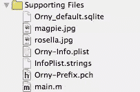](https://www.sitepoint.com/wp-content/uploads/2011/07/Figure-11.png)

图 11

现在我们要修改数据库文件。我目前使用的是 [SQLite 数据库浏览器](http://sqlitebrowser.sourceforge.net/)，但是任何可以读取和修改的工具。sqlite 数据库文件应该没问题。

一旦你安装了应用程序，你应该能够通过右键单击并选择“用外部编辑器打开”来修改文件。

[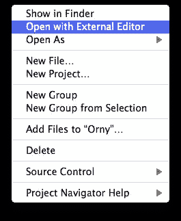](https://www.sitepoint.com/wp-content/uploads/2011/07/Figure-12.png)

图 12

在 SQLite 浏览器中，点击“浏览数据”选项卡，并从表格下拉列表中选择“ZSPECIES”。

[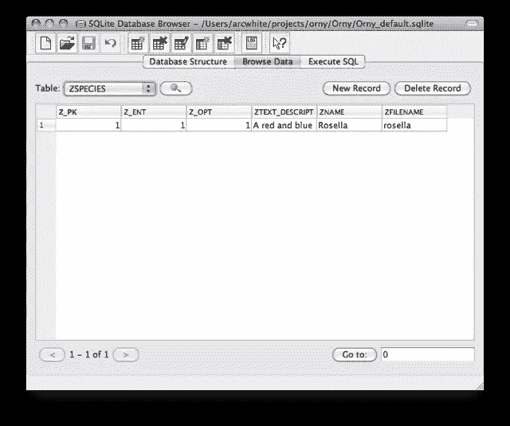](https://www.sitepoint.com/wp-content/uploads/2011/07/Figure-13.png)

图 13

插入一行，如图 13 所示。

完成后，我们还需要修改 PRIMARYKEY 表。CoreData 在这里保存它为这个数据库管理的实体的记录、实体的名称以及数据库中条目的数量。根据图 14 修改 Z_MAX 列。

[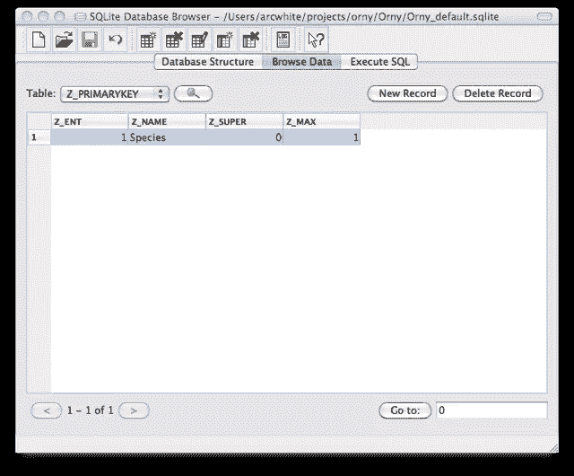](https://www.sitepoint.com/wp-content/uploads/2011/07/Figure-14.png)

图 14

点击保存图标，我们就完成了对数据库的修改。

你也可以使用一个脚本来创建你的默认数据库——参见 [Ray Wenderlich 关于如何用 Python 做这件事的文章](http://www.raywenderlich.com/980/core-data-tutorial-how-to-preloadimport-existing-data)

## 在我们的默认数据库中复制

我们还没完成。我们需要修改 AppDelegate 上的`persistentStoreController`方法，以便在默认数据库中复制(如果还不存在的话)。

```
- (NSPersistentStoreCoordinator *)persistentStoreCoordinator
{
    if (__persistentStoreCoordinator != nil)
    {
        return __persistentStoreCoordinator;
    }
    //[[self applicationDocumentsDirectory] stringByAppendingPathComponent:];

    NSURL *storeURL = [[self applicationDocumentsDirectory] URLByAppendingPathComponent:@"Orny.sqlite"];

    NSFileManager *fileManager = [NSFileManager defaultManager];
    if(![fileManager fileExistsAtPath:[storeURL path]]) {

        NSString *defaultStorePath = [[NSBundle mainBundle] pathForResource:@"Orny_default" ofType:@"sqlite"];
        if (defaultStorePath) {
            NSLog(@"COPYING");
            NSLog(@"%@", [storeURL relativeString]);
            NSLog(@"%@", defaultStorePath);
            NSError *error;
            if(![fileManager copyItemAtPath:defaultStorePath toPath:[storeURL path] error:&amp;error]) {
                NSLog(@"FILE COPY ERROR: %@", [error localizedDescription]);
            }
        }
    }

    NSError *error = nil;
    __persistentStoreCoordinator = [[NSPersistentStoreCoordinator alloc] initWithManagedObjectModel:[self managedObjectModel]];
    ...
```

为了简洁起见，我截断了上面的清单，但是您可以看到我们正在复制的行。

我还保留了一些调试方法调用。我在复制文件时遇到了问题，需要查看正在使用的相关文件路径。这是获取一些调试信息的一种快速而肮脏的方法，但是设置断点并使用调试器来探索这类问题要有效得多(我们将在另一个教程中讨论)。

好，运行应用程序，你应该大致回到我们开始时的功能——但现在我们从数据库中读取。加油团队！

## 错误处理

我们的`OrnyAppDelegate`上的默认 CoreData 方法被苹果大量评论，为我们实现了一些非常有限的错误处理。如果你想发布一个应用到应用商店，你必须阅读这些评论，并优雅地处理错误。如何处理错误取决于你自己——你可能会从头开始重新创建数据库，或者只是向用户显示一条消息，要求他们重新启动应用程序，但你肯定应该做些什么。

我会把那次冒险留给你！

## 结论

我们现在已经学会了如何使用 CoreData 从数据库中检索信息。我们还没有看到如何修改数据——我们将在后面的教程中讨论——但我们已经迈出了一大步，使我们的应用程序在未来更具交互性。

## “欧尼”系列

[安迪·怀特](http://twitter.com/arcwhite)在 BuildMobile 上提供了一个在 iOS 平台上开发应用的深度冥想。在手边有一杯可口的提神饮料的前提下，使用标签到所有[或任何](https://www.sitepoint.com/mobile/ios/)文章，或者直接从这个索引跳到一篇文章。

*   [使用 Xcode 4 的 iOS 开发基础知识](https://www.sitepoint.com/mobile/ios/)
*   [带有美味用户界面的 iOS 应用](https://www.sitepoint.com/mobile/ios/)
*   [一个互动的 Orny](https://www.sitepoint.com/mobile/ios/)
*   使用 CoreData 管理信息
*   …

## 分享这篇文章