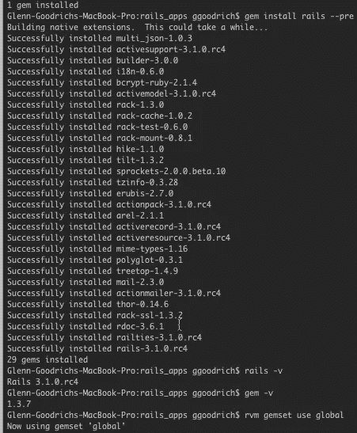
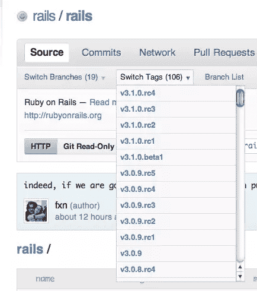
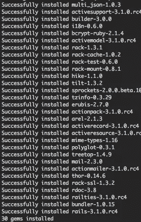

# Rails 简介，深入探讨:安装 Rails，第一部分

> 原文：<https://www.sitepoint.com/rails-development-101-installing-rails-part-one/>

继续我上一篇关于 RVM 的文章，这次我们将安装轨道。同样，本系列文章试图让您更深入地开始使用 Rails，因此我们将在首次创建改变世界的 Rails 应用程序时介绍一些可用的选项，以及随 Rails 一起安装的 gem。

### 选择口译员

首先，确保你打开一个终端，切换到我们的 RVM Ruby 解释器和 gemset，分别是 MRI 1.9.2 和 *rubysource* 。我们用

`rvm 1.9.2@rubysource`

你可以用一个快速的`rvm info`来验证。您可能知道，生成一个新的 Rails 应用程序的方法是在命令提示符下键入。

`rails new applicationName`

### 安装导轨

你可能不知道 *Rails* 可执行文件住在哪里。事实上，知道 Rails gem 只包含了 *rails* 可执行文件可能会让你感到惊讶。Rails gem 有许多依赖项，其他 gem 满足了这些依赖项，但实际的 Rails gem 只是一个可执行文件。让我们现在安装它。
`gem install rails --pre`

补白

### `--pre`

`--pre`选项告诉 RubyGems 安装最新的可用 gem，它可能不是 Rails 的“官方”稳定版本。在我们的例子中，我们得到了 Rails 3.1 RC4。“RC4”代表候选版本 4，这应该是 Rails 稳定之前的最后一个候选版本，也就是说它已经发布了。通过查看 [Github](http://github.com/rails/rails) 上的标签，我们可以看到 Rails 遵循的一般发布周期

Rails 3.1 候选版本

Where we can see that Rails follows a pattern of starting with a “beta” release, followed by 4 or 5 release candidates, before going stable. Thanks to RVM, we can muck about with any of the pre-release software without contaminating the rest of our development environment.

现在您知道了在安装 Rails gem 时“–pre”选项的作用，但是还有什么其他选项呢？“gem 安装”需要很多选项，我们可以在这里看到。

### RubyGems

RubyGems 允许我们指定项目，比如，一个特定的版本(我们已经看到了)，一个安装目的地，是否安装文档，是否安装依赖项，以及指定搜索 Gems 的来源。纵观可用的选项，很容易看出 RVM 是如何利用 RubyGems 来保持集隔离的。最后，您可以将这些选项中的任何一个放到您的~/中。如果您发现自己一遍又一遍地输入相同的选项。作为一个特别的奖励，[这里的](http://www.rubyinside.com/speed-up-gem-installs-significantly-1605.html)是一种通过在 gem 配置文件中设置选项来显著加快 Gem 安装速度的方法。

### 安装的其他宝石

当我们安装 Rails 时，它还安装了其他几个 gem。那些宝石是什么？他们的目的是什么？

用导轨安装的 Gems

Let’s briefly run through each one.

MultiJSON
MultiJSON(由 Intridea 公司开发，他们做了很多伟大的工作)允许多个 JSON 后端，检测并利用最好的一个。在普通 Rails 安装的情况下，它使用了`json_pure` gem。

[active support](http://as.rubyonrails.org/)
active support 是“对 Rails 有用的各种实用程序类和标准库扩展的集合。因此，所有这些添加物都被收集在这个包中，以收集所有使红宝石更甜的糖。”这意味着，本质上，ActiveSupport 是 Rails 的构建块，包括缓存、JSON 支持、unicode 支持和通知的抽象。它还定义了 ActiveSupport::Railtie，这是扩展 Rails 应用程序的方法之一。ActiveSupport 的范围太广，无法在此一一介绍，请在您的空闲时间查看。

[Builder](http://ruby.about.com/od/gems/a/builder.htm)
Builder 提供了一种用于生成标记的领域特定语言(DSL)。

i18n
i18n gem 为 Rails 提供了所有的本地化支持。可以想象，这是一个很大的主题，而且随着 Rails 知识的增长，这也是一个值得研究的主题。

[BCrypt Ruby](http://bcrypt-ruby.rubyforge.org/)
BCrypt 是 Rails 3.1 的新增功能，为[保护持久密码提供加密。](http://bcardarella.com/post/4668842452/exploring-rails-3-1-activemodel-securepassword)

[active model](https://github.com/rails/rails/tree/master/activemodel)
active model 为 Rails 中的模型提供了接口。从 Rails 3.0 开始提供了 ActiveModel，允许开发人员遍历 Rails 中提供给模型的语法糖的自助餐线，只将所需的位放在盘子上。

架子宝石。
[Rack](http://rack.rubyforge.org/) 提供了从 Ruby 应用程序到 web 服务器的接口。Rack 支持的项目之一是*中间件*，允许将少量代码放入 web 请求/响应管道并提供功能。 [rack-cache](http://rtomayko.github.com/rack-cache/) 是提供 HTTP 缓存的中间件。 [rack-test](https://github.com/brynary/rack-test) 以一种漂亮的 DSL 形式提供了一个用于测试 rack 应用程序(Rails 就是这样)的 API。[机架式](http://rubydoc.info/gems/rack-mount/0.8.1/frames)为 Rails 提供路由，驱动标准 Rails 应用程序的良好 RESTful 接口。
[Hike](http://rubydoc.info/gems/hike/1.1.0/frames)
Hike 处理装载并搜索轨道路径。

Tilt 为不同的 Ruby 模板引擎提供了一个接口，比如 ERB 和 Haml。

[链轮](https://github.com/sstephenson/sprockets)
链轮是 Rails 3.1 中的新特性，为 javascript 和 coffeescript 以及 SASS 和 CSS 提供了新的资产打包管道。

TZInfo 是 Ruby 的时区库。

嗯，这篇文章已经到了在火车上或在牙医诊所等候时都无法阅读的地步，所以我打算把宝石的描述分成两篇文章。下次我们将继续讨论 Erubis 宝石。我希望您会发现这种从 Rails 开始的方法具有教育意义和启发性。和往常一样，如果你认为无论如何都要改进文章或增加见解，请留下评论。

## 分享这篇文章