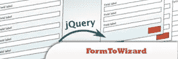
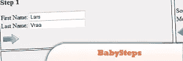
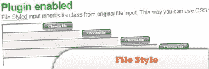
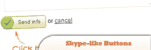
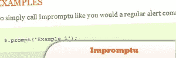
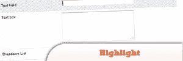
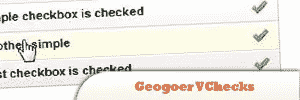
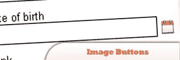
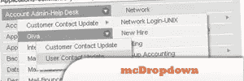

# 改进 HTML 表单的 10 个 jQuery 插件

> 原文：<https://www.sitepoint.com/10-jquery-plugins-improve-html-forms/>

10 jQuery Plugins to **improve on your HTML Forms**. jQuery makes it easier and simpler to provide your users with high quality, dynamic, good looking and intuitive input forms. This post lists some of the best available in different categories; “Form Element Visual Enhancements”, “Form Element Data Validation and Manipulation”, “Form Tool tips”, “Calendars and date pickers”, “jQuery hot key plugins” etc.

相关帖子:

*   [**30 jQuery 表单插件**](http://www.jquery4u.com/forms/30-jquery-forms/)
*   [**10 jQuery CSS3 表单教程**](http://www.jquery4u.com/plugins/10-jquery-css3-form-tutorials/)

## 1.用 jQuery (FormToWizard 插件)将任何 web 表单变成一个强大的向导

详细的教程将向你展示如何把长长的网页表格变成一个带有“向左走几步”信息的向导。

[来源](http://www.jankoatwarpspeed.com/post/2009/09/28/webform-wizard-jquery.aspx)

## 2.BabySteps

鲍勃怎么样了？reference)是一个简单且易于配置的工具，用于将长表单转换成分解的步骤，而无需逐页进行。

[来源](http://plugins.jquery.com/project/babysteps)

## 3.jQuery 的文件样式插件

文件样式插件使您能够将图像用作浏览按钮。您也可以使用 CSS 将 filename 字段的样式设置为普通的 textfield。

[来源](http://www.appelsiini.net/projects/filestyle)

## 4.如何使用 jQuery 创建类似 Skype 的按钮

如果您使用 Skype，我相信您会注意到一个动画按钮，它可以让更多的人加入聊天。当你点击它时，左边的图标会“跳跃”几次。我喜欢那个动画。这就是为什么我将向您展示如何使用 jQuery 和一些简单的 CSS 创建相同的按钮。

[来源](http://www.jankoatwarpspeed.com/post/2009/03/11/How-to-create-Skype-like-buttons-using-jQuery.aspx)

## 5.jQuery 即席

一个扩展，帮助提供一种更愉快的方式来自发地提示用户输入。或多或少，这是警告、提示和确认的一个很好的替代品。

[来源](http://trentrichardson.com/Impromptu/index.php)

## 6.高光

通过在与页面交互时突出显示元素来提高可用性。它主要用于表单，但也可用于表格、列表或您指定的任何元素。

## 7.地理观测员检查

一种用户友好的方式来显示复选框。

[来源](http://www.vaziuojam.lt/js/geogoer/jquery_plugins/vchecks/index.html)

## 8.使图像按钮成为输入字段的一部分

如果你曾经看过像微软 CRM 这样的产品，你可能会注意到有些输入字段中“嵌入”了图像按钮。如果您的客户看到了这一点，他们可能会希望在应用程序中使用它。不管你是否同意，以下是你可以轻松做到的方法。如此简单，您只需添加几行代码，就可以在整个应用程序中启用该功能。

[来源](http://www.jankoatwarpspeed.com/post/2008/11/26/Make-image-buttons-a-part-of-input-fields.aspx)

## 9.clearField

这个插件以一种非常简单的方式提供了类似的效果。这通常用于选择输入字段，其中字段的默认值类似于“您的电子邮件地址”。如果您单击该字段，文本会消失，以便您可以键入您的电子邮件地址。

[来源](http://plugins.jquery.com/project/clearField)

## 10.麦克德罗普顿

允许用户从复杂的分层选项树中进行选择。

[来源](http://www.givainc.com/labs/mcdropdown_jquery_plugin.htm)

## 分享这篇文章