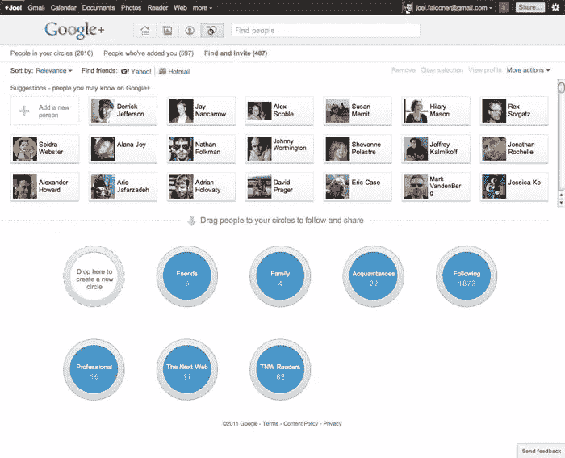
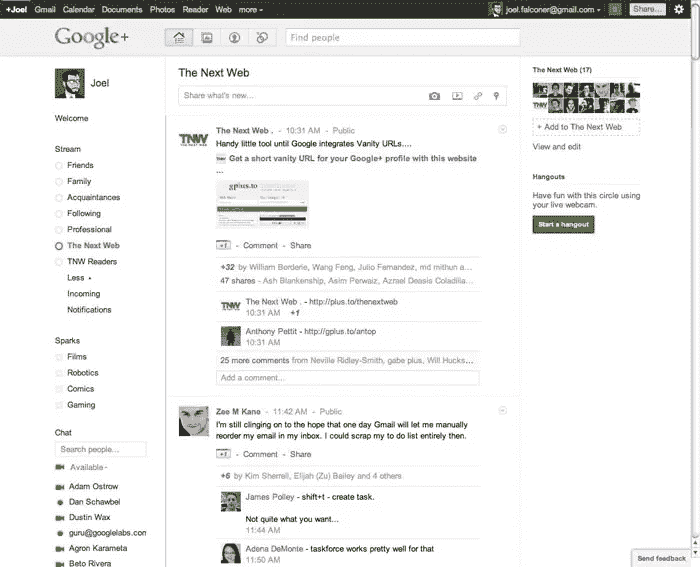
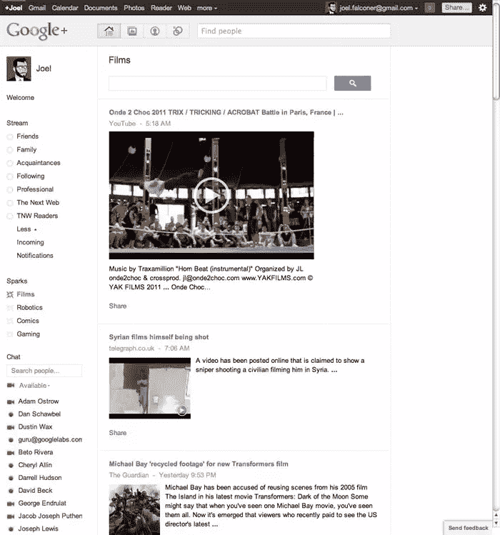

# Google+简介

> 原文：<https://www.sitepoint.com/an-introduction-to-google-plus/>

科技媒体上周花了大部分时间关注谷歌的最新产品，这是一个名为 Google+的雄心勃勃的平台，该公司希望它能打破他们在社交领域的干涸期，使他们具有竞争力。

现在还为时尚早——对许多人来说，这几乎是不可能的——但事情看起来是积极的。这款应用受到了很大程度上的积极欢迎，随着用户在新鲜感消退后继续发帖，我的流量没有放缓的迹象。

### 环

圈子是 Google+的一个基本特征，也是它与其他社交网络如此不同的原因——也是它们之间的桥梁。有了圈子，你可以控制与谁分享什么信息，让脸书式的亲密信息共享的相互关系成为可能，同时还允许 Twitter 的单向模式，让你可以关注你感兴趣的人，而不必让他们跟踪你。

组织你的圈子的界面也很酷，但我不认为是动画让人们大吃一惊。

如果我想发布一个只有我的家庭成员才能看到的帖子，我可以。如果我想让公众看到一些东西，那也是可能的。这里不像脸书那样存在“要么全有要么全无”的情况。这意味着谷歌可以同时扮演 Twitter 和脸书的角色，并将它置于一个非常强大的位置。

圆圈接口。

### 溪流

流是您可以查看传入信息的地方。这很像脸书新闻或你的 Twitter 流，但 Circles 让你可以控制你在这里看什么——它不仅仅是决定与谁分享内容。

在下面的截图中，我正在查看由我在[Next Web](http://thenextweb.com)的角色中认识的人分享的内容。我可以很容易地在朋友、家人、熟人或下面的圈子之间跳来跳去，这个圈子对我从未见过的有趣的人来说就像一个桶。

作为当今事实上的标准，流是实时更新的。谷歌工程师正在积极解决一些问题——旧帖子比其他网络更容易浮到顶部。

Google+流相当于你的脸书新闻。

### （船或飞机上的）无线电通信师

Sparks 被宣传为 Google+的主要功能之一，但目前并没有获得太多的播放时间。这是因为这是谷歌似乎没有投入太多精力创造真正有用的东西的少数领域之一。Sparks 是基于已定义主题的信息馈送，但如果你看一下下面的截图，我看到的是预定义的名为“电影”的 sparks，它没有对内容进行管理。第二个结果与一名狙击手射杀了一名在叙利亚拍摄他的平民有关——悲剧，但这并不是我想了解最近电影信息时所想的。

这个功能可以更好。它可以让发现和分享有趣的信息变得轻而易举，但要等到结果好得多的时候。这将是一个与 Google Reader 进行某种整合的完美地方，那里的内容已经由出版商和订阅者共同管理。

火花接口。

### 聚会场所

Hangouts 是 Google+最令人印象深刻的部分之一。底层技术并没有那么不可思议——我们已经有 Skype 视频会议很多年了。但是 Hangouts 可以一次处理十几二十个人没有问题，更重要的是，让这个功能令人印象深刻的不是技术，而是执行。需要安排视频通话，需要召集特定的人，但有了视频聊天，来自特定圈子的任何人都可以随意进出。这是一个不断发展的社交空间，就像你当地的酒吧一样，而不是一个僵化的呼叫结构，这种区别很重要。这让聚会变得相当具有革命性。

在你进入一个常去的地方之前，你有机会整理你的头发。

### 应用程序接口

毫无疑问，你在想:API 什么时候发布？谷歌说它很快就会出现，如果他们说的是真的，他们会比脸书更快地推出 API。看看 Google+会推出什么样的应用，而这些应用在其他社交平台上是不可能的，这将会很有趣。

有迹象表明 Google+ Games 即将推出，也有传言称与社交游戏巨头 Zynga 有合作关系。Google+会成为休闲游戏开发者的下一个平台吗？我们必须等等看，但我会在 Farmville 垃圾邮件的第一个暗示离开。

你对 Google+有什么看法？

## 分享这篇文章