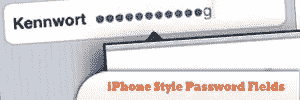
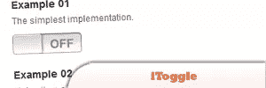
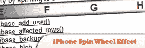
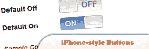
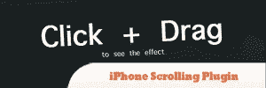
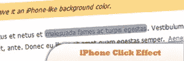
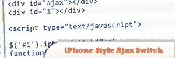
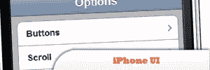
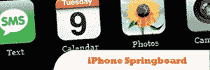
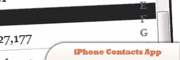

# 10 个 jQuery iPhone 风格插件

> 原文：<https://www.sitepoint.com/10-jquery-iphone-style-plugins/>

Unleash the power of jQuery on iPhone and create impressive iPhone style cool effects and widgets with these jQuery plugins. You might also want to compare these to: [10 Android Style jQuery Plugins](http://www.jquery4u.com/mobile/10-android-style-jquery-plugins/).

## 1.使用 jQuery 创建 iPhone 风格的密码字段

苹果在 iPhone/iPod Touch 上实现了一种替代方法:输入时密码被屏蔽，但行中的最后一个字符以纯文本显示。现在让我们学习如何使用 jQuery 创建如此酷的 iPhone 风格的密码字段。

[来源](http://blog.decaf.de/2009/07/iphone-like-password-fields-using-jquery/)

## 2.jQuery 的 iToggle

对 iPhone 上那些可爱的滑动开/关按钮的完全无所顾忌的改动，使得复选框(和单选按钮)看起来很不错！前几天，为了一个小挑战，我们决定看看我们能在网上多接近地重现 iPhone 的拨动开关。

[来源](http://labs.engageinteractive.co.uk/itoggle/)

## 3.SpinTheWheel jQuery iPhone 转轮效果插件

它旨在创建一种在定义的范围内选择值的直观方式。如果你想完全控制用户可以选择的值，但是由于跨度

## 4.使用 iButton jQuery 插件创建 iPhone 风格的按钮

这个插件允许你从复选框和单选按钮中生成 iPhone 风格的按钮。

[来源](http://blog.pengoworks.com/index.cfm/2009/9/3/Create-iPhonestyle-buttons-with-the-iButton-jQuery-Plugin)

## 5.一个用于 jQuery 的 iPhone 滚动插件

想要在你的浏览器中复制 iPhone 的滚动体验吗？我认为这将是一个新颖的想法，所以我快速制作了一个小的 jQuery 插件，它可以将任何溢出的块元素变成一个可滚动的窗格。

## 6.使用 MooTools 或 jQuery 的 iPhone 点击效果

当你点击一个链接时，iPhone 上的 Safari 会提供一个暗背景效果。这是最微妙的细节，但只是加强比一个行动正在发生。那么为什么不在任何页面上实现呢？我们可以使用 MooTools 或 jQuery 轻松做到这一点。

[来源](http://davidwalsh.name/iphone-click)

## 7.jQuery Iphone 风格的 Ajax 开关

在本教程中，我将纯粹着眼于使用 iPhone 按钮的功能创建一个简单的 AJAX 请求，以触发一个脚本，根据开关是开还是关返回一个字符串。您需要包含 jquery.iphone-switch.js 文件以及下载中的 jquery。

## 8.jQuery iPhone 用户界面

这是网页上原型 iPhone 界面的 JavaScript 库。

[来源](http://code.google.com/p/jquery-iphone-ui/)

## 9.用 XHTML、CSS 和 jQuery 创建 iPhone 跳板

有了这个 jQuery 教程；我将告诉你如何用 xHTML、CSS 和 jQuery 创建 iPhone 跳板。

[来源](http://css-tricks.com/2124-the-iphone-springboard-in-xhtml-css-and-jquery/)

## 10.使用 CSS 和 jQuery 创建 iPhone 联系人应用程序

将在您的浏览器中使用和显示联系人应用程序的设计。搞笑的事实是，这是第一个“iPhone 到 CSS/jQuery 的转换”。

## 分享这篇文章