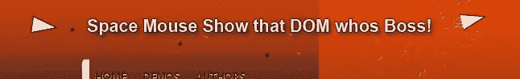

# 真棒 jQuery 空间鼠标 DOM 射手

> 原文：<https://www.sitepoint.com/awesome-jquery-space-mouse-dom-shooter/>


嗨，伙计们，有没有想过用一个小小的鼠标图标摧毁一个网页？？？现在你可以了！要玩这个游戏，只需将下面给出的 javascript 代码复制并粘贴到地址栏中，然后按回车键。

一旦你按下回车键，你可以在窗口的左上角看到一个三角形的物体。

## 控制

使用以下按键导航鼠标飞船:

**W** =上移
A=左移
**D** =右移
**空格键** =射门

## 击落你最喜欢的网站！

只需复制并粘贴下面的 javascript 到你的地址栏和你的离开！

```
javascript:var%20s%20=%20document.createElement('script');s.type='text/javascript';document.body.appendChild(s);s.src='http://erkie.github.com/asteroids.min.js';void(0);
```

如果这不起作用，请尝试 jQuery 版本:

```
jQuery(document).ready( function()
{
	jQuery.getScript('http://erkie.github.com/asteroids.min.js');
});
```

## 分享这篇文章