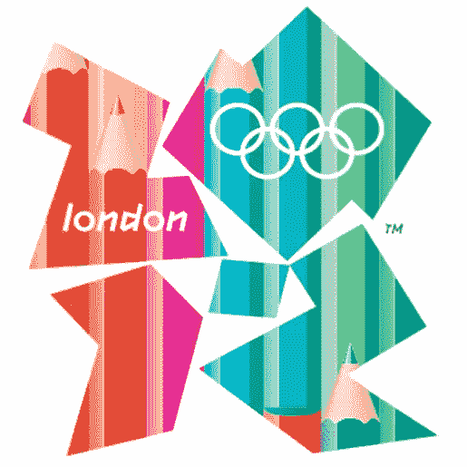
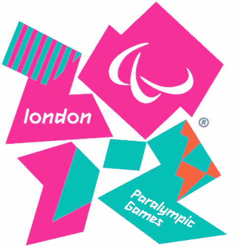

# 标志简介:伦敦 2012 教育标志

> 原文：<https://www.sitepoint.com/logo-brief-the-london-2012-education-logo/>

2009 年，伦敦 2012 举办了一场比赛，邀请年轻设计师有机会创造一个特殊版本的伦敦 2012 标志。年龄在 16 岁至 21 岁之间的设计师有资格为现有的伦敦奥运会标志输入“填充物”，它将与官方和残奥会标志放在一起。由此产生的标志将被称为教育标志。

比赛的获胜者是 18 岁的赖斯·埃文斯，她的设计基于铅笔及其在教育中的应用。

> 这个想法来自于对每个人如何使用铅笔的思考，从最早的年龄到成年以及你的一生。他们代表学校和教育。

除了看到他的标志被英国的学校和大学使用，赖斯还获得了在 2012 年伦敦奥运会创意机构 FutureBrand 工作两周的机会。

**伦敦官方标志**

2012 年伦敦奥运会的标志在 2007 年第一次被披露时，就被争议所包围。由沃尔夫·奥林斯创作的这个标志因其设计和所涉及的成本而遭到了猛烈的抨击。品牌(不仅仅是 logo)花了 40 万。锯齿状的会徽由数字 2 0 1 2 制成，有粉色、绿色、橙色和蓝色，灵感大致来自涂鸦艺术。

英国报纸暴跳如雷，不用说，博客上的评论并不支持。“对我来说，它代表了两个醉汉试图互相搀扶着站起来——非常英国化。”

在奥林匹克标志史上，同一标志将首次用于奥运会和残奥会。还计划为支持奥运会的草根项目创建一个不同的标志，新的教育标志就是一个例子。

你对 2012 年新的教育标志有什么看法？恕我冒昧，官方标志？

## 分享这篇文章