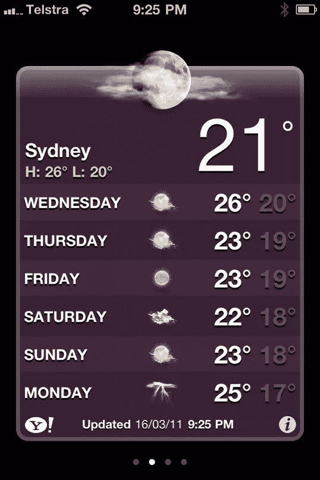
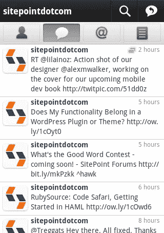
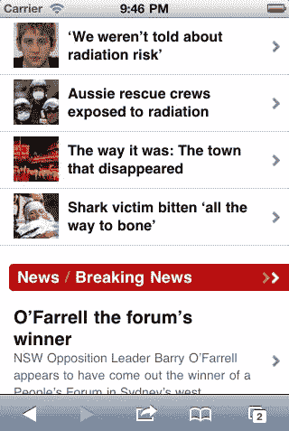

# 移动设计——站在巨人的肩膀上

> 原文：<https://www.sitepoint.com/design-for-mobile-standing-on-the-shoulders-of-giants/>

iPhone 的成功，以及整个 iOS 生态系统的成功，很大一部分是苹果对平台及其应用程序的审美和体验的关注。苹果做了大量的工作来建立最常见的应用程序设计模型，同时确保开发者的灵活性和用户的一致性。虽然我们的目标不是构建一个试图模仿使用原生应用程序的确切体验的应用程序，但从研究移动操作系统中使用的结构和设计模式中仍然可以学到很多东西。理解用户期望的界面很重要；它让我们决定什么时候值得去努力满足那些期望，什么时候去另一个方向。

让我们来看看在我们的应用程序中可能有用的一些移动设计模式。

## 旋转木马

想象一下，一些扑克牌并排放在屏幕上，用户可以通过向左或向右滑动屏幕来在每张“牌”之间滑动。

iOS 上的旋转木马模式的原型例子是苹果的天气应用，见图 2.2，“苹果天气应用中肉身的旋转木马模式”。天气应用程序将每个城市分配给一张卡片。一眼就能看到我们选择的城市所需的所有天气信息，而不受其他地方发生的事情的干扰。

图 2.2。苹果天气应用中的旋转木马图案

WebOS 也使用 carousel 模式在应用程序之间切换。使用这种模式的应用程序通常信息丰富，但交互性差。

轮播是我们要研究的最简单的模式——它通常由以线性集合组织的单一类型的内容组成。旋转木马的好处是简单(这很好，记得吗？).界面是最小的，数据结构非常容易理解。它还提供了一个隐含的重要性层次:第一项是最容易访问的，并且通常是用户最感兴趣的。这种结构的另一面是没有办法在一张卡以外的视图之间移动。

**好人**

*   用起来很简单。
*   它利用整个屏幕来显示内容。
*   导航需要自然的手势。

**坏的**

*   它依赖于手势——用户必须从一张卡刷到另一张卡，这可能不如按按钮或菜单项直观。
*   给定页面的所有信息必须同时显示在屏幕上，否则结构会崩溃。
*   每个页面需要在概念上是相同的。
*   用户必须在序列中前进；他们不能跳过前面。

## Tab Bar

在 iOS、Android 和 webOS 中随处可见 tab bar 模式。对于网页设计者和开发者来说，标签并不是一个新的概念。多年来，我们一直使用它们来建立层次结构并将内容分组。概念上，移动应用中的标签页和桌面网站中的标签页是一样的；主要的区别是标签栏在移动应用程序中通常有一个固定的位置，所以总是出现在屏幕上。有趣的是，在 iOS 上，标签栏组件出现在页面底部(靠近你的拇指)，而在 Android 上，惯例是将标签栏放在屏幕顶部(进入内容)。

图 2.3。Twitter 应用程序中使用的标签栏

选项卡栏对于快速建立应用程序的结构很有用。它让用户可以在应用程序的各个部分之间轻松移动，还可以作为一个锚点——选项卡栏的各种选定状态也表示用户当前在应用程序中的位置。如图 2.3“推特应用程序中使用的标签栏”所示，安卓的推特应用程序使用标签栏让用户在另一个用户的个人资料的不同模式之间移动。

**好的**

*   它为用户提供了一个熟悉的导航。
*   它允许在模式、视图或任务之间轻松切换。
*   它指示应用程序的当前状态/位置。

**坏**

*   它的层次是扁平的——没有简单的方法来嵌套子页面。
*   它总是出现在屏幕上，占用宝贵的不动产。
*   它最多只能有效地处理五个导航项目，除此之外就很笨拙了。

## 列表

列表是移动应用程序最常用的设计模式。列表作为一个界面模型是不言自明的:内容显示在一个垂直的列表中，允许用户滚动选项。在 iOS 中，它们随处可见，除了最简单的实用程序之外，它们几乎无处不在。虽然很简单，但它们也非常灵活。列表可用于呈现可操作的选项；充当一长串内容的索引；最重要的是，作为一种导航层次结构，它允许用户沿着树结构向下工作。

列表是最强大的导航模型。列表可以容纳的导航层次结构的深度实际上没有限制，因此，对于结构深度超过一层的应用程序，列表几乎是通用的。

这种模式完美地映射到我们习惯于在线处理的框架中。列表结构是一棵可以通向任何地方的树，它通常用于让用户从项目索引向下钻取单个项目的详细视图。这就是所谓的主/从模式，一种一直在桌面和移动应用程序中使用的模式。几乎每个电子邮件应用程序都使用这种交互模式，让我们快速浏览可用项目，然后专注于一个项目。稍后我们将回到这个观点。

例如，News.com.au 使用列表模式，允许用户在进入他们感兴趣的任何故事之前浏览标题，如图 2.4 所示，“列表是新闻应用程序常用的”。

图 2.4。列表通常由新闻应用程序使用

列表的主要限制是，一旦用户沿着树向下移动，他们就失去了通过一个简单的步骤移动到上一层的任何项目的能力。从第四层往下，他们必须折回第三层才能回到顶层——这并不理想。为了克服这个缺陷，列表结构通常与标签栏模式相结合，以创建一个强大的、有深度和灵活性的结构化导航。

**好的**

*   它足够灵活，可以处理大量数据。
*   很熟悉，也很好理解。

**坏**

*   这是天生的等级制度。
*   用户需要回到起点来改变路径。

## 摘要

记住，这些模式提供了一个建议的结构——我们不一定要使用它们。熟悉和一致可以赋予设计权威，但你仍然可以打破常规。有无数应用程序的例子，它们避开 UI 惯例，为它们的用户创建令人愉快的、直观的、独特的界面；出于同样的原因，有许多应用程序没有很好的理由就脱离了这些简单的模式，最终让用户感到困惑和沮丧。

我们应该始终考虑打破常规会如何增强或削弱我们应用程序的主要任务。如果我们不能设计一个比传统模式更好的替代方案，我们可能不应该这样做。

## 分享这篇文章