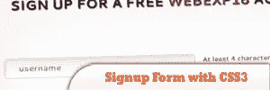
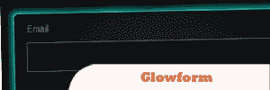
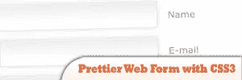
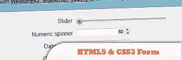
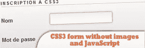
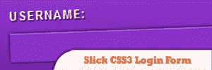
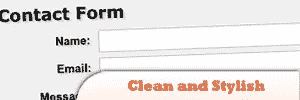
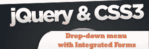

# 10 jQuery CSS3 表单教程

> 原文：<https://www.sitepoint.com/10-jquery-css3-form-tutorials/>

10 jQuery **CSS3 Form Plugins to bring life** and countless new possibilities to make better web forms. In this post we have compiled a list of the best 10 jQuery css3 tutorials and plugins to make great forms using this new and amazing technology.

相关帖子:

*   [**30 jQuery 表单插件**](http://www.jquery4u.com/forms/30-jquery-forms/)

## 1.使用 CSS3 和 jQuery 注册表单

本教程将向你展示如何使用 CSS3 创建一个好看的表单，以及如何使用一些 jQuery 让它更加用户友好。

[来源](http://webexpedition18.com/articles/how-to-create-a-multi-step-signup-form-with-css3-and-jquery/)

## 2.Glowform:令人惊叹的 CSS3 表单

这个表格不使用任何图像，只有 CSS3。我强烈建议您阅读本教程和表单源代码，因为您将学到许多不用图像就能创建杀手级表单的伟大技术。

## 3.使用 CSS3 的更漂亮的 Web 表单

这个非常简单的教程将向你展示如何使用一些基本的 CSS3 属性创建一个表单，比如 box-shadow。

[来源](http://net.tutsplus.com/tutorials/html-css-techniques/design-a-prettier-web-form-with-css-3/)

## 4.带有 HTML5 和 CSS3 的时尚联系人表单

关于创建一个表单并使用 CSS3 对其进行样式化的高质量教程。结果是，正如你在上面看到的，真的很酷。

[来源](http://line25.com/tutorials/create-a-stylish-contact-form-with-html5-css3)

## 5.HTML5 和 CSS3 表单

HTML5 引入了有用的新表单元素，如滑块、数字微调器和日期选择器。本教程将向你展示如何用 HTML5 创建一个表单，并用 CSS3 让它看起来很酷。开始使用 CSS3 和 HTML5 的好方法。

[来源](http://net.tutsplus.com/tutorials/html-css-techniques/how-to-build-cross-browser-html5-forms/)

## 6.没有图像和 JavaScript 的 CSS3 表单

本教程是法语的，但是结果看起来很好，我不应该把它包括在列表中。对于不懂法语的人来说，只要拿到源代码就可以了，玩的开心。

## 7.漂亮的 CSS3 搜索表单

大多数搜索表单(包括我在这个网站上使用的那个！)看起来很无聊。使用一点 CSS3，你就可以把旧的、无聊的形式变成绝对现代和酷的东西。必读教程。

[来源](http://webdesignerwall.com/tutorials/beautiful-css3-search-form)

## 8.光滑的 CSS3 登录表单

再一次，一个简单的教程使用 CSS3 创建一个简单的表单，但是绝对没有图片。

[来源](http://www.threestyles.com/tutorials/css3-login-form-tutorial/)

## 9.简洁时尚的 CSS3 表单

这种形式简单、干净、时尚。除了你可能会在大多数网站上使用的技巧之外，没有什么特别的。

[来源](http://gazpo.com/2011/02/form/)

## 10.带有集成表单的 jQuery 和 CSS3 下拉菜单

关于如何创建一个 CSS3/jQuery 下拉菜单的教程。毫无疑问，你的客户会喜欢它的！

[来源](http://addyosmani.com/blog/formbox/)

## 分享这篇文章