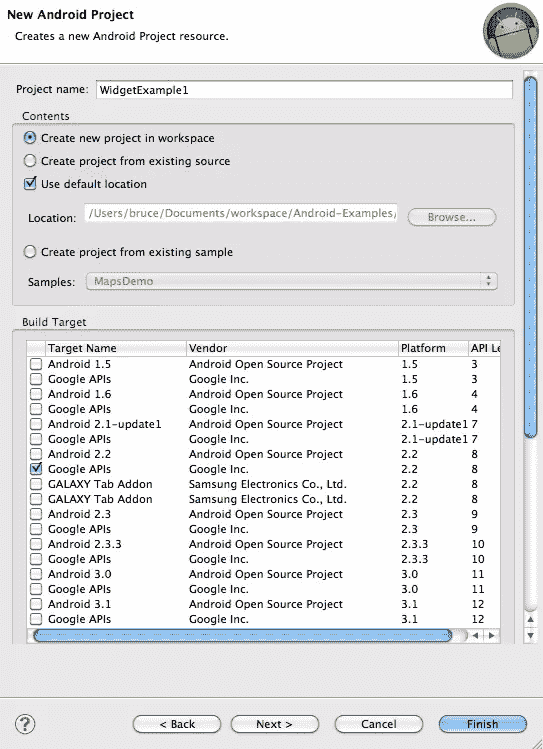
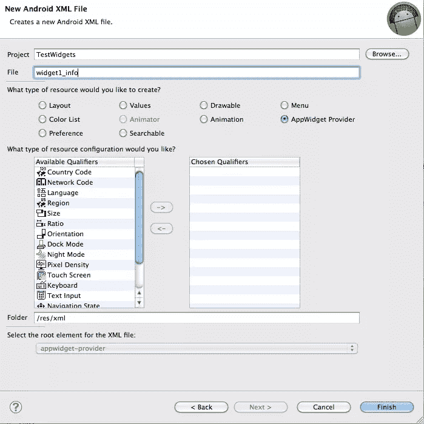
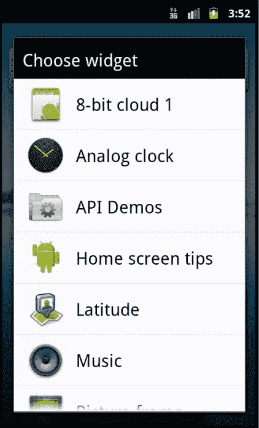
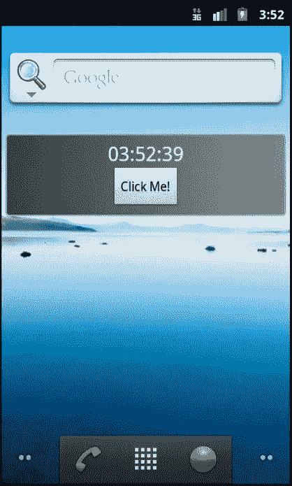

# 如何编写 Android 小部件

> 原文：<https://www.sitepoint.com/how-to-code-an-android-widget/>

Android 的一个经常被吹嘘的功能是主屏窗口小部件。取自 Android 文档的小部件的官方定义是:

> 应用程序小部件是微型应用程序视图，可以嵌入到其他应用程序(如主屏幕)中，并接收定期更新。

实际上，小工具通常只在主屏幕上使用。小部件也可以被交互，对触摸事件作出反应，尽管有一些限制。在本文中，我将向您展示如何编写一个简单的小部件来显示当前时间，并在您点击它时加载您的应用程序。在未来的文章中，我们将添加额外的功能来显示图形，经常更新，并从互联网上获取数据来显示。

Android 的 [App Widgets](http://developer.android.com/guide/topics/appwidgets/index.html) 文档为学习 Widgets 提供了一个很好的起点。我们将从一个与他们的教程非常相似的例子开始，然后我们将继续演示一些更高级的特性。我们假设用户使用 Eclipse 和 Android 开发扩展来开发他们的应用程序，但是在其他 ide 中也可以获得同样的结果。[Android 入门](https://www.sitepoint.com/getting-started-with-android/)是一本设置 Android 开发环境的实用指南。

让我们从创建一个新的 Android 项目开始。选择*文件新建 Android 项目*。在向导中填入你认为合适的值。您可以选择您喜欢的任何值，但是在我的例子中，我特别使用了下面的值，其他值保留默认值。

*   项目名称:小部件示例
*   构建目标:2.2 [API 级别 8]
*   应用程序名称:小部件示例
*   包名:com . eightbitcloud . example . widget

[](https://www.sitepoint.com/wp-content/uploads/2011/06/widget-create-project.png)

图 1

然后点击*完成*。这将为您创建一个完全可用且可测试的 Android 应用程序。如果你愿意，现在就在模拟器中运行它，右击项目并选择*作为 Android 应用程序运行*。您可能需要为模拟器创建一个定义。一旦运行，应用程序只是显示一个黑色的屏幕，里面有一个“Hello World”字符串。很无聊，但这是一个很好的起点。

在 Android 中，操作系统中显示的所有组件都在清单文件中定义。从项目的顶层加载 AndroidManifest.xml。Eclipse 将在结构化编辑器中显示文件，但是如果您熟悉 XML，通过选择编辑器中的最后一个选项卡切换到源代码视图可能会更容易。它应该是这样的:

```
<?xml version="1.0" encoding="utf-8"?>
<manifest xmlns:android="http://schemas.android.com/apk/res/android"
  package="com.eightbitcloud.example.widget" android:versionCode="1"
  android:versionName="1.0">
  <uses-sdk android:minSdkVersion="8" />

  <application android:icon="@drawable/icon" android:label="@string/app_name">
    <activity android:name=".WidgetExampleActivity"
      android:label="@string/app_name">
      <intent-filter>
    <action android:name="android.intent.action.MAIN" />
    <category android:name="android.intent.category.LAUNCHER" />
      </intent-filter>
    </activity>

  </application>
</manifest>
```

目前这个文件中最重要的是指定应用程序主视图的*活动*。您将在应用程序标签中看到它。这告诉 Android 指定你的应用程序的主视图的类在哪里，它应该被赋予什么名字(通过标签属性)，以及它应该响应什么*意图*。主视图被标记为*主*动作，以指示 Android 应该在应用程序启动时加载它，并用*启动器*指示它应该出现在应用程序列表中。所有这些都与小部件没有直接关系，但是对于 Android 如何处理它的清单是有用的背景。

要添加我们的小部件，我们需要向清单中引入一个新元素来指定它。在活动下方，添加以下内容

```
<receiver android:name=".ExampleAppWidgetProvider" android:label="8-bit cloud widget 1">
  <intent-filter>
        <action android:name="android.appwidget.action.APPWIDGET_UPDATE" />
  </intent-filter>
  <meta-data android:name="android.appwidget.provider" android:resource="@xml/widget1_info" />
</receiver>
```

这指定了一个新的类`ExampleAppWidgetProvider`，它将负责接收`APPWIDGET_UPDATE`意图。我们需要给我们的小部件起一个名字，这是通过为`android:label`属性指定一个值来实现的。通常，您会在应用程序的`res/values/strings.xml`文件中指定这个值，但是为了简单起见，我将这个值直接放在了清单文件中。我用的是“8 位云 widget 1”。小部件的其余配置将在*元数据*文件中指定，该文件位于 *res/xml/widget1_info.xml* 文件中。我们下一步是创建元数据文件。通过选择*文件新建其他 Android Android XML* 创建它，并填写如下。

[](https://www.sitepoint.com/wp-content/uploads/2011/06/widget-create-resource.png)

图 2

创建文件后，切换到 source 选项卡，将文件内容设置为以下内容:

```
<?xml version="1.0" encoding="utf-8"?>
<appwidget-provider xmlns:android="http://schemas.android.com/apk/res/android"
    android:minWidth="294dp"
    android:minHeight="72dp"
    android:updatePeriodMillis="1000"
    android:initialLayout="@layout/widget1">
</appwidget-provider>
```

`minWidth`和`minHeight`参数指定小部件的大小。关于 Android 小工具的大小有一些特殊的规则，因为 Android 将其主屏幕排列成 4 x 4 的网格。文档规定使用以下公式计算大小:

> 大小=(单元格数量* 74)-2

在我们的示例中，我们希望小部件的大小为 4 * 1 个单元格，因此我们将大小指定为(4 * 74)-2 = 294 乘 72 dps。

Android 视图只会定期更新。我们想要显示一个时钟，所以我放入了一秒(1000 毫秒)的`updatePeriodMillis`,这样它每秒更新一次。事实证明，这么小的值是行不通的，但我稍后会回到这一点。最后，我们指定小部件将使用什么布局。让我们使用之前使用的同一个 android XML 创建向导来创建这个布局文件，只是这次我们选择了一个布局类型和一个文件名 widget1。像以前一样，切换到文件的 source 选项卡，并使用以下内容:

```
<?xml version="1.0" encoding="utf-8"?>
<LinearLayout
  xmlns:android="http://schemas.android.com/apk/res/android"
  android:orientation="vertical"
  android:layout_width="match_parent"
  android:layout_height="match_parent"
  android:gravity="center"
  android:layout_margin="4dp"
  android:background="@drawable/background">
    <TextView android:id="@+id/widget1label" android:layout_height="wrap_content" android:textAppearance="?android:attr/textAppearanceLarge" android:layout_width="wrap_content"/>
    <Button android:text="Click Me!" android:id="@+id/button" android:layout_width="wrap_content" android:layout_height="wrap_content"/>

</LinearLayout>
```

布局指定了小部件中将包含哪些组件，以及它们是如何布局的。然而，这里需要注意的是添加到其中的`TextView`和`Button`组件。它们对应于将在屏幕上显示的组件。

创建小部件时，您可能会尝试使用自己的定制组件和复杂布局来创建精美的布局。然而，对于部件中可以使用的组件有非常严格的限制，因为部件在不同的应用程序中运行，并且在渲染时不能访问您自己的代码。

有一些偷偷摸摸的方法可以让你的 widget *看起来*更复杂，我会在另一篇文章中介绍。现在，请注意，您可以在小部件中使用的组件只有:

*   框架布局
*   线性布局
*   相对布局
*   模拟时钟
*   纽扣
*   精密计时计
*   ImageButton
*   影像检视
*   进度条
*   文本视图
*   取景器

您会注意到在布局中也为小部件指定了背景。你需要在 *res/drawable/background* 中创建你自己的可绘制背景，或者你可以使用我为示例创建的[背景。](https://github.com/brucejcooper/Android-Examples/tree/master/WidgetExample/res/drawable/background.xml)

```
package com.eightbitcloud.example.widget;

import java.text.DateFormat;
import java.text.SimpleDateFormat;
import java.util.Arrays;
import java.util.Date;

import android.app.PendingIntent;
import android.appwidget.AppWidgetManager;
import android.appwidget.AppWidgetProvider;
import android.content.Context;
import android.content.Intent;
import android.util.Log;
import android.widget.RemoteViews;

public class ExampleAppWidgetProvider extends AppWidgetProvider {
  DateFormat df = new SimpleDateFormat("hh:mm:ss");

  public void onUpdate(Context context, AppWidgetManager appWidgetManager, int[] appWidgetIds) {
    final int N = appWidgetIds.length;

    Log.i("ExampleWidget",  "Updating widgets " + Arrays.asList(appWidgetIds));

    // Perform this loop procedure for each App Widget that belongs to this
    // provider
    for (int i = 0; i < N; i++) {
      int appWidgetId = appWidgetIds[i];

      // Create an Intent to launch ExampleActivity
      Intent intent = new Intent(context, WidgetExampleActivity.class);
      PendingIntent pendingIntent = PendingIntent.getActivity(context, 0, intent, 0);

      // Get the layout for the App Widget and attach an on-click listener
      // to the button
      RemoteViews views = new RemoteViews(context.getPackageName(), R.layout.widget1);
      views.setOnClickPendingIntent(R.id.button, pendingIntent);

      // To update a label
      views.setTextViewText(R.id.widget1label, df.format(new Date()));

      // Tell the AppWidgetManager to perform an update on the current app
      // widget
      appWidgetManager.updateAppWidget(appWidgetId, views);
    }
  }
}
```

这个类包含的代码将用于在每次超时过期时更新我们的视图。它负责更新小部件的内容。小部件运行在与我们的应用程序不同的应用程序(主屏幕)中，所以这不仅仅是简单地更新组件的问题。相反，您可以访问一个`RemoteViews`组件，您可以使用它在远程组件上设置字符串、图像和按钮动作。

在我们的案例中，我们希望做两件事。首先，我们想为我们的按钮添加一个动作监听器，这样当我们点击它时，它会打开我们的主应用程序。这是通过`PendingIntent`和`setOnClickPendingIntent()`方法完成的。其次，我们希望更新视图中的`TextView`,以显示当前日期。这是通过调用`setTextViewText()`来完成的。完成后，我们使用`updateAppWidget()`方法更新小部件。

瞧啊。我们现在有了一个工作的小部件应用程序。通过选择您之前创建的运行配置文件，将它安装到您的模拟器上。和以前一样，它将向您显示应用程序视图。使用主屏幕按钮退出主屏幕，然后长按背景并选择*小工具*。现在您应该看到一个小部件列表，您的小部件在列表中。选择您的 widget，它将被添加到您的主屏幕。

[](https://www.sitepoint.com/wp-content/uploads/2011/06/widget-add-widget.png)

图 3

[](https://www.sitepoint.com/wp-content/uploads/2011/06/widget-running-widget.png)

图 4

耶！等等，时钟不更新了！在我们的元数据文件中，我们将更新周期设置为 1 秒，所以它应该每秒更新一次，对吗？事实证明这是有很好的理由的。每次小部件需要更新时，Android 都会唤醒您的设备，加载您的应用程序，并运行 *WidgetProvider* 类来更新小部件。即使你的屏幕关闭，手机处于睡眠状态，它也能做到这一点。如果更新周期被设置为一小时运行几次或更少，那么这并不意味着大量的电池消耗。如果更新周期像我们的例子一样非常短，那么小部件会很快耗尽，你会有一长串愤怒的客户。为了避免这种情况，谷歌将更新周期限制为每半小时或更长时间一次。

幸运的是，有另一种方法来处理更频繁的更新；一种只在屏幕打开时工作的灯，以免耗尽电池。为此，我们使用[报警管理器](http://developer.android.com/reference/android/app/AlarmManager.html)。使用 AlarmManager 将是我下一篇文章的重点。

和我所有的文章一样，我已经将源代码发布到了 GitHub 上。你可以在 [WidgetExample](https://github.com/brucejcooper/Android-Examples/tree/simpleWidget) 子目录中找到我的 [Android-Examples](https://github.com/brucejcooper/Android-Examples) 库的代码。这个项目将随着教程系列的进展而更新，所以我将第一个例子标记为标签。请随时提问或提供反馈。

如果你喜欢读这篇文章，你会爱上[可学的](https://learnable.com?utm_source=sitepoint&utm_medium=link&utm_campaign=learnablelink)；向大师们学习新技能和技术的地方。会员可以即时访问 SitePoint 的所有电子书和互动在线课程，如[开始 Android 开发](https://learnable.com/courses/beginning-android-development-1678?utm_source=sitepoint&utm_medium=link&utm_campaign=learnablelink)。

对本文的评论已经关闭。有一个关于 Android 的问题？为什么不在我们的[论坛](https://www.sitepoint.com/forums/forumdisplay.php?340-Developing-For-Mobile-Devices?utm_source=sitepoint&utm_medium=link&utm_campaign=forumlink)上问呢？

## 分享这篇文章