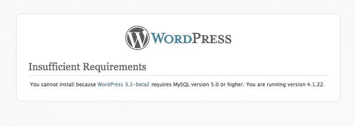
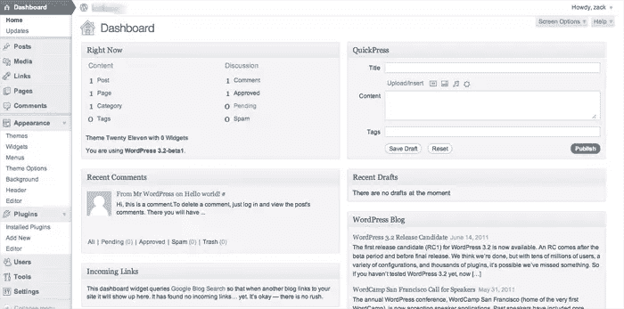
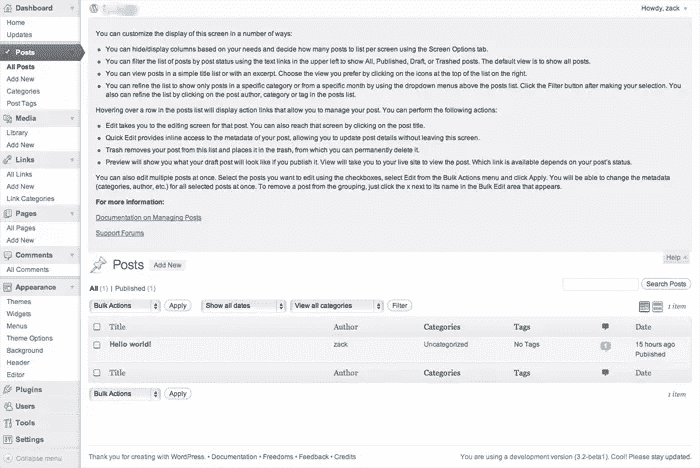
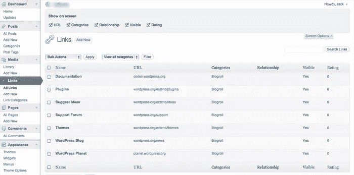
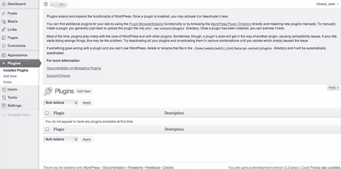
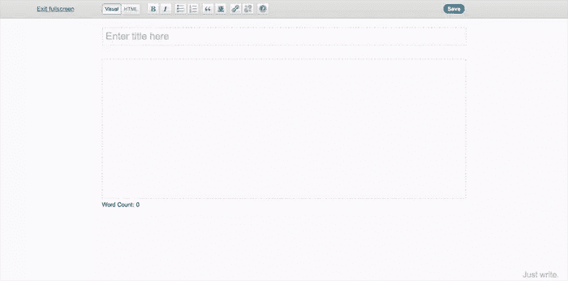
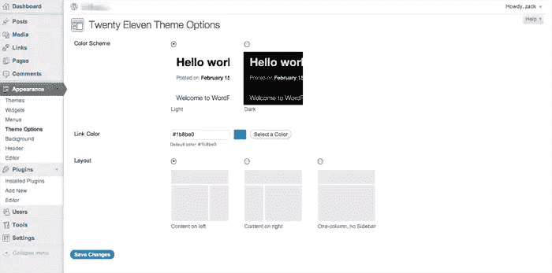

# 关于 WordPress 3.2 你应该知道的七件事

> 原文：<https://www.sitepoint.com/seven-things-you-should-know-about-wordpress-3-2/>

WordPress 已经[宣布](http://wordpress.org/news/2011/06/wordpress-3-2-release-candidate/)WordPress 3.2 的初始发布候选版本现已推出，这意味着 WordPress 3.2 的全面发布指日可待。

有一些非常酷的新功能和改进肯定会让很多人高兴，但是也有一些你应该知道的 WordPress 需求的重大变化，以免你点击你的 WordPress 管理中的神奇升级按钮而失望。

以下是你需要了解的关于 WordPress 3.2 的七大要点:

### MySQL4 和 PHP4 的死亡以及您为什么应该关注它

正如我们大多数人所知，保持 WordPress 的更新是非常重要的。很容易理解在自动更新功能被添加到 WordPress 几个版本之前，WordPress 的安装是如何保持过时的，但是现在几乎没有借口了。

我经常在新客户现有的 WordPress 网站上看到他们运行 2.7 和 2.8 版本的 WordPress，这让我感到惊讶。由于 WordPress 令人难以置信的受欢迎程度，它经常成为黑客攻击系统安全漏洞的目标。这些漏洞通常会被捕获和修补，从而不断更新，保持 WordPress 的新鲜、干净和安全。

如果你不保持你的 WordPress 安装是最新的，你就有成为完全可以预防的恶意攻击的受害者的风险——假设你实际上通过更新你的代码来防范它们。

也就是说，WordPress 到目前为止一直是一个非常友好的公民，非常乐意和你一起工作，并且生活在旧的、过时的网络服务器上。这意味着 WordPress 本质上是向后兼容的，很好地支持 MySQL4 和 PHP4。然而，尝试在一台既没有 MySQL5 也没有 PHP5 的服务器上将 WordPress 升级到 3.2，你会看到类似这样的内容:

MySQL5 和 PHP5 系统已经稳定运行了几年，它们共同增加了相当多的功能，但仍然有服务器出于各种完全合理的原因运行旧的 web 服务。

如果你目前正在托管一个更大的主机提供商，如 Hostgator、Bluehost、Softlayer、Rackspace、LiquidWeb 等，不要担心——你可能就很好。但是如果你碰巧在一个较小的托管公司，有一个账户有几个需要旧服务的“遗留网站”，或者甚至运行你自己的服务器，你可能最终需要升级 WordPress *和*它所在的服务器。

如果你不知道你的网站是否运行在支持 WordPress 3.2 的服务器上，有一个由 Ryan Duff 编写的小插件叫做 [WordPress 需求检查](http://wordpress.org/extend/plugins/wordpress-requirements-check/)。只需下载它并将其添加到你的 WordPress 安装中，它会让你知道你是否准备好了下一个版本的 WordPress。

所以不要惊慌失措 WordPress 3.2 的正式发布定于 6 月 30 日左右，所以你还有时间收拾自己的行囊，加入到乐趣中来！

### 再见，IE6

考虑到即使是微软也在倒计时，直到我们再也不用处理那个可怜的 IE6，官方不再支持 IE6 也就不足为奇了。

不过，在网上看到它应该会让经验丰富的 web 开发老手在某种程度上感到温暖。IE7 也即将退出，尽管 WordPress 暂时不会正式放弃对它的支持。

### 惊喜！一个新的简化的管理界面

现在我们已经讨论了你需要知道的重要的东西，让我们来谈谈你附近的 WordPress 安装有什么新的好的东西！我们将从新的、改进的、简化的 WordPress 管理界面开始。

随着 WordPress 3.0 的发布，我们在 WordPress 管理界面中感受到了一种更轻、更友好的感觉，而 WordPress 3.2 界面的更新版本似乎朝着这个方向更进一步。

我真的很喜欢 WordPress 如何继续做出协调一致的尝试，消除不必要的混乱，大幅压缩左侧边栏的宽度，并降低管理标题的高度。

此外，最初在 WordPress 3.0 中引入的上下文屏幕选项菜单在 3.2 中大放异彩。它们的工作方式本质上是一样的，但是现在 WordPress 的其他部分已经过时了，所以更加直观了。如果你从来没有机会玩上下文屏幕选项，看看下面的两个截图是如何工作的:

正如你所看到的，在处理文章时利用屏幕选项，如上所示，提供了不同的选项来处理链接时的屏幕选项，如下面的屏幕截图所示。

**帮助**按钮也以同样的方式与上下文相关，所以如果你不确定如何在 WordPress 管理界面的任何给定部分进行操作，你总是可以得到相关的帮助，如下例所示。

### 无干扰写作

延续“不碍事”的主题，WordPress 还通过增强现有的全屏书写模式来改善其创作体验。如果你愿意，你总是可以在全屏模式下编辑帖子，这种体验已经以一种非常 Ajax-y 的方式进行了简化。

从编辑器中打开全屏模式，你会看到一个非常小的屏幕，只给你一些基本的创作选项，就像你在下面看到的。

然而，停止摆弄你的鼠标一两分钟，所有这些都神奇地消失在背景中，只留下一个灰色的屏幕和一个闪烁的光标。这消除了你屏幕上的所有杂乱——除了 WordPress 在右下角温柔的提醒“只管写”。

再次移动光标，全屏视图再次出现，像以前一样给你格式选项，以及保存你的工作的能力。非常酷的东西，对于严肃的博客作者来说是一个受欢迎的补充。

### WordPress 更快。*快得多*。

3.2 的另一个重大发展是开发团队在 WordPress 的速度上做了大量的精简和优化。核心开发团队已经完全重组了 WordPress 中的核心代码，删除了不赞成使用的功能，使得整体运行更加高效。

这导致了更快的页面加载、更快的升级和更快的插件添加，当你只是在管理界面上玩的时候，这一切真的显示出来了。此外，从 PHP4 到 PHP5 的切换也显著提高了速度。

特别是随着谷歌改变网站速度和性能，将其纳入有机搜索引擎排名，这对 WordPress 来说是一个巨大的推动，除了帮助它成为一个向前发展的坚实平台外，别无它用。

### 核心 WordPress 的增量升级

3.2 实现的另一个重要特性是围绕 WordPress 的升级。虽然在过去，升级是核心代码的完全替换，但是系统已经被修改，现在只替换实际上已经被修改并且需要被换出的文件。

这使得升级过程更快，因为需要下载和交换的文件更少。更重要的是，它还使该过程更加安全和可靠，由于下载的代码量减少，大大降低了下载错误的可能性。

### 新的默认主题:2011 年

如果这些还不够，WordPress 也给了我们一个新的默认主题，如果我们愿意的话。Twenty Eleven 看起来是一个相当可靠的默认和免费的主题，给了你比它的前辈更多的定制选项。

Twenty Eleven 从两种默认配色方案(一种浅色和一种深色)开始，为您提供了几个可靠的选项，包括轻松将整体布局更改为几种不同的配置，如您在下面的截图中所见。

你也可以改变文本颜色，并通过主题选项上传你自己的图片标题。还支持每页随机标题图像，以及上传和使用自定义背景的能力。

无论如何，所有这些东西都很容易编码到任何自定义主题中，但很高兴看到 WordPress 让人们更容易快速建立一个网站，并使它看起来不同于我们在网络上无数 WordPress 安装中所熟知和识别的标准 Twenty Ten 安装。

### 底线

新的 WordPress 特性将会非常有用，但是在一天结束的时候，你需要记住的最重要的事情是，你需要确定你已经在服务器层面做好了准备。

也就是说，仅仅是速度的提高就足以让这个开发者对 WordPress 3.2 的发布感到非常兴奋(不是说它以前太慢了)，我认为改进后的全屏体验对于经常在系统内做大量工作的内容编辑来说应该是一个很好的补充。

你呢？你的服务器为 WordPress 3.2 做好准备了吗，在新版本中你最期待看到什么？

## 分享这篇文章