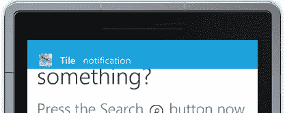
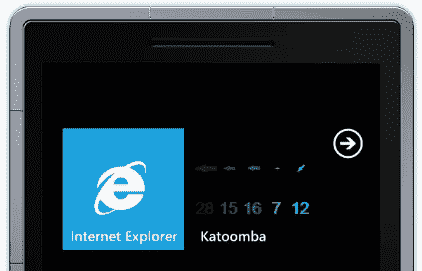
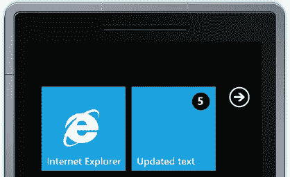
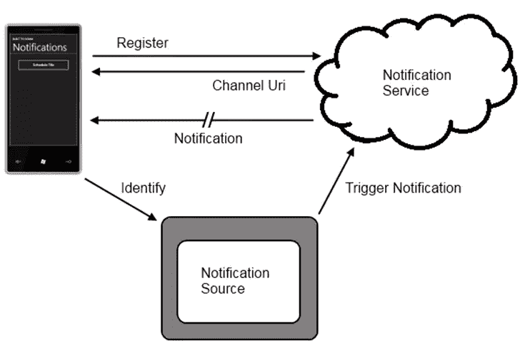

# Windows Phone 中的推送通知

> 原文：<https://www.sitepoint.com/push-notifications-in-windows-phone/>

在我之前的[帖子](https://www.sitepoint.com/personalise-windows-phone-7-live-tiles/)中，我提到了 Windows Phone 自带的通知系统，特别是指更新开始屏幕上的动态磁贴。我们将深入了解推送通知系统是如何工作的，以及您可以使用的通知类型。首先，您的应用程序可以利用三种类型的通知:

### Toast 通知

如果您想通知用户应用程序中的一个重要事件，您可以发送一个 Toast 通知。这个通知由两部分文本组成，无论用户当前在哪个应用程序中，这两部分文本都会重叠显示，如图 1 所示。第一个文本，在这种情况下单词“Tile”是粗体的，而第二个文本不是。通知区域将只显示单行文本，因此在决定在您的 toast 通知中包含什么文本时要小心。以便用户可以识别通知来自哪个应用程序，它伴随有应用程序图标。

图 1

需要注意的一个例外是，如果用户实际上在 toast 通知所属的应用程序中，他们将看不到通知。相反，在应用程序中会引发一个事件，由应用程序来处理 toast 通知。

### 磁贴通知

开始屏幕的目标之一是向用户呈现关于其应用程序状态的“浏览”信息。正如在之前的文章中所讨论的，你可以用一个的[更新时间表来做这件事。但是，有时您希望基于事件动态更新图块，而不是局限于某个更新频率。为此，您可以向设备发送磁贴通知。这可用于更新背景图像、文本和显示在磁贴上的徽章。图 2 和图 3 说明了如何通过发送图块通知来定制整个图块。](https://www.sitepoint.com/personalise-windows-phone-7-live-tiles/)

图 2

在图 2 中，背景已经更新为动态生成的图块，显示了过去两个小时的风向和风力。图 3 相同的磁贴已被重置回默认背景，但文本已被更改，并且在右上角设置了标记 5。

图 3

标记通常用于指示应用程序中未读或未处理项目的数量。将徽章设置为 0 将完全隐藏徽章。您不能完全移除文本覆盖，但您可以将其设置为一个空格(即“”)，这将达到相同的效果。

### 原始通知

Windows Phone 支持的最后一种通知类型是原始通知。与磁贴或 Toast 通知不同，原始通知没有关联的视觉提示或指示符。正如您想象的那样，原始通知用于将少量数据直接发送到应用程序中。想象一下这样一个场景，您的 Windows Phone 应用程序调用一个 web 服务来启动一个冗长的批处理进程。几分钟后，该服务向设备发送一个原始通知，表明该过程已经完成。这被应用程序截获，这可能会触发应用程序中的一些其他操作，或者用于向用户更新状态。为了接收原始通知，应用程序当然需要在发送通知时运行。因此，原始通知对于大多数应用程序来说价值有限。

在我结束这篇文章之前，让我们通过图 4 中的步骤来了解一下通知系统是如何工作的。一切都始于你在 Windows Phone 上运行的应用。该应用程序向 Microsoft 托管的推送通知服务注册，该服务返回一个通道 URI。您可以将此视为运行在特定设备上的应用程序的唯一标识符 **a** ，以及任何人都可以向其发送消息以便将其作为通知路由到特定设备的 URI**b**。

图 4

在大多数情况下，一旦将信道 URI 返回给运行在 Windows Phone 上的应用程序，该应用程序就需要将信道 URI 发送给将生成通知的任何服务或应用程序。你可以认为这是一个识别过程，应用程序在说“你好，我在这里，这是我的 URI 频道，你可以用它给我发送通知。”这个通知源看起来像什么完全取决于你。在大多数情况下，它将是一个 web 服务，该服务接收信道 URI 和一些其他标识符(例如设备 ID)以与信道 URI 相关联。

要向设备发送通知(tile、toast 或 raw ),通知源只需向相应的通道 URI 发送 HTTP Post。消息的结构决定了推送通知服务向设备发送什么类型的通知。

在这篇文章中，你已经看到了 Windows Phone 推送通知服务的概述，以及可以发送到手机的通知类型。接下来，我们将深入展示您的应用程序如何注册通知，以及如何通过管理适当的 XML 来发送通知。

## 分享这篇文章