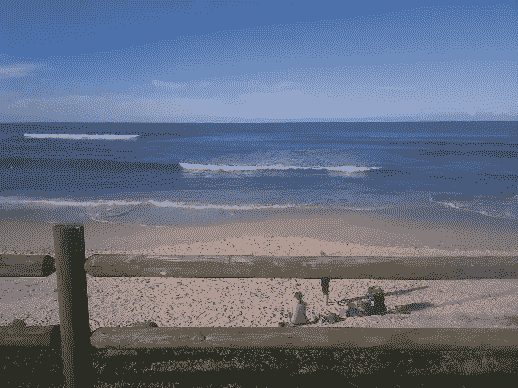
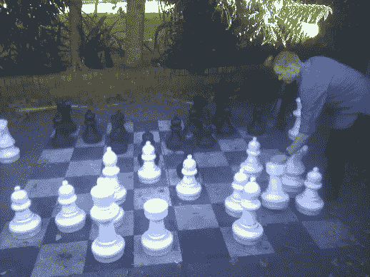
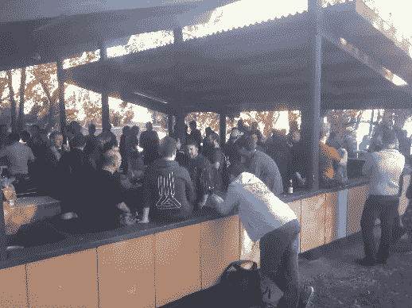
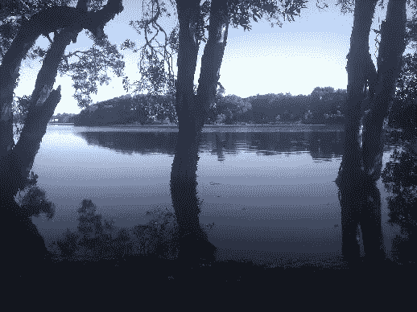
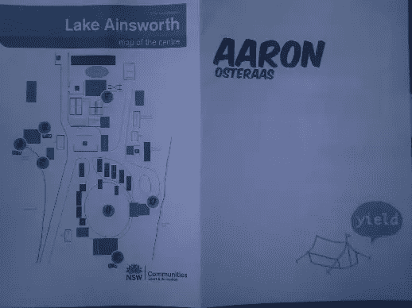
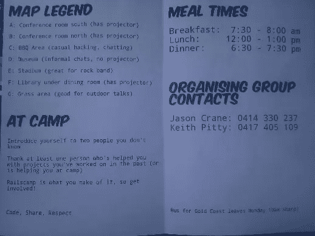
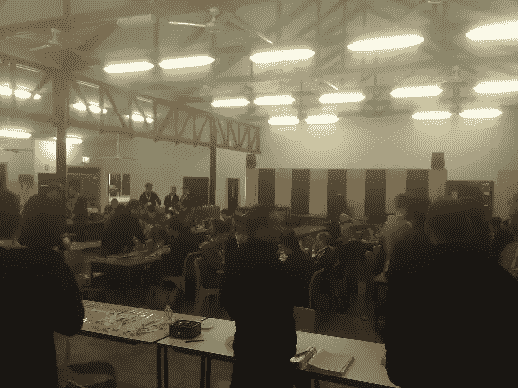
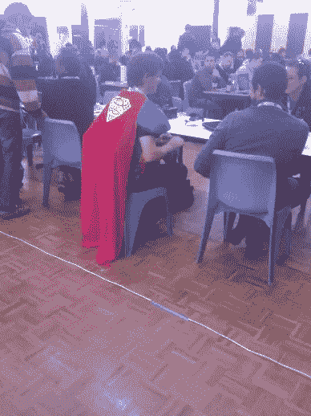

# RC9au 湖

> 原文：<https://www.sitepoint.com/rc9au-the-lake/>

老实说，如果在我的生命中有那么一段时间，有那么几次，我对自己说“我需要一个真正的相机”，那么今天就真的过去了。

在我的最后一篇文章之后，我跑下楼，冲了个冷水澡(从来都不理想。)，长途跋涉到机场。到处都是啤酒，最后公共汽车来了，我们跳上了车。

当我意识到我需要一台真正的相机时

我们在伦诺克斯角停了下来，我发现营地就在路的那头。这真是一个可爱的地方。如果有机会你应该去看看，那是一个非常安静和放松的地方。

勒比奇

这是开发人员在业余时间在开发营里做的事情。

国际象棋呼叫 le dev

当我们最终到达那里时，迎接我们的是一家烧烤店

乐 Dev 烧烤

那个湖和那个导游

像玻璃一样平

外部页面

乐内页

我估计，考虑到这里的人数，这里大约有 17.5 万澳元的 MacBooks。

我说过，我需要一台真正的相机。

最后，今晚有请瑞安·比格。他被选为今年的红宝石英雄之一。

瑞安·比格。他现在正在写一本书。

尽管宿醉未醒，明天还会有更多关于 RailsCamp 的报道。今天晚上和下午认识了很多超级搞笑的人。首先是对乌克兰小伙子基里尔的采访。

## 分享这篇文章