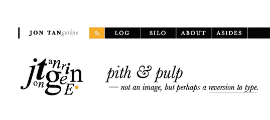

# 设计节播客 Jon Tan 的字体设计

> 原文：<https://www.sitepoint.com/design-festival-podcast-6-typography-with-jon-tan/>

大家好，欢迎来到设计节播客的第六集。这周我联系了一个朋友兼同事，[analog . coop](http://analog.coop/)[map along](http://mapalong.com/)的 [Jon Tan](http://jontangerine.com/) ，以及字体托管和授权服务 [Fontdeck](http://fontdeck.com/) fame。乔恩是一个高度认可的设计师和排版，当我们赶上我们讨论所有的事情排版和网页排版。

在最后，我为简短的乱码道歉——Skype 太调皮了。

<audio controls="" preload="metadata"><source src="http://traffic.libsyn.com/designfestival/designfestivalpodcast006.mp3" type="audio/mpeg; codecs=&quot;mp3&quot;"></audio>

## 下载这一集

您可以下载这一集的独立 MP3 文件:

*   设计节播客#6:乔恩·谭的字体设计

你可以直接或通过 iTunes 订阅设计节播客[—](http://feeds.feedburner.com/designfestivalpodcast)[将设计节播客添加到 iTunes](http://itunes.apple.com/au/podcast/design-festival/id436083343) 。

## 剧集摘要

### 提出者

*   [Simon Pascal Klein](http://klepas.org/)([@ klepas](https://twitter.com/klepas)
*   **嘉宾:** [陳陈乔恩](http://jontangerine.com/)([@陈乔恩](https://twitter.com/jontangerine))

### 内容缩减

*   印刷术……共同的激情
*   网页排版的当前状态(不包括网页字体)——“排版不仅仅是挑选一种‘酷’的字体”， <acronym title="Cascading Style Sheets">CSS</acronym> 2.1， <acronym title="Cascading Style Sheets">CSS</acronym> 3，做很多基础工作
*   网络字体&事物的科技一面
*   超越桌面:移动，并为 BBC 测试移动排版
*   托管和许可服务:Fontdeck(什么，如何，谁)
*   管道中的惊人之作:布鲁克林测试版
*   本周推荐

#### 推荐

*   **Jon:**[*Jan Tschichold 的新排版*](http://www.amazon.com/New-Typography-Weimar-Now-Criticism/dp/0520071476) ，Robert Bringhurst 的 [*排版风格的元素*](http://www.amazon.com/Elements-Typographic-Style-Robert-Bringhurst/dp/0881791326) ，Jost Hochuli 的 排版中的 [*细节(全部高度赞同，值得*嗅一嗅*……)。*](http://www.amazon.com/Detail-Typography-Jost-Hochuli/dp/0907259340)

## 音频抄本

**Jon Tan:** 啊，在我们开始之前，让我检查一下门上有没有，告诉他们把****关了，否则他们会跑进来说“哇哇哇”，我会说“把****关了”……啊，糟糕——毁了播客。

[德语加粗斜体混音作为介绍音乐]

西蒙·帕斯卡·克莱因:够了。无论如何，只有那首歌的混音才是最棒的。总之，欢迎来到 DesignFestival.com 播客的第六集。我们这周又回到了纯音频，所以我是你们的共同主持人之一帕斯卡，本周我和一位令人敬畏的嘉宾一起:来自 jontangerine.com 的乔恩·谭——嗨，乔恩。

乔恩:你好。

**帕斯卡:**哎。[咯咯笑]。所以，我想你在这个节目上——我希望每个人都已经知道你是谁了——如果你愿意，我会给你一点时间来解释这个问题？

乔恩:当然可以。

**帕斯卡:**否则我觉得任何不知道你是谁的人都值得一巴掌。

乔恩:那太好了。我肯定有很多人不知道我是谁，如果你真的想让我解释，我很乐意解释。

帕斯卡:去吧。

乔恩:我是一名设计师；主要是网页设计师。我共同创立了 Fontdeck，这是一个在英国运行的网络字体服务。我和一群叫 Analog Coop 的合作伙伴一起工作——我们算是一个国际合作组织:我们在美国、旧金山和纽约都有员工，还有一些人在布里斯托尔，也就是我现在所说的英国。我们目前正在做一些你可能听说过的事情:我们正在做布鲁克林测试版，这是我们今年的第二年。这是在纽约布鲁克林的一个会议……这是世界上最友好的网络会议——故意的。也许不是最好的组织或最光滑或闪亮的，但在我看来绝对是最有趣的。它在一个叫做“隐形狗”的地方举行，这是一个艺术空间，非常靠近纽约布鲁克林区的一个社区艺术空间。所以在这方面的工作，我也主要是在一个叫 Mapalong 的网络应用上，它是带注释的地图。这就是我，空中的球，如果你喜欢的话…一次很多。

**Pascal:** 你说你在布里斯托尔，你之前在幕后聊天时简单提到你那边有点不安定。

乔恩:嗯，是的，有一点。过去一周左右，报纸的标题是“布里斯托尔之战”;从一周前的上周四开始。我在布里斯托尔的工作室在一个叫斯托克斯克罗夫特的地方，斯托克斯克罗夫特是一个非常独立的另类区域。根据你的政治信仰，你可以称它为一群脆皮和嬉皮士，或者你可以称它为一个充满活力的文化区，有很多艺术家、音乐家和像我一样的人。

**帕斯卡:**我喜欢后者。

乔恩:我也是，老实说，我更喜欢那个。所以我们在布里斯托尔这里是一个非常独立的小区域，到处都是涂鸦和公共艺术，然后在英国这里有一个大型连锁店，乐购决定开设一家商店，人们一直在反对它，所以一周前的上周四，警方收到了一份密报——巧合的是在这家商店开设这家大型连锁店的一周后——在马路对面的一个蹲坑里有人带着汽油弹， 所以他们决定带着 160 名防暴警察，狗和马下来，巧合的是，他们决定在今年迄今为止最热的晚上下来，就在银行假日周末之前，那时每个人都在咖啡馆和酒吧外面的街上，基本上在布里斯托尔最另类的地区建立了一个武装营地。 所以…在某个时候，不幸的是，我猜人群中的一些白痴决定他们不喜欢这些带着防暴盾牌和警棍的武装警察在这里，他们融入了一场骚乱。所以，在过去的一周左右，我可怜的小社区已经遭受了三次暴乱。是的，相当疯狂。

帕斯卡:听起来像是对纳税人金钱的巨大浪费。

乔恩:很有纪念意义，老实说，大部分都是和平抗议，只是警方一度在街上部署了 300 名防暴警察。所以你可以想象这对很多当地人会有什么影响——让他们有点抓狂，特别是当他们被推来推去，没有人告诉他们发生了什么，然后你有一些白痴决定向警察扔几个瓶子，这在凌晨 3 点左右演变成一场巨大的街头战斗，在马路中间起火， 投掷导弹——一边是咄咄逼人的警察，另一边是一群不高兴的年轻人，是的，你知道头顶上有警用直升机； 这一切都很戏剧化。然后最棒的是他们决定在皇家婚礼那天突袭这个地方并逮捕那些人。所以，当全世界的目光都聚焦在威斯敏斯特大教堂的时候——不管它有什么价值——布里斯托尔正处于警察占领之中，就在我的工作室外面！但是，幸运的是，现在一切都平静下来了——都很冷。

帕斯卡:所以那段时间你没完成多少工作？

乔恩:老实说，我下来是为了确认一切都好，去看一个朋友的商店——这里下面有一个画廊和一个咖啡馆，看看那些人是否还好，并检查一下工作室；但是没有，我没有完成很多工作。这似乎不是一个好主意，跑警察的挑战，去工作室，特别是因为我听说过的故事是警察用警棍敲打他们的盾牌，说“走开！，走开！”任何试图接近这种情况的人，不管他们是在这里生活还是工作。所以，是的，没有:没有完成很多工作，但你知道这很好，这很好；可以说，这是生活丰富多彩的一部分。

**Pascal:** 我之所以说前面的人要认识你，我之所以提出你的作品；你当然以你的排版工作而闻名，特别是我认为你是…呃，在我看来绝对华丽的网站 jontangerine.com—

乔恩:谢谢你。

Pascal:…啊，我想作为一个好的字体和好的排版的个人爱好者，我希望听众已经猜到了这一点:我们今天将谈论一些关于排版的内容。我想首先整个网络字体热潮已经起飞，但在我们滑入之前，我想谈谈纯粹的排版:网络上的排版，不一定与你可以选择的字体有关，或者你知道，你是否可以扩展到“网络安全”字体之外。我能把这个问题留给你吗:你如何看待事情的现状，特别是随着 <acronym title="Cascading Style Sheets">CSS</acronym> 3 慢慢被采用——你认为我们现在处于什么位置，暂时把网络字体放在一边？

乔恩:当然可以。我认为我们正处于一个开创性的时刻，真的。我认为今年绝对是网络字体走向成熟的一年，而网络上的印刷术通常也将走向成熟，我这么说的原因是因为很多人都建议——各位，非常受尊敬的人，比如大卫·伯洛，你知道，他们称之为——大卫称网络为“原始媒体”,在某种程度上与印刷术相比，人们在羊皮纸上书写有一千年的悠久历史， 然后在纸上和各种不同的东西上打印，这个世界是年轻的，相对原始的——我们谈论的是平均 96 <acronym title="Dots Per Inch">DPI</acronym> 显示器。 这需要很多非常聪明的人花很长时间来尝试解决如何在这个低分辨率的屏幕上最好地显示非常小的字符和字形。但不仅仅是渲染引擎之间的差异——如果你愿意，我们可以深入探讨？—事实上，像 Mozilla 的 John Daggett 这样的人在 <acronym title="Cascading Style Sheets">CSS</acronym> 中推动对 OpenType 功能的支持，对数字屏幕排版中复杂、非常现代的功能的支持，其中许多功能对印刷排版人员来说已经存在很长时间了，但只是最近才被带到 web 上，所以现在有了 Firefox，我们第一次可以做一些令人惊讶的事情。所以在我看来，它从来没有像现在这样好——引用五十年代哪位总统的话，我们从来没有这么好，而且只会越来越好，所以我对我们现在在网络排版方面的情况非常乐观。

Pascal: 我当然同意你的观点，尤其是 Daggett 的出色工作，我期待有更多的 OpenType 特性可用。我知道不一定每个人都会欣然接受它，但会有很多人甚至不知道 OpenType 的高级特性是什么，但只需要几个人展示一些很棒的工作，然后在某个地方的博客上出现，然后突然得到大量曝光。

乔恩:是的，我是说我的同事里奇·鲁特，他和我一起创办了[font deck](http://fontdeck.com/)——里奇今年早些时候在西南偏南[SxSW]做了一个很棒的演讲，他在演讲中谈到了火狐对这些高级排版功能的支持，这是一个很好的起点，如果人们想搜索里奇·鲁特的 SxSW，他们可能会偶然发现他的演讲。但是，我的意思是，老实说，除了我们的新东西，我认为 <acronym title="Cascading Style Sheets">CSS</acronym> 在此之前就已经设计好了，用于设置字体。承认已经存在；这并不像我们需要新的东西，我认为我们已经可以在网络上做真正令人惊讶的事情，即使我们已经有了。网页设计行业对我来说是一件令人惊奇的事情，因为我们自己已经将网页设计定义为一种职业，这意味着进入的门槛非常低——我不是指以任何方式居高临下，因为我多年前就是这样进入这个行业的。这意味着今天网上有很多人没有接受过与网页设计相关的任何学科的正式培训，所以举例来说，他们没有——他们来自各种不同的背景——他们来自<acronym title="Human–Computer Interaction">人机交互</acronym>，以用户为中心的设计，传统的可用性，他们可能来自工程背景，计算机科学背景，纯图形设计背景， 但是只有少数人在进入网络之前可能已经学习过平面设计，他们有排版的基础，即使这样，很多平面设计课程也没有以我希望的方式学习排版。 很多平面设计课程似乎主要是关于广告，主要是关于软件，所以他们可以制作广告材料和印刷材料

帕斯卡:现在依然如此。

乔恩:没错，所以他们并没有把重点放在网络或排版本身作为一门学科。网络重新发现了，在印刷工的帮助下，在这些已经在这个领域工作了几十年的人的帮助下，通过重新发现——也发现了，等等“哇，我们真的可以做这个东西”；我们可以实现这些约定，并用现有的工具进行测试。所以是的，火狐；约翰·达格特的工作令人惊讶地推动了科学的发展，但即使在我们已经拥有的东西中，甚至在网络字体之前，我认为还有很多伟大的印刷表达的空间，我们不应该忘记这一点。

是的，不，我当然同意。正如杰夫·克罗夫特曾经说过的一句著名的话，“选择一种酷字体不是排版。”

乔恩:(咯咯地笑)嗯，绝对没有。

Pascal: 我发现自己总是回到那个该死的时代，尤其是在网络字体的整个时代，以及它是如何爆炸的，只是因为你知道你可以选择一个网络字体——你甚至可以付钱——你可能仍然有一个狗屎网站。

乔恩:给你。SxSW 2009 我正在做一个演讲，第一次见到了伊恩·科伊尔，我认为他是一个伟大的设计思想家，我和伊恩进行了一次很好的讨论，你真的不需要那么多的字体来做好工作——事实上他提出了著名的 measure 他认为一生中你只需要八张脸就能完成好的设计工作。因此，这就是历史，Elliot Jay Stocks 最近完成的《T2 8 面杂志》背后的背景故事，我很幸运能帮上一点忙。我在 SxSW 的绿色房间里讨论的一个关键是，为了做好工作，你不需要成百上千的字体——事实上，只有几个可能是一件好事，因为它让你了解它们。因此，尽管它可以被视为一种限制，但我认为像所有限制一样，它们可以非常健康，对设计有益。直到今天，Georgia 仍然是我最喜欢的字体之一，仅仅因为它是网络核心字体的一部分并不会影响这一点；它所做的仍然是美丽的，现在我知道它不会让我失望。

帕斯卡:是的，我绝对尊重这个决定；格鲁吉亚将永远是我的最爱。最近有几次，我甚至想从 Fontdeck 或 Typekit 为我自己的个人网站搬家，但我觉得我在欺骗它，所以我决定暂时坚持下去。

关于 webfonts，特别是作为一个 webfonts 托管和许可服务的创建者，你能给我们简单介绍一下——正如你所看到的——web fonts 目前的状态吗，因为我知道事情在过去一年左右发生了巨大的变化。

乔恩:好的，当然，我会尽力的。当 Rich Rutter 和我第一次谈论成为 [Fontdeck](http://fontdeck.com/) 的服务时，我想是 1 月，我想可能是 2009 年 1 月，也可能是 2008 年；我不记得了。无论如何，那是很久以前的事了，那时还没有 webfonts 服务，我们观察到，为了让 webfonts 基于 kon Wium Lie 已经完成的令人惊叹的工作和[他在一份名单上的开创性文章](http://www.alistapart.com/articles/cssatten/)而产生，为了让它发生，需要有服务。现在，巧合的是，很明显很多其他人也有着和你所观察到的一样的想法，因为所有的网络字体服务都出现了。我们目前所处的情况是，在某种程度上，市场出现了这种热潮；人们急于获得服务，在网上打字。一些印刷商看到了其中的机会，我们直接抓住了它；其他人稍微不太情愿——一些代工厂和设计师。我们目前的情况是，世界上许多字体是为印刷而设计的，就像我们之前说的，因为网络是一个相对低保真度的媒体，一些字体不适合屏幕，我认为需要在设计上做大量的工作，使它们更适合屏幕。此外，由于微软优化字体和字体轮廓以及屏幕字体的方法，这给代工厂和字体设计人员带来了额外的开销，他们必须以非常详细的方式准备字体，以便使它们能够在 Windows 机器上正常工作。所以我们现在的情况是，我们有令人敬畏的、令人惊奇的、漂亮的字体，我们想在网上使用，而有能力、有时间、有投资的铸造厂正在为网上字体做准备。所以你已经有了像 FontFont 和 WebType 这样做得非常好的人来为屏幕准备他们自己的字体，甚至还有像杰里米·坦卡德和 FontSmith 这样的人在 Fontdeck 投入了大量的时间和精力，真的打赌它会有回报，我认为这是一个很好的赌注。我认为网络字体的使用只会增加，但仍有许多工作要做，我的观点是，排版社区将从每个人的开放合作中受益，以提出如何为网络准备字体的最佳实践。目前，你有很多与少数人深度“储存”的知识，如果这些知识被共享，我会感到很惊讶，因为它允许较小的代工厂，较小的字体设计人员以与大公司相同的方式共享他们的东西，如果这种情况发生，如果我们能够降低字体设计人员和代工厂的成本和开销以及投资，为屏幕准备轮廓，屏幕的字体轮廓，那么我们将获得越来越好的质量，这最终会发生；我希望它能早点发生。很大程度上来自于 Fontdeck 当 Rich 和我与 OmniTI 的人一起创建 Fontdeck 做技术工作时，我们对 Fontdeck 的愿景是让它成为一个公平的竞争环境；这在很大程度上是一个市场——字体设计师和铸造厂控制着字体，如果他们想的话，可以随时改变和改进它们，他们还设定许可价格。这在很大程度上是将控制权交还给这些东西的创造者，而不是我们成为一种经销商，或者一个大商店，我们在那里购买股票并出售以获取利润——我们在 Fontdeck 所做的只是试图帮助人们为屏幕准备字体，然后我们给他们一个市场，他们可以在其中发放许可证，他们可以为自己设定价格， 希望给设计师一定程度的信心，他们所有的脸都是由最初的设计师和有这些脸的铸造厂策划的。 希望最终结果是，你不需要成为一个巨大的铸造厂，以便将你的字体放在可以欣赏它们的设计师面前，事实上事实证明是这样的，因为杰里米·坦卡德，例如，在 Fontdeck 取得了令人难以置信的成功，他是一个人的装备——这只是杰里米·坦卡德的排版公司。所以对我来说这是一个成功；我认为我们现在的重点是质量

帕斯卡:是的，好的工作会得到回报…

**乔恩:** *是的！*在那里获得质量；试着想办法让字体在屏幕上表现得越来越好——帮助人们做到这一点，它只会变得更好。如果可以的话，我想说的一件事是，我认为网页设计师指责字体如何渲染是错误的，比如说，微软，或者任何他们不喜欢的渲染引擎。我认为，这从根本上说是不公平的，把责任推给类型设计者本身也是不公平的。Windows 的努力——Windows 排版，这些人做了令人难以置信的工作，准备字体在屏幕上非常非常不利的条件下工作很长时间。如果你回想一下微软内部 web 项目核心字体的早期，你会发现人们花费了数千工时来准备字体、提示字体、给出字体说明，以便它们能够在 <acronym title="Cathode Ray Tube">CRT</acronym> 屏幕上尽可能好地呈现，甚至在 <acronym title="Liquid Crystal Display">LCD</acronym> 屏幕上也不行；在没有子像素定位的 CRT 屏幕上，只有围绕字体轮廓的黑白抗锯齿，这是一项巨大的工作。现在，我是这样描述的:微软的做法是将控制权交还给印刷商、铸造厂和字体设计师——非常精细的控制。他们以一种被认为是这些技术能够实现的最清晰、易读的输出方式来做这件事，并通过给予控制——但这有点像为一个应用程序建立一个界面，每个控制都有一个按钮在你面前——有点像微软的 Word，或者可能仍然是；我不知道，我已经不用了。

**帕斯卡:**依然是，是。

乔恩:对，还是——好吧。…你知道，有了这个巨大的功能仪表板，你可能会用到它；它们是如此令人困惑和耗时，你实际上从来没有——这是一种开销，是一种负担。但是，这是善意的，如果你看到微软排版多年来的输出，尽管我们谴责已经发生的一些事情，当它从标准渲染切换到 ClearType 时，ClearType 和 <acronym title="Graphics Device Interface">GDI</acronym> plus ClearType 中没有 y 轴初始化，尽管我们谴责意图是好的。因此，你不能责怪微软试图让人们控制字体在屏幕上工作得很好，但同时你也不能责怪字体设计者和代工厂，因为为了给屏幕准备字体，特别是在微软平台上，这是一项巨大的努力——成本高昂。所以这很棘手，这是非常棘手的情况；我们需要更多一点的平衡，而不是指责 Windows，或者指责这个人或那个人，我们需要更多一点的平衡，如何对待这个问题，并意识到我们仍然处于这个时代，就像大卫·伯洛所说的，“原始媒体”；它不会尽善尽美，但我认为它已经足够好了，我认为我们正在达到目标。

**帕斯卡:**有意思。你提到了一些很棒的观点。我应该注意到，你自己很大程度上是一个 Mac 用户，所以这不像你是一个坐在围栏一边的福音传道者…

乔恩:不，一点也不。

**帕斯卡:**……不择手段。我发现你提出的许多想法是——我的意思是，我在 Windows 上短暂地开始了我的计算生活，然后很大程度上由于我的父亲，我在很短的一段时间内跳到了 Linux/免费桌面上，我发现人们需要冷静下来，不要因为他们在许多情况下通常不理解的事情而相互指责， 特别是当有组织和企业参与其中时，他们不知道闭门会议和闭门会议后的决定，因此他们无法评估为什么在许多情况下实际上做了一些事情，特别是当他们得到免费的大便时。

乔恩:是的，你说对了，我们都为此感到内疚——我永远也不会比你更神圣:我咆哮过，愤怒过，沮丧过，为我所看到的和不理解的事情抱头痛哭过；当 Windows 切换到 <acronym title="Graphics Device Interface">GDI</acronym> plus ClearType 时，我不知道为什么网页上的显示尺寸在曲线上，在字形轮廓上有锯齿。印刷术社区告诉我这一点，因为我找不到任何材料来说明这种情况正在发生。

Pascal: 一些 web 开发人员认为 <acronym title="Internet Explorer">IE</acronym> 调试是一件痛苦的事情；只要等到你开始做 ClearType 的东西。

**Jon:**[轻笑]但现在你知道我们在这种情况下，我们在两个轴上都有抗锯齿——在 Windows 中的 x 轴和 y 轴，在 ClearType 中的直写，或直接 UD，无论你怎么描述它。我不是一个开发人员，所以有时…我尽量不把这些事情弄混，但有时我会，但 Windows 中的 ClearType 新字体渲染技术太棒了；它在两个轴上都有子像素定位或渲染…轮廓非常平滑，它可以在子像素位置开始绘制字形轮廓，这意味着字符之间的字距调整和跟踪通常要好得多。我们正在取得这些进步——意义重大的进步，就像我说的，我感觉很积极；我知道这可能令人沮丧，但总的来说，我真的感觉很积极，我认为你说我们需要更加谨慎是非常正确的。虽然它并不完美，有时很难向客户解释为什么它不完美，你知道，我们还年轻；网络仍然相对年轻——我们可能不再是青少年，但我们肯定仍然年轻。

帕斯卡:是的，我认为这是个不错的建议。所以，我想深入了解一下 Fontdeck，但在深入了解之前，我想调查一件事:我知道，特别是理查德——我不知道你在这方面的工作范围——理查德最近做了一系列工作:超越桌面，关注移动平台，特别是与 <acronym title="British Broadcasting Corporation">BBC</acronym> 。

乔恩:是的。

帕斯卡:你能和我们谈谈这个吗？你在哪里参与，做了什么样的工作？

乔恩:当然可以。我参与了。我会试着非常小心，试着依次而不是不合时宜地谈论它。基本上发生的事情是， <acronym title="British Broadcasting Corporation">BBC</acronym> 有一个全球体验语言，这实际上只是一套在屏幕上设计的标准，跨所有不同的设备和平台，所以这只是把它分成整齐的块，所以它们并不完美:这是传统的桌面网络，移动和 <acronym title="Internet Protocol">IP</acronym> <acronym title="television">电视</acronym>。他们已经有了这种全球经验语言，应该给他们一种结构，在可预见的未来为网络制作内容。全球体验语言最初的一个问题是，首选字体之一是 Helvetica·纽，显然任何了解网络的人都知道，Helvetica·纽目前只使用 <acronym title="Operating System">OS</acronym> <abbr>X</abbr> ，如果你在字体堆栈中指定 Helvetica，你会在 Windows 机器上遇到各种各样的问题，例如，人们可能从某个地方错误地复制了 Helvetica， 也许作为一名学生，他们从光盘上获得了它，或者他们甚至合法地购买了一份副本(我希望如此)，但这是一份没有为屏幕准备的副本，因此它将呈现糟糕的正文大小。 所以，这是一个小失误，所以他们很快切换回 Arial，这是一种在屏幕上更强大的方式。英国广播公司正在寻找一种连贯的方式来实现好的排版，独特的排版，在屏幕上可读，清晰的排版，在未来继续前进。所以里奇和我很幸运地参与进来，帮助他们找到他们的选择。我们得到了 BBC 支付的巨大特权，去研究目前在屏幕上的印刷是什么样的，以及它可能的发展方向。这太棒了——我喜欢为我真正喜欢做的事情获得报酬。非常感谢英国广播公司。所以，是的，这就是我们正在寻找的；Rich 研究了其中的移动元素，我研究了我们更熟悉的桌面。

**Pascal:** 这些发现是公开的，还是会在未来某个时候公开？

乔恩:这是一个很好的问题，我也不确定。我认为虽然 <acronym title="British Broadcasting Corporation">BBC</acronym> 正在考虑所有这些不同的选项，但我认为在某个时候会有更多关于它的公开谈话……当然，肯定如果 <acronym title="British Broadcasting Corporation">BBC</acronym> 走上屏幕上任何特定类型的路线，许多人都会感兴趣，我相信会有人问问题，[浮夸、嘲弄的英国声音]并且必须给出答案，因为你知道这是<acronym title="British Broadcasting Corporation">BBC</acronym>；这是一个英国的机构，我们都觉得对它有一种奇怪的共同所有权，主要是因为我们确实为此付出了代价。

帕斯卡:耶。

乔恩:调查结果——我能说什么呢——调查结果实际上都是积极的。我怎么说都不为过。在互联网的历史上，这是第一次大的组织，甚至是小的组织，有机会做他们在印刷中已经做了几十年或几百年的事情…或者使用印刷术来定义他们自己的身份，并在屏幕上给人们提供独特的用户体验，最终丰富和令人愉快。我们以前从未有过这样的机会，这就是我要说的主要成果——是的，这都是可能的、可行的、可取的，而且实际上应该做的，这就是我的想法。主要是因为到目前为止，你可以以某种有限的方式在屏幕上定制字体，但不支持…你必须将它们嵌入或嵌入到图像中，或者使用像<acronym title="Scalable Inman Flash Replacement">【sIFR】</acronym>之类的东西，或者你有什么；某种图像替换技术，但现在我们可以有实时文本，这不是很神奇吗？

帕斯卡: Yup。

乔恩:那实际上是什么意思——我的问题是那意味着什么？我认为这意味着人们对待品牌的方式发生了根本性的变化，从这一点开始，网络上的独特品牌体验也发生了变化。因为，如果你盖住一个网站上的标志——甚至盖住整个刊头——你能认出几个？这真是个好问题。我不记得是谁了，但是不久前有人在 Twitter 上提到了这件事。我认为，如今人们与公司、组织和机构打交道的大部分经历都是在网络上，这是定义那些组织、机构或公司的品牌资产的地方——人们在网络上的经历是定义他们的地方。

帕斯卡:是的，绝对的。

乔恩:因此，字体选择是一个直接的、发自内心的指标，甚至在人们描述它之前，他们就已经对面前使用的字体有了某种反应——他们马上就有了情绪反应，这就是我今年早些时候在西蒙·科利森组织的[新冒险会议](http://newadventuresconf.com/)上的演讲内容。我们大脑的这个部分被称为[杏仁核](https://secure.wikimedia.org/wikipedia/en/wiki/Amygdala)，这是大脑中最古老的部分之一，有趣的是，它是我们对事物做出情绪反应的地方，也是我们做出战斗或逃跑反应的地方——笼统地说，因为我不是神经科学家，但它是那种东西生活的地方。杏仁核没有语言，所以这意味着不处理感觉输入，但杏仁核接收感觉输入；所以我们不用语言来处理。所以当我们看到一种字体或一种形状或一种形式时，我们会有一种无语言的情感反应，在我们有时甚至还没有确定我们在看什么之前，没有用语言描述它。我认为字体设计会引发这种情感反应。我想没人会——用经典的例子来说——没人会看文森特·康纳雷的漫画，认为那是一张严肃、严肃和清醒的脸。不管你是谁，你不必是一个印刷工来理解这一点。

**帕斯卡:**耶，哈哈。

乔恩:因此，在我看来，在这个网络字体的新时代，这些对形式的反应转化为对屏幕的反应，设计师能够鼓励观众，利用字体，立即产生情感反应。现在这是可能的。对 <acronym title="British Broadcasting Corporation">BBC</acronym> 来说是可能的，对各种各样的组织来说也是可能的——事实上，我不能说是谁，我上周刚和一个人谈过，他正在考虑为屏幕定制字体，并从中衍生出网络字体，特别是为屏幕提供独特的身份。这对我来说太棒了，你知道，这就是我们需要去的地方，这很好。

帕斯卡:有趣…谢谢…

乔恩:对不起，帕斯卡，我喜欢咆哮和谩骂。

帕斯卡:不，很好——确切地说，是什么——怎么说来着:我不能指望有比这更好的了，尤其是考虑到这份工作的性质；你正在做合作工作，它不一定会可用，但考虑到这一点，就像你说的，这是 <acronym title="British Broadcasting Corporation">BBC</acronym> ，【浮夸、嘲弄的英国之音】和英国机构，它是【乔恩咯咯笑】，它有可能在未来可用…并且可能，考虑到是谁做的工作，我会说留意你的网站，或理查德·鲁特的网站——想想那是 clagnut.net，以防它在未来出现。

乔恩:是的，[clagnut.com](http://clagnut.com)，是的。

**帕斯卡:**。com，是的。

乔恩:让我再说最后一件事:由于独特的情况和由英国纳税人的钱资助的 <acronym title="British Broadcasting Corporation">BBC</acronym> ，我可以预见未来可能出现的情况——同样，这是非常可能的，但不是确定的，我不是代表 <acronym title="British Broadcasting Corporation">BBC</acronym> 在这里发言，我只是推测——但我可以预见一种情况，你可以从一个英国机构免费获得典型的英国字体，而不是人，用于屏幕——那不是很棒吗？英国广播公司因在帽子里使用无鳃鱼而闻名…

Pascal: 我正要说，那会是哪种字体…？

乔恩:是的。你有吉尔桑斯，它已经被 <acronym title="British Broadcasting Corporation">BBC</acronym> 用在他们的铭牌上…永远，你有其他典型的英国面孔，像 Johnston，用在地铁上，甚至是交通路标上…你有巴斯克维尔和卡斯伦的所有历史——英国字体。像 <acronym title="British Broadcasting Corporation">BBC</acronym> 这样的英国公司和机构有机会为 21 世纪开发典型的英国字体。就我个人而言，我再一次不代表英国广播公司或除我之外的任何人说话:我希望看到这一切发生；我很想看到典型的英国网络字体产生…现在。

帕斯卡:听起来棒极了。

乔恩:你可以说杰里米·坦卡德已经在做了，所以我不会从杰里米那里拿走任何东西，他的工作是惊人的，但是你知道，我认为这将是惊人的，不是吗？

Pascal: Mhh，听起来确实很棒，如果它真的被制作出来，我希望它能在 Fontdeck 上发布？

乔恩:我不知道…我很想说，“当然！”，但我不知道——这都是我的猜测；我很想看到它发生。

**Pascal:** 回到 Fontdeck，你能告诉我们这个想法的历程和想法吗，你必须跨越什么样的障碍，在实施过程中有没有任何重大问题，有没有法律问题等等？

乔恩:哇，好吧……

**Pascal:** 这个问题有点大，不好意思……

**乔恩:**没关系；我会尽力的。Rich 已经发表了关于 webfont 服务如何工作的文章，我想他在很多年前就已经这样做了——如果不是在 2007 年，可能是在 2008 年……所以，他已经这样做了。我已经有了关于它如何工作的想法，我想我已经发布了一些关于它的简短的东西。当时，人们认为那里没有模型——这么说似乎很奇怪——但是没有任何商业模型可以将字体移植到网络上。但是我们有一个如何运作的想法，我想就像我之前说的，就是这个创造一个公平竞争环境的想法；提供一个尽可能有用的网络字体服务，但是从根本上把控制权留在了最初设计这些字体的设计师手中。我和里奇是在布莱顿的一次技能交换会上认识的——如果人们不知道什么是技能交换会，那是一种晚上聚会，几个人谈论他们真正感兴趣的事情——那天晚上我和里奇在谈论印刷术，我们谈到了 webfonts 服务的话题。就像我说的，当时没有，所以我们真的认为“必须有人做这件事…让我们做吧，为什么不呢？”那年晚些时候，在 SxSW，我们一起开了一个会——让我这么说吧，SxSW 产生了太多令人惊讶的想法——我们一起在 South-by 第六大街的一家很棒的餐厅和 OmniTI 的人开了一个会，我当时和他们一起工作，他们是杰出的技术人员，基本上写了一本关于可伸缩性和网络性能的书……[西奥·施洛斯纳格](http://omniti.com/is/theo-schlossnagle)他是 OmniTI 的<acronym title="Chief Executive Officer">首席执行官</acronym>；他在上面写了奥莱利式的圣经。我现在记不清它叫什么了，因为这不是我的领域，但我想它是……我记不清了——反正和可扩展性有关……

**帕斯卡:**耶。【顺便说一下，提到的书有 [*可扩展互联网架构*](http://www.amazon.com/gp/product/067232699X) (Sams)和 likely、 [*Web 运营*](http://www.amazon.com/gp/product/1449377440) (奥莱利)。]

乔恩:所以这些人有技术知识来做这件事，并且已经制作了大量的内容……为像《国家地理》这样的大型网站服务，所以我们知道我们有技术能力来做这件事。所以我们基本上就在那里形成了它——说“让我们就这样做吧。”因此，有了客户工作，OmniTI 也在做客户工作，ClearLeft 和 Rich 和他的团队也是，我们没有尽可能快地制作 Fontdeck，与此同时，所有其他服务开始到来:你让 [Kernest](http://kernest.com/) 先到达， [Typotheque](http://www.typotheque.com) 制作他们的服务， [Typekit](http://typekit.com/) 推出他们的服务，你让 Ethan Dunham 在 [Font Squirrel](http://www.fontsquirrel.com/) 和 [Font Spring](http://www.fontspring.com/) 对面——他正在做他的事情……突然就有了对我们来说，这就像是“哇”——太棒了，这正是我们想要的。

Pascal: 请原谅我这么说，但这听起来确实像是很多重复的工作？

乔恩:嗯，是的。我认为，老实说，每个人都认为这是一个商机——我们也是，尽管我不得不说这不是我们的主要动机；我们不想因为生产这种服务而明显亏损；我们的主要动机是，这并不存在，我们想确保它存在，在那个时候。但是，是的，有很多重复的努力，但是这真的很健康，因为每个人都互相推动…

帕斯卡:耶。

**Jon:**…这里有非常不同的商业模式——完成的方式也非常不同。Fontdeck 我们有意将它创建为一个专业的解决方案，这就是为什么你一次许可一种字体一年，所以如果你为客户工作，你可以让客户接受许可并自己付费，或者以某种方式将许可转让给客户…所以作为一个设计师，你要继续工作。显然其他人有不同的解决方案。他们把 typefaces 更像是一个图书馆订阅，我们不想走这条路，主要是因为我把字体托管等同于网站托管——很多人很乐意代表他们的客户托管网站，但肯定不是我作为设计师的专长， 我不想作为一名设计师代表客户负责维护字体服务托管——我宁愿这种工作远离我，这就是为什么 Fontdeck 是这样的，因为这是一件非常简单的事情:一种字体一个许可证，为期一年； 你可以把它传递给客户。从根本上来说，价格合理。字体设计师和代工厂在 Fontdeck 上自行定价，我们在上面加了一小笔佣金——我的意思是很小……我的意思是很小——以支付运营服务的费用。利润是他们的——他们自己设定价格，他们中的许多人足够精明地意识到市场是巨大的，所以每种字体的许可价格不必很高，人们对此做出了回应。我认为他们已经做到了，这很好。是的，所以有一定程度的重复，但你有一些人在做惊人的工作；Ethan Dunhmam 横跨字体松鼠——我希望我说对了他的名字；抱歉，伊森，如果我弄错了你的姓，但伊森一直在做惊人的工作，他采用了保罗·爱尔兰最初用[的防弹字体语法](http://paulirish.com/2009/bulletproof-font-face-implementation-syntax/)所做的工作，并对其进行了改进，使其可用。因此，这个行业中所有不同的人都在为同一种目标努力——是的，我们都在努力赚一点钱，并提供良好的服务——但与此同时，网络字体变得越来越好也符合我们自己的利益，我认为我们都在合法、真诚地努力实现这一目标。 [Webtype](http://www.webtype.com/) 是一个经典的例子…那些家伙已经离开并为 web 重新绘制了一些字体——在我看来，在为 web 准备字体方面花费了巨大的努力……我认为对于字体社区中的许多其他人来说，他们在为 web 准备字体方面投入的时间、精力和勤奋非常鼓舞人心。老实说，我认为我们目前正在进行这场辩论——我真的很诚实……我自己也在进行这场辩论——一些 Webtype 的字体在设置时表示它们在屏幕上相当于 ems 中的 16 像素，它们在宽度方面比 web 的等效核心字体大得多，所以这让我有点紧张，因为字体堆栈需要在印刷上优雅地后退。但是，我不会否认这是一项了不起的工作。

帕斯卡:是的，我同意。暗示了 Fontdeck 任何潜在的令人敬畏的未来？我看到你手下现在有八九个代工厂，还有几个小设计师，比如单身设计师——我没有得到完整的数字。

乔恩:我认为远远不止这些…即使过一会儿我也数不清了…我自己也要快速看一下，因为我需要检查一下自己——这不是我手头上的那种数字。

**帕斯卡:**我注意到有[降落伞](http://www.parachute.gr/)，有 [TypeTogether](http://www.type-together.com/) ，我绝对会宰了这个名字:[exlbris](http://www.exljbris.com/)…乔斯…

乔恩:(笑)乔斯·布文加，是的。

帕斯卡:是的……哦，我的上帝……对不起乔斯。

乔恩:(笑得更多)是的，没关系。关于网络，我发现一件有趣的事情是，我们花了太多时间阅读，以至于我们带着自己的发音——或者我当然有——来读别人的名字，读来自其他语言的不同事物，然后我们在某个时候听到它，就像“哇，你就是这么说的！天哪，我一直生活在一种基于文本的洞穴里……(笑)基于文本的洞穴”…

**帕斯卡:**是的。

乔恩:…但我一直都是这样。最近，我们有越来越多的 [Fontsmith](http://www.fontsmith.com/) 的令人惊叹的字体出现在屏幕上，很快。他们最近加入了我们；詹森·史密斯……那些家伙已经决定独家使用 Fontdeck 我们还没有得到独家合同或任何东西；他们只是决定只使用我们，因为他们喜欢我们的工作方式，我觉得这是令人难以置信的谦卑和伟大的赞美，因为这就是为什么我们开始这项服务，吸引像 Fontsmith 这样的代工厂。

**帕斯卡:**太牛逼了。

**乔恩:**杰森说他保留控制权的事实；他可以自己定价，但他有一个可靠的服务来为他的客户提供 webfonts 对他来说是一个完美的选择——它允许他继续做一个字体设计师，做他最喜欢做的事情——

**帕斯卡:**愚蠢的问题…

乔恩:说吧。

Pascal: 实际上，这是一个非常愚蠢的问题——我应该亲自检查一下——你们允许通过 Fontdeck 让免费字体活起来吗？

Jon: 我们有，最初的意图之一是支持复杂的脚本，因为许多设计师为即将消亡的语言或非常小众的语言免费设计复杂的脚本，以支持这些语言，我们想做的事情之一肯定是免费托管这类东西。我们确实从其他代工厂免费托管字体，但这必须平衡，这对我们来说有点棘手，因为即使免费托管也要花费我们的钱，以便在带宽和其他方面为这些字体提供服务，所以我们必须小心不要开枪打自己，做我们实际上真正喜欢做的事情，也就是说“是的，如果你想免费提供字体，欢迎你这样做。”据我所知，我认为 Jos Buivenga 的一些字体，其中一些免费的字体，今天仍然免费提供给我们。

**帕斯卡:** Ahuh。所以 Fontdeck 是你最近一直在做的一件大事…我听说还有一些其他的事情，或者你一直在做的事情在某种程度上是现场的，或者…我想——你能和我们具体谈谈这两件事吗？

乔恩:当然……目前我正试图快速完成我为手册所写的一些东西，如果人们没有听说过这本手册，它对我来说就像一本真正的书……关于设计思想、网页设计或网络文化思想的杂志，由安迪·麦克米兰出版，他在贝尔法斯特举办 Bil 会议……所以手册将很快出版，我们正试图为此做些事情。但是除此之外，我还在努力为[的&符号会议](http://www.ampersandconf.com/)准备一个演讲，这个会议很快将由布莱顿的 ClearLeft 的人组织。除此之外，实际上最主要的事情——事实上我已经很久没有在 Fontdeck 上做大量的工作了；这主要是由美国 ClearLeft 和 OmniTI 的人员完成的——我一直在做的主要工作是 [Mapalong](http://mapalong.com/) 。Mapalong 是一个带注释的共享地图应用程序，Mapalong 背后的想法非常简单:我在 Analog 的同事 Chris 和 Andrei 去冰岛旅行，想要记录他们的旅行，所以他们一起黑了——以天才开发人员的方式——他们一起黑了某种方式，使用 <acronym title="Global Positioning System">GPS</acronym> 和时间戳以及各种聪明的东西， 与此同时，Chris 试图为来纽约看望他的家人准备一张地图，但他发现 Google Maps 有点…并没有完全实现他想要的功能。 所以 Mapalong 背后的想法是我们想要解决注释地图的问题，共享注释地图，在那里你可以真正记录你最喜欢的地方；你想去的地方以及你去过的地方，看看其他人的地图，真正开始用地图讲述你的故事。发生的事情很奇怪…对我来说，无论如何，我喜欢地图…每当我在地图上看到数据时，它就给它添加了一个全新的维度，在这种情况下可视化数据。所以 Mapalong 基本上是一个巨大的共享地图。我们现在处于私人测试阶段，慢慢地发出邀请。我们正在尽可能快地进行公开募股，但如果有人想排队接受邀请，我们欢迎他们这样做，我们会继续发出邀请。你只要去[Mapalong.com](http://mapalong.com/)报名就可以了；请保留您的用户名，这样您就可以确保在最终收到邀请时拥有您想要的用户名，然后排队，我们会尽快向您发送邀请。这就是我们一直在做的主要工作——

帕斯卡:所以那是在 Mapalong.com[的](http://mapalong.com/)？

乔恩:【Mapalong.com】T2，是的。

Pascal: 我会确保它在元链接之类的地方。

乔恩:干杯！谢谢你。我想，我应该提到的另一件事是 [Brooklyn Beta](http://brooklynbeta.org) ，这是我们和[虚拟亲戚](http://fictivekin.com/)的人一起举办的会议；实际上，是 Fictive Kin 的 Cameron 和 ADI 公司的 Chris Shiftlett 领导并推动了这项技术的发展，即使不是全部，也是完成了大部分繁重的工作。布鲁克林测试是一个会议——你可能会猜到——在纽约的布鲁克林。去年第一次举办，这真的只是一个让人们聚在一起的想法…让人们聚在一起参加我们所说的最友好的网络会议。这很大程度上是讲故事——我想在某种程度上有点像 map along——我们有演讲者，他们基本上分享他们的经验，而不是单独提供教程或试图提出下一个新的大事情。我们真正想做的是励志故事，这是去年发生的大部分事情。它超级小。故事发生在当地一家名为“隐形狗”的美术馆——布鲁克林一座令人惊叹的旧仓库。这一切都非常布鲁克林风格，非常“格伦德基”…

帕斯卡:听起来棒极了。

乔恩:一个艺术家在电梯井的里面写了“但丁的地狱”。这是一个很棒的场地，就在当地布鲁克林区的正中央。它很小——我想今年我们大约有 200 人，我猜？所以门票的需求量非常大，人们有点失望，因为很多人都因为没能买到票而感到沮丧。但它背后的整个想法是保持小规模，保持真正友好和开放，同时模糊演讲者和与会者之间的界限，因为我不是网络上任何意义上的虔诚的名人文化的忠实粉丝——我想在某些方面是有用的，当然在布鲁克林测试版中我们想让它真正扁平；像对待演讲者一样对待与会者:确保每个人都感到受欢迎；每个人都被包括在内，每个人都感觉和其他人一样。我认为这在去年取得了巨大的成功，这也是它今年销售一空的原因。人们玩得很开心，参加了一个基本上是友好的会议，有一大群志同道合的可爱的人，他们想互相交谈。

帕斯卡:耶。

乔恩:今年不能再等了，不能再等了。

Pascal: 我发现一个非常有趣的想法；我在澳大利亚参加过很多网络会议……可能我最喜欢的会议是我们在这里举办的 BarCamps，简单地说……我想，我在付费会议上注意到的模式，在大型音乐会上，你支付五、六、七百美元参加，有一个专业的演讲者等等……演讲者有点受尊敬， 鉴于这种额外的地位，其他人并没有这种地位，而在像 BarCamps 这样的地方，这一切都被重置，人们获得这种地位取决于他们的谈话有多好。 因此，每个人都处于同一水平，可以有一个演讲者从人群中脱颖而出，发表演讲，这可能不是很好，人们只是…“好吧，无论如何…好吧”，然后可以有另一个演讲者发表惊人的，令人兴奋的演讲，然后那个人回到人群中，其他人稍后继续讨论，在走廊等处。

乔恩:没错，是的。我不打算在任何会议上发言——我已经讲过几次了；在这方面，我真的很幸运，我真的很感激，但我认为如果你问人们他们在哪里度过了最美好的时光，在哪里获得了最多的灵感，我记得几年前听到人们常说[紧急服务警报响了起来]——对不起，等一下；只是一声警笛声过去了…

**帕斯卡:**不再有暴乱？[笑]

乔恩:不会再有暴乱了…[笑]我想只是一辆随机的救护车。几年前，在 <acronym title="O’Reilly Open Source Convention">OSCON</acronym> ，我记得第一次听到人们谈论走廊跑道，他们多么喜欢 <acronym title="O’Reilly Open Source Convention">OSCON</acronym> 的走廊跑道。真的，那只是一种酒吧/餐馆，边喝咖啡边聊天，每个人都在同一水平线上，每个人都参与其中。这就是问题所在:参与，感觉你又一次站在了同一水平上…就像我说的，我不是一个崇敬和尊重的狂热爱好者…我不是名人文化的狂热爱好者，但作为一个与会者和会议的发言人，我想感觉被包括在内；我不想感觉自己只是一名观众，不能——你知道，不能和演讲者在同一水平线上。这是布鲁克林测试版中我们刚刚废除的一个东西；我们只是“这不是我们要做的。”事实上，网络上也有很多了不起的人；我们有一群观众，他们很容易站起来发表演讲，因为每个人都在做有趣的工作，每个人都有令人惊讶的事情要说，有有趣的想法要分享。所以，如果你愿意，我不确定为什么在会议上需要二等公民——这并不意味着发言者不必受到照顾，因为他们是那些花费大量时间和精力准备演讲的人。

帕斯卡:耶。

乔恩:但是在真正的会议当天，演讲的人和参加会议的人是不应该分开的。

**帕斯卡:** Mhh。我想现在出现的两个问题是 a)，你在布鲁克林贝塔怎么做，b)，还有票吗？

乔恩:回答第一个问题:我们这样做是因为几乎没有舞台——我的意思是隐形狗是如此微小和舒适，以至于没有这么大……这不是一个会议场所；这是一个艺术画廊，所以舞台可能有六英寸高，前排可能离讲台有两英尺远，所以没有这么大的距离——你不是一个演出或会议场所，一个传统的场所……你只是碰巧作为人在一个房间里，有人站起来演讲。

帕斯卡: Yup。

乔恩:我们这样做的方式是，没有绿色房间，没有单独的东西给演讲者——每个人都混在一起。要进入隐形狗的花园，你必须爬过一个窗户…所以你爬上这些台阶，爬过一个窗户，从另一边出去…

帕斯卡:[笑]

乔恩:…那是大家一起吃午饭的地方；所有人都在外面闲逛。再说一次，这是非常布鲁克林式的文化；在同一水平上，每个人都是平等的，每个人只是在那里混在一起——如果你想和某人说话，就去和他们说话；每个人都超级友好。克里斯和卡梅隆很早就决定——我们都同意这一点——它应该尽可能负担得起，所以这让我回答第二个问题:不，没有票了，很遗憾。我知道有人对此感到沮丧——门票在我们发行的两天里都在一分钟内售罄，这是因为我们……我们想变小。

**帕斯卡:**哇，太不可思议了。

乔恩:是的，我的意思是我们可能会坐满一个巨大的会场——老实说，是帕斯卡——但这不是重点。关键是它需要小，它需要亲密以保持那种友好；在一个地方团聚的感觉。不管怎样，这只隐形狗只能容纳这么多人，否则消防队很可能会出现，把我们都赶出去。我们不想让它精英化；为什么要让它变得超级昂贵——这意味着更多钱的人可以去，这只是精英主义的另一种形式。所以，是的，票很快就卖光了。我真的很抱歉任何人没有得到一个，我知道人们真的很沮丧。这两天我们都很沮丧，因为让人失望是不好的，但是…

**Pascal:** 以后再运行一次就行了……？

乔恩:嗯，希望我们会继续这样做…也许我不知道，也许我们会在其他地方运行其他测试版…

**帕斯卡:**布里斯托贝塔？

乔恩:布里斯托尔贝塔，这是头韵——我们总是喜欢在我们的工作中加入一点头韵。[笑]

**Pascal:** 感谢你与我们分享你一直在做的项目，你对网络排版、网络字体的想法，老实说，更重要的是感谢你的精彩对话——我真的很享受最后一个小时。

乔恩:谢谢你邀请我。

**Pascal:** 你能给我们一些——我们在哪里能找到你，你的 Twitter 资料，有没有什么令人敬畏的应用程序，或网络服务，或书籍或你在过去几周看过的东西推荐给我们……所以传统的播客结尾嘉宾评论？

乔恩:啊，哦…哎哟。好吧，快速绞尽脑汁继续…我想，第一件事:我几乎在任何地方都是 jontangerine，所以这是我在 Twitter 上的名字，这是我的网站域名…我是 jontangerine 的唯一原因是它让我笑，也让我的一个朋友笑，所以 Jon Tan → jontangerine 你知道，你可以看到这是如何工作的——真的很傻，但很有趣。所以到处都是 Jon tangerine…【jontangerine.com[，推特上还有](http://jontangerine.com/) [@jontangerine](https://twitter.com/jontangerine) 。我的 coop 是 Analog 的一部分，所以它是 [Analog.coop](http://analog.coop/) 和[map along](http://mapalong.com/)——请一定要检查一下，伙计们——喜欢在某个时候看到每个人都在那里……真的很努力地工作；我希望看到人们参与进来，告诉我们他们的想法……Mapalong.com。就最近看到的真正好的东西而言——老实说，我已经听说得相当多了——我真的很兴奋能在 *[从约翰·博德利那里得到第一份](http://ilovetypography.com/)[抄本](http://codexmag.com/)的副本。*

**帕斯卡:**一样！

乔恩:我只是希望能和*一样好，我喜欢排版*已经有几年了，但在印刷方面，我迫不及待地想得到一本。就书和其他东西而言…很可能在明年的某个时候会有一本书从我这样的人手里出来，或者类似于排版[糟糕的音质] …但我不应该说太多，以防它永远不会发生…但它很可能就是那样的东西。我不得不诚实地说，我实际上重读了 [*新的版式*](http://www.amazon.com/New-Typography-Weimar-Now-Criticism/dp/0520071476) ，我在那里找到了很多启发我的东西，事实上是基诺先生写了新版式的介绍，或者说是最近的介绍，我在那里找到了惊人的灵感，甚至是就我们目前在网上用字体做的事情而言。所以，如果人们能拿到复印件的话，我强烈推荐阅读类似的东西。除此之外，我很抱歉地说，我真的没有太多其他可以提供的，我只是太忙了，我几乎没有时间阅读自己的电子邮件，更不用说了解网络上发生了什么。[笑]

帕斯卡:(笑)不，我能理解。

乔恩:实际上我试着推荐一件事——我相信每个人都已经知道了——但是实际上，我会特别推荐一本书，我想你很清楚我要说什么:我认为你永远不会在布林赫斯特先生的*排印风格的要素中出错。我的意思是，正如里奇最近所说，他更像一个诗人，而不是一个作家，这一点可以看出；这是最——即使只是一件物品，这本书的精装本看起来也很漂亮…*

 *帕斯卡:是的…

乔恩:…不管我读多少遍或翻阅多少遍，它都会成为我的一个美丽的物件，可能会伴随我的一生——对一本书来说，这是一件很奇怪的事情，但却非常棒。还有一本小小的书，我推荐每一个从事网络打字工作的人去买，尽管它不是特别关于网络的:它是印刷术中的*细节，我想如果我发音正确的话，它是:“Jhost”或“Jost”Hochuli——(拼出作者的姓氏)——是的，它叫做印刷术中的细节。这是一本不可思议的小书。你可以在一个小时左右的时间里边喝咖啡边读它，它充满了关于我们如何阅读，什么是字体，以及它如何在非常小的范围内工作的惊人见解。给你——希望这样够好。*

 ***Pascal:** 你的推荐绝对牛逼；我把这两本书都放在那里——实际上我有很多本，其中一些还包着，我想保存起来或者作为礼物送给别人。它们都是很棒的书，看起来、摸起来、闻起来都很美。

乔恩:[笑]

帕斯卡:…是的，很有趣。

乔恩:每个人都以非常尴尬的语气承认；我认为我们应该为闻到印刷的文字而自豪！我认为嗅闻书籍和杂志有很大的满足感。实际上，也许我们不应该喊得太大声，尽管如此，我想也许…是的…也许从现在开始我会保持安静。

**Pascal:** Jon Tan，这绝对是我的荣幸——非常感谢您，我相信……我会在将来的某个时候与您联系；我相信我们还会以这样或那样的方式再次相遇。

乔恩:帕斯卡，谢谢你邀请我来这里，真的很感激。

**帕斯卡:**无忧。再次感谢你。

乔恩:保重。

[闭幕曲]** 

## **分享这篇文章**