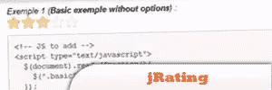
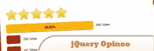
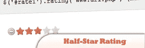
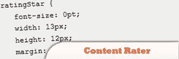
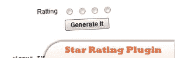
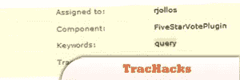
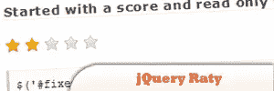
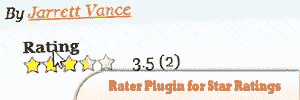
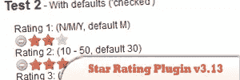

# 10 个 jQuery 评级插件

> 原文：<https://www.sitepoint.com/10-jquery-rating-plugins/>

Ratings, Polls, voting are very common these days! We the developers, use our most of time in searching good scripts for rating/polls. Today I have collected **10 jQuery rating scripts and plugins for better user experience** for your next project. Have Fun!Related posts:

*   [**10 个增强用户界面的 jQuery 插件**](http://www.jquery4u.com/user-interface/10-jquery-ui-plugins/)
*   [**10 jQuery 安全插件**](http://www.jquery4u.com/security/10-jquery-security/)

## 1.jRating

这是一个非常灵活的 jQuery 插件，可以快速创建 AJAX 星级系统。从“星星的数量”到“星星是否能代表小数”，每一个细节都是可以配置的。

## [2。jQuery Opineo 插件](http://plugins.jquery.com/project/Opineo)

Opineo 让你无需注册账户或聘请专家就能完成所有这些工作。这款 DIY 工具让您能够轻松、即时地倾听客户的声音。你所要做的就是上网，设计你的小工具并把它放在你的网站上。

来源

## [3。半星评级插件](http://plugins.learningjquery.com/half-star-rating/)

这是一个用于星级评定系统的 jQuery 插件。这个剧本最初的灵感来自威尔·斯塔基的星级系统。但是原始脚本需要太多的编码。此外，它也没有规定开发一个星级系统(如 GMail，你可以在那里星级或取消星级的电子邮件)。

来源

## [4。使用 ASP.NET、Ajax 和 jQuery 的内容分级器](http://riderdesign.com/articles/displayarticle.aspx?articleid=21)

用 ASP.NET、MS AJAX 和 jQuery 构建一个 MSDN 风格的内容分级器。

来源

## 5.jQuery 星级插件

这是 Ritesh Agrawal 创建的 star rating 的黑客版本，它将一组单选类型的输入元素转换为 star rating 类型，并保留单选元素的名称和值，因此可以与您的表单集成。它相当于一个普通的单选按钮。

## [6。TracHacks](http://trac-hacks.org/ticket/6693)

按照现在的情况，这个黑客在一个单独的表中创建所有的投票。由于我使用投票来对人们认为重要的票证/错误/功能进行排名，因此了解哪些票证有什么评级是很有用的。

来源

## [7。jQuery Raty——一个星级插件](http://www.wbotelhos.com/raty/)

jQuery Raty 是一个自动生成可定制星级的插件。

来源

## 8.新的 jQuery 星级评分插件

jQuery Star Rating 小部件是一个可以添加到您的网站的简洁控件。它有许多选项，让您可以轻松地定制它。

## 9.jQuery 星级插件测试版

这是我快速和肮脏的重新创建一个星级插件。这是一个完全可降解的插件，基于简单的表单结构创建星级评定界面。

## 10。jQuery 星级插件 v3.13

星级插件是 jQuery JavaScript 库的一个插件，它基于一组单选输入框创建一个不显眼的星级控件。

来源

## 分享这篇文章