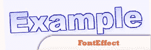
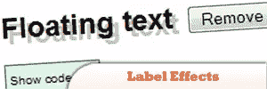
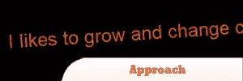
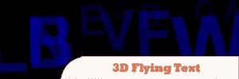
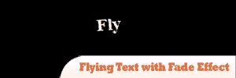
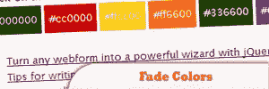

# 10 个 Magicial jQuery 文本效果插件

> 原文：<https://www.sitepoint.com/10-jquery-text-effect-plugins/>

10 个神奇的 jQuery 文本效果插件，让你的网站更受关注！jQuery 不仅仅是菜单和动画效果。使用 jQuery，您还可以创建吸引人的文本效果，并与文本一起玩，以便与用户很好地交流。使用此集合，您可以创建文本渐变、文本飞行效果、文本发光等等。尽情享受吧！

## [1。代号彩虹](http://labs.dragoninteractive.com/rainbows.php)

我们使用一些 JavaScript 和 CSS 魔法对任何文本应用双色渐变。也可以应用阴影和高光。这在大型网站或动态内容上特别有效，因为为每个实例创建图像是不切实际的。

来源

  

## [2。jQuery FontEffect 插件](http://www.iofo.it/jquery/fonteffect/)

字体效果是一个 jQuery 插件，为 html 文本添加一些效果。可用的效果有(目前)轮廓、阴影、渐变和镜像。

来源

## 3.Textgrad:一个 jQuery 文本渐变插件

它包含四个适用于选择的函数:spanize、unspanize、textgrad 和 textscan。

*(2022 年更新:不再提供)*

## [4。jQuery 标签效果](http://keith-wood.name/labelEffect.html)

一个 jQuery 插件，将高亮和阴影效果应用于控件中的文本。

来源

## [5。jQuery 方法](http://srobbin.com/jquery-plugins/jquery-approach/)

Approach 是一个 jQuery 插件，它允许你根据光标与对象的接近程度来设置样式属性的动画。它的工作方式与 jQuery animate 非常相似，但是它是基于距离而不是时间来制作动画的。

来源

## 6.jQuery 中的 3D 飞行文本

这里有一个教程将向你展示如何在 jQuery 中制作 3D 飞行文本。

## 7.机场

一个相当简单的 jQuery 文本效果插件。它模仿了你有时在机场和火车站看到的那些闪烁的信息板的风格。

## [8。jQuery:带淡入淡出效果的飞行文本](http://blog.waiyanlin.net/2008/12/17/jquery-flying-text-with-fade-effect/)

使用这个伟大的 JavaScript 框架 jQuery，您可以创建一些类似 flash 的效果。在这篇文章中，我将展示如何使用 jQuery

[创建非常简单的飞行和渐隐文本效果](http://blog.waiyanlin.net/2008/12/17/jquery-flying-text-with-fade-effect/)

## [9。使用 jQuery](http://www.jankoatwarpspeed.com/post/2009/10/13/Fade-colors-jQuery.aspx) 淡化颜色

本教程将解释如何使用 jQuery 淡化元素数组中的颜色。

来源

## 这是一道彩虹！–使用 jQuery 改变文本和背景的颜色

这里有一个快速简单的方法可以在多种颜色之间平滑地切换。通常你会在 CSS 中定义(背景)颜色，这就结束了。在这种情况下，我们希望能够在页面加载后调整颜色，而不是只调整一次——我们的目标是持续调整。

[来源](http://buildinternet.com/2009/09/its-a-rainbow-color-changing-text-and-backgrounds/)

## 分享这篇文章