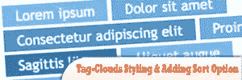
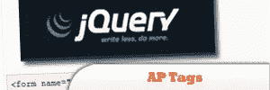
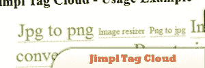
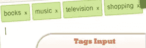
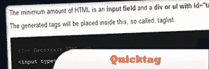
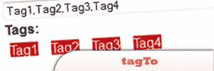
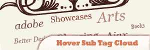

# 10 jQuery 标记和标记云

> 原文：<https://www.sitepoint.com/10-jquery-tagging-tag-clouds/>

A jQuery tag-cloud is a great way of showing visitors to your blog the main topics of interest that are available. Today we listed Most Desirable Collection Of powerful **jQuery and Ajax tag cloud** . We obviously cannot cover all the best from the web, but we have tried to cover as much as possible. Have fun!

## 1.标签云样式和添加排序选项

本文由两部分组成:一部分是标记和样式化标签，另一部分是使用客户端脚本向标签云添加行为。

## [2。构建基于 jQuery 的标签云](http://net.tutsplus.com/tutorials/javascript-ajax/building-a-jquery-powered-tag-cloud/)

标签云是向你的博客访问者展示感兴趣的主要话题的好方法。标签云中还包含其他信息。除了实际的链接本身，它让人们对你的网站所涵盖的主题有一个概念，它们也可以显示不同主题有多受欢迎。

来源

## [3。AP 标签](http://plugins.jquery.com/project/aptags)

AP Tags 是一个简单易用的标签组件，增加了使用单个文本框快速创建标签的能力。这个组件与 WordPress 中使用的标签组件非常相似，但它是一个完全定制的组件。

来源

## [4。Jimpl 标签云](http://plugins.jquery.com/project/JTC)

一个简单的插件，可以在你的页面上创建标签云。它基于 jQuery 框架。你只需要指定标签容器，插件会将文本从它转换成标签云。易于使用和配置。

来源

## 5.jQuery 标签输入

这个插件将把你无聊的标签列表变成一个神奇的输入，把每个标签变成一个有风格的对象，有自己的删除链接。插件处理所有的数据——你的表单只看到一个逗号分隔的标签列表。

## [6。jQuery 快速标签](http://iplantideas.com/quicktag/)

Quicktag 是 jQuery JavaScript 库的一个标记插件。

来源

## [7。tagto jquery 插件](http://chen.xianan.name/projects/tagto/)

一个标签处理的 jQuery 插件，del.icio.us 风格。

来源

## [8。悬停子标签云](http://noupe.com/examples/tagcloud/tag-cloud.html)

使用 jQuery 来减少站点上标签云的大小。当鼠标悬停在主标签链接上时，会出现一个子标签云。

来源

## [9。使用谷歌网络工具包的标签云](http://net.tutsplus.com/tutorials/javascript-ajax/building-a-tag-cloud-using-the-google-web-toolkit/)

它是一种可视化的形式，根据一些预定义类别在云中出现的大小来显示它们在重要性或活跃性方面的差异。

来源

## 10\. Ajax TagCloud

这个想法太符合法比奥·蒙特·阿莱格雷的 Pensaletes 3.0 网站的设计了，标签云附在顶部，当有人点击标签时就会加载。除了各种脚本，该网站还使用 Prototype 和 script.aculo.us。

## 分享这篇文章