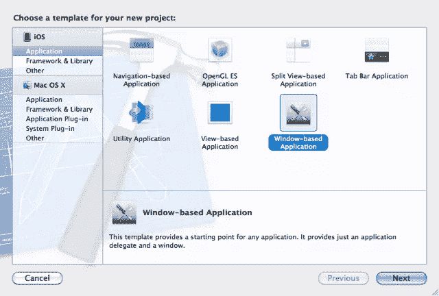
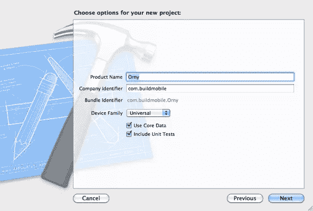
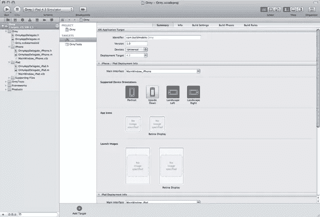
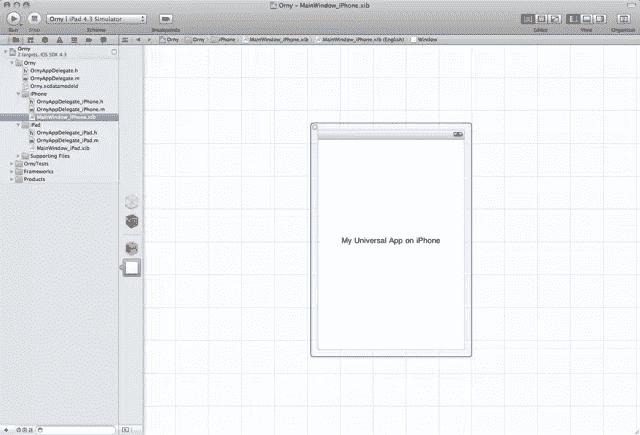
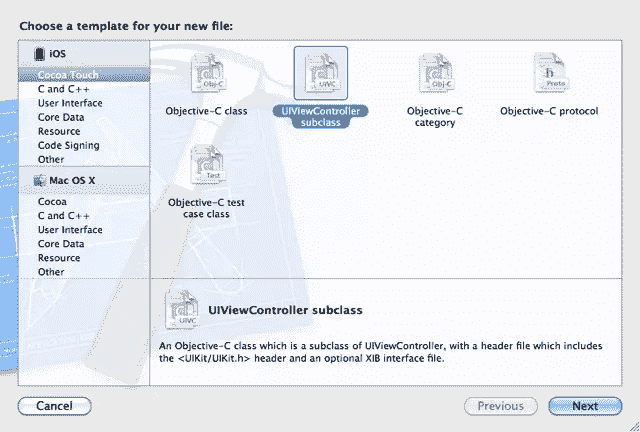
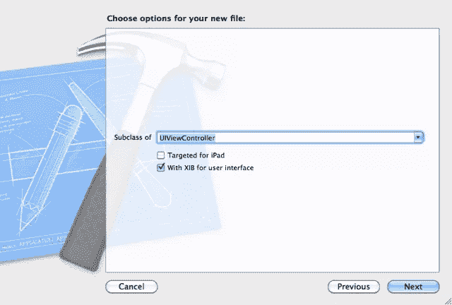
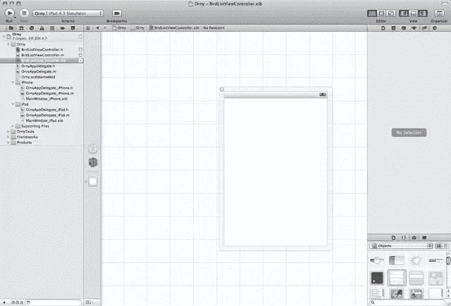
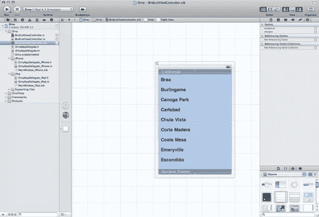
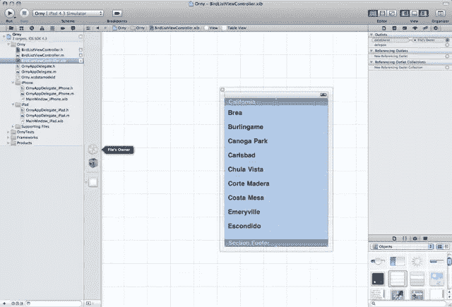
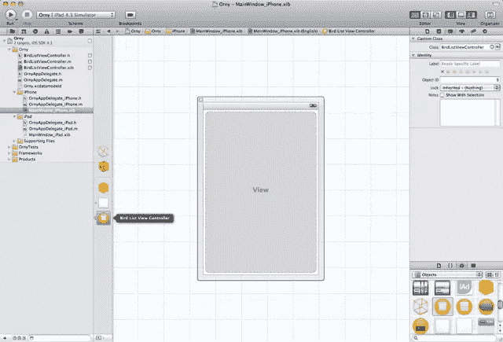

# 带有美味用户界面的 iOS 应用

> 原文：<https://www.sitepoint.com/ios-development-basics-orny-1/>

在本系列接下来的几章中，我们将构建一个应用程序来帮助业余鸟类学家识别和记录他们遇到的鸟类。我们将非常简单地开始，一点一点地构建应用程序。这是 [Orny](https://www.sitepoint.com/mobile/ios/) 系列。

### 安装

首先，打开 Xcode 并点击“创建一个新的 Xcode 项目”，然后像上一个教程一样，选择“基于窗口的应用程序”。这次我们将使用 Xcode 的内建界面生成器来创建用户界面。

[](https://www.sitepoint.com/wp-content/uploads/2011/05/Figure110.png)

图 1

在下一个屏幕上，给它命名。我把我的名字叫做“Orny ”,所以你应该跟着它走。确保“设备系列”设置为“通用”，并选中“使用核心数据”和“包括单元测试”框。这一次我们不会对 CoreData 和单元测试做任何事情，但我们会在未来的教程中做:计划是随着系列的进行，我们会不断修改这个应用程序，直到我们有一些假设可以发布的东西！

让一个应用程序“通用”意味着它可以在 iPhones 和 iPads 上运行。创建一个适合这两个设备系列的 UI 需要做更多的工作，因为这通常意味着创建两个支持相同控制器的独立 UI。

[](https://www.sitepoint.com/wp-content/uploads/2011/05/Figure23.png)

图 2

点击“下一步”, Xcode 将生成您的应用程序。

### 你的众多杰出的应用代表

好吧。和以前一样，但是不一样！您会注意到现在有三个 AppDelegates，而不是一个，即`OrnyAppDelegate`、`OrnyAppDelegate_iPhone`和`OrnyAppDelegate_iPad`。哇哦！怎么回事！？

[](https://www.sitepoint.com/wp-content/uploads/2011/05/Figure31.png)

图 3

请记住，我们已经使这个应用程序通用。Xcode 事先不知道这个应用程序将在哪个设备上运行，所以它给每个设备一个单独的代码入口点。iPhones 运行`OrnyAppDelegate_iPhone`，iPads 运行`OrnyAppDelegate_iPad`。这意味着您可以为每个设备实现完全不同的 ViewControllers 和视图。

“但是等等！”你很有帮助地反对道，“这肯定意味着我必须做双倍的工作吗？”

不是这样的，温柔的开发者！您的两个特定于设备的 AppDelegates 从您的`OrnyAppDelegate`类继承功能。这意味着你在`OrnyAppDelegate`上写的任何代码也会出现在`OrnyAppDelegate_iPhone`和`OrnyAppDelegate_iPad`上。免费的。

当然，你可能想要覆盖你的基类`OrnyAppDelegate`上的一个方法，只是为了 iPad 版本。您也可以这样做，因为在`OrnyAppDelegate_iPad`或`OrnyAppDelegate_iPhone`中实现的任何消息都将覆盖父节点上具有相同*签名*(名称和参数)的消息。

您可以在`OrnyAppDelegate_iPhone.h`的第 12 行看到我们声明一个类是另一个类的父类:

```
@interface OrnyAppDelegate_iPhone : OrnyAppDelegate {

}
```

那`@interface OrnyAppDelegate_iPhone : OrnyAppDelegate`粗略地翻译成*假设存在一个名为`OrnyAppDelegate_iPhone`的类，它是`OrnyAppDelegate`* 的子类(即从其继承功能)。

### XIB 档案

你也有一些 XIB 的文件，`MainWindow_iPhone.xib`和`MainWindow_iPad.xib`。XIB 文件是 Xcode 视图的表示，实际上，它们是应用程序的用户界面。

如果你点击一个，你会打开界面编辑器。我们马上就要探索这个观点。

[](https://www.sitepoint.com/wp-content/uploads/2011/05/Figure41.png)

图 4

### 一个 ViewController 来为它们服务

我们希望我们的应用程序能够做的第一件事是显示当地鸟类的列表。我们将创建一个数据结构来包含我们想要显示的信息，然后使用一个“UITableView”向用户显示这些信息。

### 创建鸟列表视图控制器

让我们添加一个 ViewController。我们将在我们的两个 AppDelegates 和两个器件系列中分享这一点，因为我们可以做到这一点。

点击“文件>新建文件”或点击“命令+N”。

[](https://www.sitepoint.com/wp-content/uploads/2011/05/Figure51.png)

图 5

Select ‘UIViewController’.

[](https://www.sitepoint.com/wp-content/uploads/2011/05/Figure61.png)

图 6

将“子类化”字段设置为“UIViewController ”,但确保选中“用户界面使用 XIB”。我们想要那个！

在另存为字段中输入“BirdListViewController ”,然后点击“保存”。确保保存到“Orny”项目和文件夹或组中，也称为“Orny ”,默认目标为“Orny”应用程序。

您现在应该有 3 个附加文件:

*   一个头文件，`BirdListViewController.h`
*   一个消息文件，`BirdListViewController.m`
*   一个 XIB 文件，`BirdListViewController.xib`

不错！

### 准备我们的数据

我们需要一个结构来保存我们想要显示给用户的数据。我们将在我们的`BirdListViewController`中创建一个嵌套数据结构，一个包含 NSDictionary 的 NSArray！

让你的`BirdListViewContoller.h`看起来像下面这样:

```
@interface BirdListViewController : UIViewController {

}

- (void)loadBirdData;

@property (nonatomic, retain) NSMutableArray *birds;

@end
```

我们添加了一个方法签名`- (void)loadBirdData`和一个`@property`。

记住——我们需要`@synthesize`我们的`@properties`,所以在`@implementation`声明之后，向`BirdListViewController.m`添加下面的代码行:`@synthesize birds;`

在文件的更下方(接近末尾的某处)，将下面的消息实现添加到`BirdListViewController.m`:

```
#pragma mark UITableViewDataSource methods

- (void)loadBirdData {
    birds = [[NSMutableArray alloc] init];

    // Add a Magpie to our bird array
    [birds addObject:
        [NSDictionary 
         dictionaryWithObjects:[NSArray arrayWithObjects:@&quot;Magpie&quot;, @&quot;magpie.jpg&quot;, @&quot;Black and white and crafty all over!&quot;, nil]
         forKeys:[NSArray arrayWithObjects:@&quot;name&quot;, @&quot;image&quot;, @&quot;description&quot;, nil]
        ]
     ];

    // And another!
    [birds addObject:
     [NSDictionary dictionaryWithObjects:
      [NSArray arrayWithObjects:@&quot;Rosella&quot;, @&quot;rosella.jpg&quot;, @&quot;A red and blue parrot&quot;, nil] 
      forKeys:[NSArray arrayWithObjects:@&quot;name&quot;, @&quot;image&quot;, @&quot;description&quot;, nil]
      ]
     ];     
}
```

`#pragma mark`为我们自己定义一个关于代码的“注释”;它就像一个注释，但是 Xcode 可以用它来标记我们的代码部分。

我们已经为我们的`birds`属性分配了内存，并将其实例化为一个`NSMutableArray`。数组表示对象的集合。一个`NSArray`是不可变的，也就是说，当它被创建时，它包含你用一个类似于`initWithObjects`的实例化方法扔给它的任何东西。之后，您不能添加或删除项目。

相比之下，`NSMutableArray`是动态的，可以在设备内存限制内动态添加大量对象。

我们继续向我们的`NSMutableArray birds`添加两个对象，它们都是`NSDictionaries`。字典是键值对的集合，就像 PHP 中的关联数组一样。`NSDictionary`和`NSArray`一样，是不可变的，但是它有一个子类`NSMutableDictionary`，可以在创建后修改。

您可以看到，我们正在向字典添加另一个数组，其中包含我们希望字典引用的值。然后我们传递另一个数组，包含我们想要引用那些值的键。一个键在其数组(列表中的名称，图像，描述)中的位置对应于它所代表的值的位置(@"Mapie", @"magpie.jpg", @ "黑白分明，诡计多端！")

我们添加的值都是字符串。在 Objective 中，我们使用@-符号`@"like this"`来表示字符串。

关于这个函数的最后一点，我们用' nil '结束任何对象列表，让我们传递列表的对象知道“嘿，这个列表已经完成了。”

### 关于内存和泄漏

我不想在这里过多地讨论内存管理问题，但是这个问题必须要说。我们已经`alloc`了一个对象，这意味着我们已经为它保留了内存。我们最终必须归还那段记忆，否则我们最终会永远保留它，这就是内存泄漏。

安德鲁·马卡姆在《T2》上发表的关于 iPhone 内存管理的文章对内存管理问题做了一个很好的概述，但是为了简洁明了，我们需要释放我们分配的内存。所以，让`BirdListViewController.m`的`dealloc`方法看起来像这样:

```
- (void)dealloc
{
    [birds release];
    [super dealloc];
}
```

快好了。

### 觉醒

我们已经定义了一个消息来创建我们的数据结构并存储它，但是到目前为止，我们还没有调用它。代码永远不会执行！

稍后，我们的 ViewController 将被另一个对象引入，在本例中，是我们应用程序的窗口。当这种情况发生时，我们需要某种方法来调用我们的方法，这个方法被称为`awakeFromNib`。

在您的`initWithNibName`方法下添加以下代码:

```
- (void)awakeFromNib {
    [self loadBirdData];
}
```

### 编辑视图

现在我们想要编辑我们的 XIB 文件并添加一个 UITableView。点击`BirdListViewController.xib`。

[](https://www.sitepoint.com/wp-content/uploads/2011/05/Figure71.png)

图 7

如果您没有看到右边的实用程序面板，如图 7 所示，请使用 Xcode 界面右上角的三个“查看”按钮中最右边的按钮来查看它们。

首先，从编辑器左侧的对象列表中选择文件所有者对象，它看起来像一个透明的 3D 框。用鼠标右键单击对象，调出 Outlets 菜单，从“View”右边的圆圈画一条线到 UIView，ui View 是一大片白色区域，周围有边框。

界面编辑器左侧的这些图标通常代表代码对象的“连接”。它们本身并不是真正的代码对象，而是指向一些你可以定义和重定义的任意代码块的指针。当应用程序运行时，iOS 知道如何处理它们。

接下来，从位于实用程序面板底部的对象浏览器中，选择一个“UITableView”并将其拖动到位于界面编辑器中间的白色“View”上。

点按表格以选择它，然后点按最右侧工具栏顶部的向右箭头，该工具栏是“实用工具”面板的“连接”检查器。在那里，您将看到我们刚刚添加的“UITableView”的插座。请注意，您也可以右键单击“UITableView”来弹出一个类似的菜单。

[](https://www.sitepoint.com/wp-content/uploads/2011/05/Figure81.png)

图 8

将鼠标悬停在 Outlets 内“dataSource”右侧的圆圈上。点击并拖动，画一条线一直到“文件的所有者”，你会记得这是透明的 3D 框，如图 9 所示。现在，您已经告诉您的“UITableView”从“BirdListViewController”中提取数据。咻！

[](https://www.sitepoint.com/wp-content/uploads/2011/05/Figure91.png)

图 9

### 礼仪和礼节

UITableView 需要任何连接到它的对象作为“数据源”来符合协议。这是对象之间的契约，表示它们支持并期望实现某些方法。

我们需要指定‘BirdListViewController’符合‘uitableview data source’协议，所以在`BirdListViewController.h`中修改它的定义，如下所示:

```
@interface BirdListViewController : UIViewController &lt;UITableViewDataSource&gt; {

}
...
```

意图只能让我们到此为止，我们还必须实现一些方法来支持我们对协议支持的声明。将下面的代码添加到我们之前停止的底部的`BirdListViewController.m`:

```
- (NSInteger)tableView:(UITableView *)table numberOfRowsInSection:(NSInteger)section {
    return [birds count];
}

- (UITableViewCell *)tableView:(UITableView *)tableView cellForRowAtIndexPath:(NSIndexPath *)indexPath {
    UITableViewCell *newCell = [[[UITableViewCell alloc] init] autorelease];
    NSDictionary *thisBird = [birds objectAtIndex:[indexPath row]];

    UILabel *newCellLabel = [newCell textLabel];
    [newCellLabel setText:[thisBird objectForKey:@&quot;name&quot;]];

    return newCell;
}

// fixed font style. use custom view (UILabel) if you want something different
- (NSString *)tableView:(UITableView *)tableView titleForHeaderInSection:(NSInteger)section {
    return @&quot;Some Birds&quot;;
}
```

协议定义了必需的和可选的方法。在这里，我们只实现所需的方法，我们的`cellForRowAtIndexPath`可以使用一些改进，但是我们应该在后面的文章中更详细地介绍这些项目。

### 差不多！差不多！

我们快到了。

我们需要做的最后一件事是设置我们的 iPad 和 iPhone 的‘ui windows’的‘rootview controller’。对`MainWindow_iPhone.xib`和`MainWindow_iPad.xib`重复以下步骤:

1.  打开相关的 XIB 文件。
2.  从对象库中选择一个 UIViewController。
3.  将其拖放到编辑器左侧的实体列表图标中。
4.  选择 UIViewController，并从“实用工具”面板中，单击左侧第三个图标，这是“自定义类和身份”窗格。
5.  将该类的名称更改为“BirdListViewController”。
6.  单击窗口，界面编辑器左侧图标中非常普通的白色方块，再次单击右键显示它的出口。
7.  从“rootViewController”出口右侧的圆圈到左侧列表中的“BirdListViewController”对象拖放一条线。

图 12 演示了步骤 1 到 6，您可以看到在对象库的右下角突出显示了“UIViewController ”,在 Identity Inspector 的顶部显示了新的类名，并且指出了结果“Bird List View Controller”。

[](https://www.sitepoint.com/wp-content/uploads/2011/05/Figure101.png)

图 10

还要注意白色的“窗口”图标，它在步骤 6 和 7 中连接到“鸟列表视图控制器”。你记得 iPhone 和 iPad 的 XIB 文件都需要这样做，对吗？唷！

### 执行！执行！

点击运行。您应该会看到一个“UITableView ”,其中有两行包含 Magpie 和 Rosella。您可以从模拟器返回 Xcode，选择另一个模拟器并再次热运行，以便测试两个设备。

这一章到此为止。我们已经介绍了通用应用程序的创建，在单个 ViewController 中管理数据和编辑视图，最后，在 iPhone 和 iPad 上使用它。下一次，我们将看看增加一些互动性！

## “欧尼”系列

[安迪·怀特](http://twitter.com/arcwhite)在 BuildMobile 上提供了一个在 iOS 平台上开发应用的深度冥想。在手边有一杯可口的提神饮料的前提下，使用标签到所有[或任何](https://www.sitepoint.com/mobile/ios/)文章，或者直接从这个索引跳到一篇文章。

*   [使用 Xcode 4 的 iOS 开发基础知识](https://www.sitepoint.com/mobile/ios/)
*   带有美味用户界面的 iOS 应用
*   [一个互动的 Orny](https://www.sitepoint.com/mobile/ios/)
*   [使用 CoreData 管理信息](https://www.sitepoint.com/managing-information-with-coredata)

## 分享这篇文章