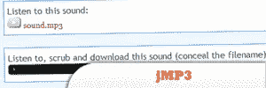
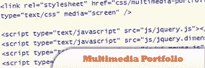
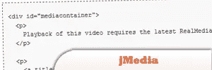
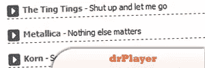
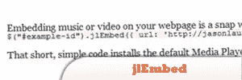

# 9 个 jQuery 音频插件

> 原文：<https://www.sitepoint.com/10-jquery-audio/>

Let jQuery play the tunes, with these fresh jQuery Media Player plugins. They include **in-page mp3 players, media players, html5 audio, flash sound, web itunes player** and heaps more. Crank up the sound! Have fun!Related posts:

*   [**8 款最佳 jQuery 媒体插件**](http://www.jquery4u.com/media/8-jquery-media-plugins/)

## [1。jMP3 (javaScript MP3 播放器)](http://www.sean-o.com/jquery/jmp3/)

这是一个简单的方法，使用时尚的 Flash 单个 MP3 播放器和 fantabulous jQuery，可以让任何 MP3 直接在几乎任何网站上播放(对于那些启用了 Flash 和 JavaScript 的网站)。

来源

## 2.jQuery 多媒体作品集

jQuery 的这个插件将自动检测每个媒体的扩展名，并应用适配的播放器。

## [3。媒体](http://www.contentwithstructure.com/extras/jmedia)

一个 jQuery 插件，用于不引人注目的、可访问的和灵活的多媒体嵌入。

来源

## 4.drPlaye

一个简单免费的 jQuery 插件，用于创建 MP3 播放列表。

## [5。一个非常简单的 jQuery html 5 音频播放器插件](http://jay-notes.blogspot.com/2010/06/simple-player-very-simple-html5-audio.html)

一个 jQuery 插件，允许 web 开发者控制他们网页上的音频文件。通过 CSS 支持风格。所有支持 HTML5 音频标签的浏览器都支持该插件支持的 mp3 或 ogg 格式。

来源

## [6。jme](http://protofunc.com/jme/)

一个带有 Flash Fallback 的 HTML5 音频/视频开发工具包，侧重于灵活性、直观的 DOM-API 和语义代码。

来源

## [7。夜间为 StreamPlug 编写 JQuery 插件](http://ebotros.wordpress.com/2009/03/18/jstreamplug/)

一个先进的网络媒体播放器:它解码 MPEG4 视频流，如 h264，和 vorbis 音频从一个远程文件使用一个简单的 http 服务器。这个 JQuery 插件将帮助你在你的网站/博客上添加一个 streamplug 播放器，一行就足以将播放器显示到合适的大小，并且动态播放媒体，没有任何缓冲时间！

来源

## 8.jQuery 的 jlEmbed

jQuery 的一个插件，可以更容易地将嵌入式媒体播放器添加到你的网页中。有了对 Adobe Flash、Quicktime、Real Player、Silverlight、Windows Media Player 和 YouTube 的支持，您将不再需要为您的音乐或视频硬编码冗长、繁琐和无效的 HTML。

## [9。j player–jQuery html 5 音频/视频库](http://www.jplayer.org/)

是完全免费和开源(GPL/MIT)的媒体库。jPlayer 是一个 jQuery 插件，它允许你快速地将跨平台的音频和视频编织到你的网页中。jp player 全面的 API 允许您创建创新的媒体解决方案，而 jp player 活跃且不断发展的社区则提供支持和鼓励。

来源

## 分享这篇文章