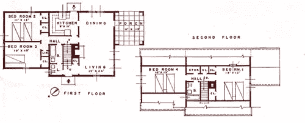

# 不会让人睡着的演示文稿

> 原文：<https://www.sitepoint.com/presentations-that-dont-put-people-to-sleep/>

建筑设计师在展示蓝图时最糟糕的事情是这样的:

“好了，各位，这里你们看到前门了。居住者会从那里进入。然后，他们会走进入口通道。在左边，你可以看到餐厅，天花板很高，有嵌入式照明。穿过餐厅就是厨房。”

你厌烦了吗？

建筑师迈克尔·弗雷德里克解释说，这是一个让你的观众入睡的方法，而不是吸引他们。然而，这通常是我们向客户或团队成员展示我们的可交付成果的方式。会议中的电话、平板电脑和笔记本电脑给了你更多的竞争来吸引听众的注意力。那么，让我们来谈谈为什么创造敬业度如此困难，以及我们如何克服它。

## 你所有的都是艺术品

你做过研究，你有明确的方向感，你希望每个人都能够建设性地讨论你的想法和解决方案。唯一的问题是，你不是在创造最终产品，而是在创造帮助利益相关者*设想*最终产品的文档。其中一些可能是:

*   战略文件
*   路线图
*   个人的
*   线框
*   设计模型
*   原型

在每一种情况下，你都向团队展示了一个被提议的解决方案的工件，而不是解决方案本身(例如，最终产品)。一旦你提出这些想法，人们就开始赋予它们自己的意义。它们的含义可能是，也可能不是你想象的最终解决方案。这就是沟通障碍开始发生的地方。

## 故事的力量

从我们还是孩子的时候起，我们就把这个故事当作发挥想象力的最佳方式。如果我们所拥有的只是我们的人工制品，我们需要在客户的头脑中创造一个愿景，那么还有什么比故事更好的工具呢？一个故事:

*   创建一个设置
*   谈论人
*   培养同情心
*   打开讨论的机会
*   帮助你建立一个观点
*   将讨论从个人观点转移到商业角度的解决方案

在建筑领域也是如此，这就是为什么 Frederick [列出了](http://amzn.to/l5qxRY "101 Things I Learned in Architecture School")六个步骤来让你的观众参与到你所展示的解决方案中。让我们来看看每个步骤，看看它如何应用到 web 上:

1.  **陈述设计问题。**
    如果没有人知道他们在解决什么，所有的解决方案都是无聊的。每个问题都是多方面的。例如，某些产品的转换率莫名其妙的低，人们没有参与到重要的内容中，一个新的计划或部门需要被合并，等等。如果你对利益相关者进行了预先采访，总结一下你从他们那里听到了什么。
2.  讨论你对设计问题的价值观、态度和方法。
    你是如何着手解决问题的？你选择了哪种研究，为什么？概述你使用的不同方法，并解释你如何努力保持客观性。
3.  描述你的过程，以及一路上你遇到的主要发现和想法。
    在这里，你可以更具体地了解你的研究以及解决方案是如何形成的。这是讲故事真正有趣的地方，因为你想让你的观众与使用你试图改进的产品的人产生共鸣。让用户的痛苦、沮丧、矛盾、快乐、喜悦在会议室里活灵活现。我曾经有一个客户开玩笑说，他想在会议的这一部分服用布洛芬。
4.  陈述在你的过程中出现的部分或统一概念。用一个简单的图表来说明这一点。
    我并不总是有一个简单的图表，就像弗雷德里克建议的那样，但是我总是有一个统一的概念。这就是驾驶整艘船和把所有部件粘在一起的东西。如果研究做得很好，并且你有足够的时间来分析结果，我会感觉很明显。
5.  展示你的图纸和模型，总是描述它们与零件的关系。
    现在，你可以在上下文中谈论它们，而不是通过前门来浏览你的文档。你创造了一件艺术品的意义，否则它将是非常二维的。步骤 1-4 已经建立了一个基础，现在你只需要设计房子。
6.  进行谦虚而自信的自我批评。
    当掌声平息后，你可以花一分钟来承认过程中的弱点和你的项目没有解决的领域。

## 当它不是所有的玫瑰

无论计划得多好，在开始任何演示之前，都有一些事情需要注意。留意淹没他人的大嗓门。这些人会扭曲每个人的看法，让平衡的对话变得困难。如果是有议程的利益相关者，情况尤其如此。

我想是卢·罗森菲尔德说过“网站是建立在移动目标上的移动目标。”期望一个无懈可击的完美解决方案忽视了网络的动态本质。每个人都必须接受这种媒体的不断发展，并创造适应它的策略。

记住这些事情，你应该为你的下一个演示做好准备。祝你好运！

## 分享这篇文章