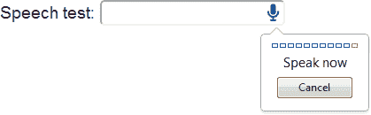

# 如何使用 HTML5 语音输入字段

> 原文：<https://www.sitepoint.com/html5-speech-input-fields/>

我无言以对。这是一个耻辱，因为我可以口授这篇文章直接进入我的浏览器！

最近发布的 Chrome 11 默认开启了语音分析。如果你正在使用 Chrome，请前往 [**语音输入演示页面**](https://blogs.sitepointstatic.com/examples/tech/speech-input/index.html) ，点击麦克风按钮图标…



印象深刻？结果将取决于你的口音和你说的话。我在“HTML5 语音输入”的尝试结果是“html fonts p chip foose”！不过，总的来说，如果系统没有被训练来识别你特定的悦耳音调，那么经常使用的英语单词和数字的解析会令人惊讶地好。

让我们来看看语音输入所需的 HTML 代码:

```
<input type="text" x-webkit-speech />
```

或者，如果您喜欢类似 XHTML 的语法:

```
<input type="text" x-webkit-speech="x-webkit-speech" />
```

x-webkit-speech 属性可用于任何 HTML5 输入元素，包括文本、数字、电话或搜索类型。不幸的是，这在文本区域是不允许的。我怀疑这是为了防止人们长时间使用它，因为这会导致不准确的结果或高内存使用率。

以下 JavaScript 代码可用于测试是否启用了语音输入:

```
 if (document.createElement("input").webkitSpeech === undefined) {
	alert("Speech input is not supported in your browser.");
} 
```

你不太可能需要这个，因为不支持语音的浏览器会显示一个标准的输入框。但是，您可以在分配“onwebkitspeechchange”事件处理程序之前使用它，以便在处理语音后运行函数。

语音输入是最近几个月出现的最具创新性的浏览器技术之一。它很容易实现，并且有几个明显的用途:

*   行动不便者的辅助听写
*   手机和平板电脑的替代输入选项，以及
*   键盘或鼠标不实用的任何环境。

我怀疑我们会在游戏和教育工具中看到怪异而奇妙的用途。

你会在你的应用程序中加入语音输入支持吗？Chrome 比你的伴侣更懂你吗？欢迎所有评论…

## 分享这篇文章