# 光速 iOS 应用程序:Padsteroids 1

> 原文：<https://www.sitepoint.com/light-speed-ios-apps-padsteroids-1/>

我要逆势而为，说为 iPad 写游戏既容易又有趣。大触摸屏、漂亮的显示屏和触摸传感器的准确性只是 iPad 游戏如此受欢迎的几个原因。再加上加速度计和无线网络，你就拥有了一台真正的游戏机。

在这篇文章中，我将使用 iOS 平台的一些非常基本的功能来创建一个简单的 2D 小行星游戏，我称之为“Padsteroids”。通过本教程，你将学到一系列不同的技能，这将有助于你自己的游戏开发。其中包括:

*   如何构建 iOS 应用程序并在 Xcode IDE 中导航
*   如何在视图中实现自定义绘制:视图是 iOS 控件的基本构建块，在这个游戏中我们将构建几个绘制图形和响应触摸的视图。
*   动态生成视图:游戏中的小行星是动态随机创建的。
*   计时器驱动的游戏:在这个例子中，我们将使用计时器来移动船和小行星。
*   图形元素、不透明度、剪辑和渐变:我们将在整个示例过程中使用所有这些元素。

当然，你会一直学习 iOS 和 Objective-C 编程语言。所以让我们开始吧。

### 构建应用程序

创建 iPad 应用程序首先要从苹果开发者网站下载 Xcode 开发环境。如果你还没有一个开发者账户，你需要买一个，这会花掉你一些钱。当然，如果你开发了一款热门游戏，这一切都是值得的。

在漫长的下载、安装和重启之后，是时候开始构建应用程序了。当您启动 Xcode 时，首先会看到如图 1 所示的欢迎对话框。

[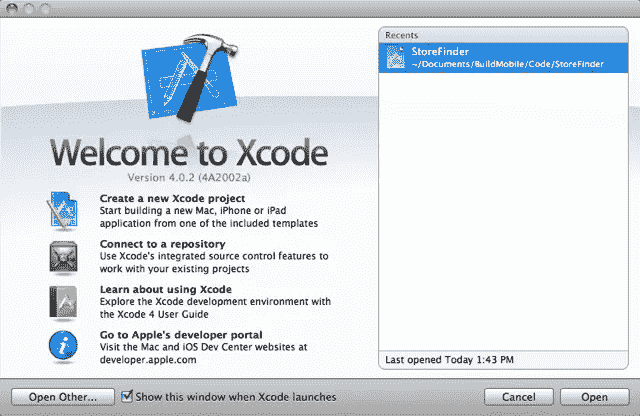](https://www.sitepoint.com/wp-content/uploads/2011/05/Figure1.png)

图 1

这里有很多值得学习和探索的好东西。但是对于本教程来说，要做的事情是点击“创建一个新的 Xcode 项目”。这将打开如图 2 所示的向导。

[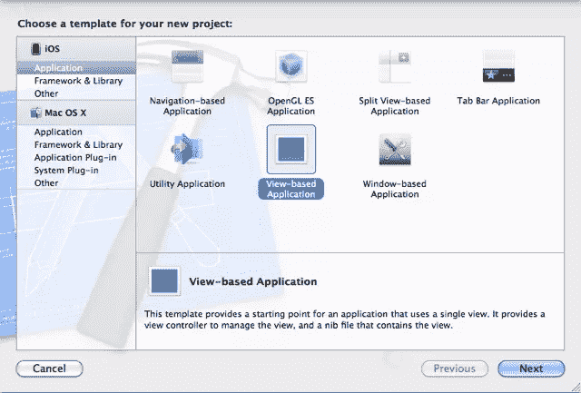](https://www.sitepoint.com/wp-content/uploads/2011/05/Figure2.png)

图 2

在该向导中，我们希望从 iOS 部分选择应用程序，并从中选择基于视图的应用程序。苹果手机、iPad 和 iPod Touch 都是 iOS 平台。您可以使用 Xcode 为 iOS 或 Mac OS X 构建应用程序，这两者有很多相似之处。现在，我们想构建一个 iPad 应用程序，所以它是 iOS。

如果你对 Mac OS X 的构建感兴趣，你将能够重用在本教程中学到的很多技能。两个平台的框架有所不同，但是除了一些名称不同的不同控件之外，UI 开发的基本前提在很大程度上是相同的。

接下来要做的是单击“next”并为应用程序指定一个名称，如图 3 所示。

[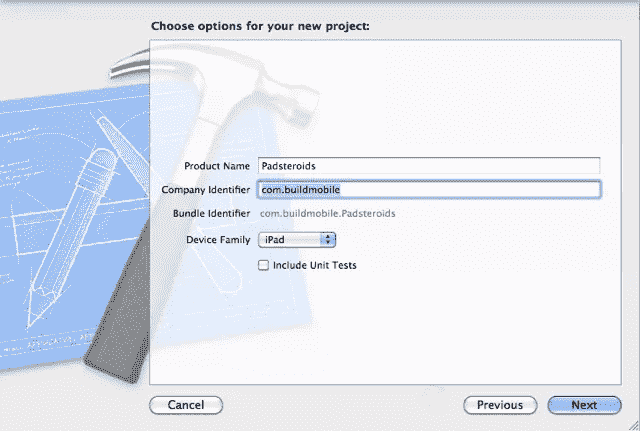](https://www.sitepoint.com/wp-content/uploads/2011/05/Figure3.png)

图 3

我推荐将应用程序命名为 Padsteroids，因为它将帮助你跟随教程。你可以给它任何你喜欢的公司名称。但在点击“下一步”之前，请务必选择 iPad 作为设备系列。如果您选择 iPhone，然后返回并添加 iPad 功能，这可能会变得有点复杂。

单击“Next”将构建项目并打开 IDE 窗口，如图 4 所示。

[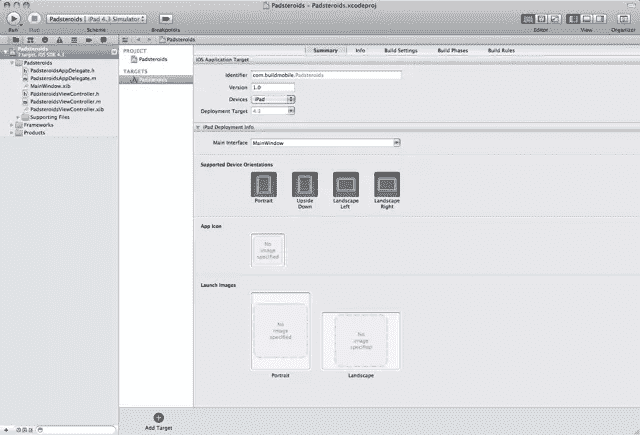](https://www.sitepoint.com/wp-content/uploads/2011/05/Figure4.png)

图 4

这是你将要做大部分工作的窗口，所以要习惯看着它。这里的视图是 Padsteroids 项目的“目标”设置。我们希望对支持的设备方向进行调整，如图 5 所示。这告诉 iOS，这个应用程序支持的唯一方向是横向模式。

[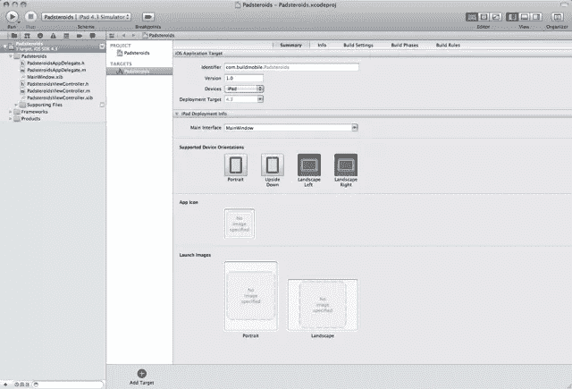](https://www.sitepoint.com/wp-content/uploads/2011/05/Figure5.png)

图 5

从这里开始，下一步是第一次启动应用程序，以确保一切正常。我们按下窗口左上角的“运行”按钮。这将显示一个带有白色大屏幕的模拟器，如图 6 所示。

[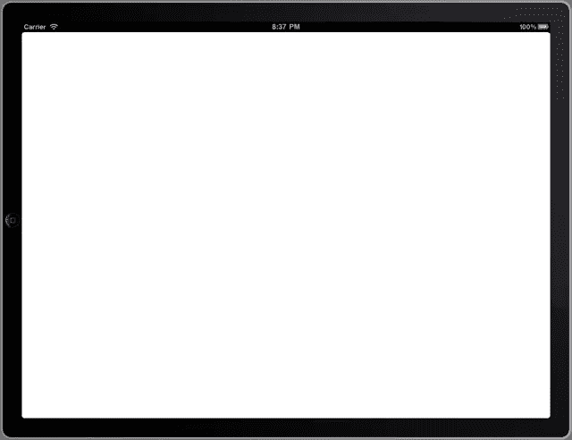](https://www.sitepoint.com/wp-content/uploads/2011/05/Figure6.png)

图 6

太棒了，一切看起来都很棒。在这一点上，你可以说你已经完成了你的第一个 iPad 应用程序，如果你正在构建的是一个手电筒的话。但这肯定不是我们小游戏的终点。所以接下来要做的是构建一个视图，作为游戏界面。

### 构建游戏界面

游戏界面将包含宇宙飞船、小行星以及玩家用来驾驶飞船和发射激光的控件。游戏表面本身就是 UIView 的一个子类。我们通过右键单击 Padsteroids 文件夹并选择“New File”来创建它，如图 7 所示。

[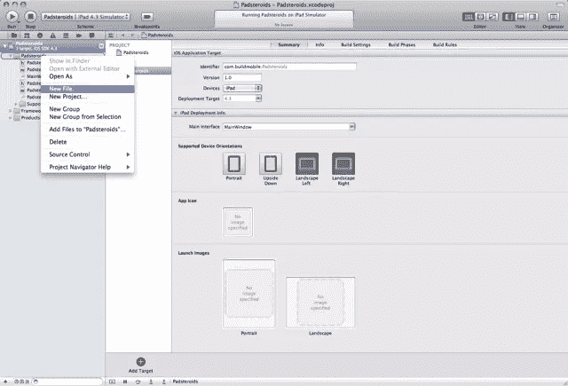](https://www.sitepoint.com/wp-content/uploads/2011/05/Figure7.png)

图 7

这将打开一个向导，我们可以在其中选择 Objective-C class，如图 8 所示。

[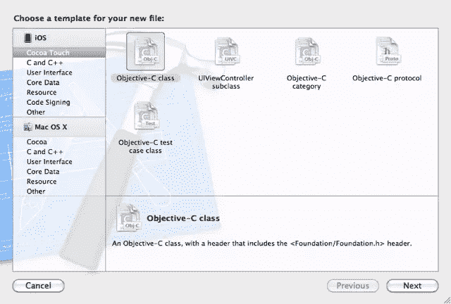](https://www.sitepoint.com/wp-content/uploads/2011/05/Figure8.png)

图 8

从这里我们按下“Next ”,然后指定我们想要一个 UIView 的子类，如图 9 所示。

[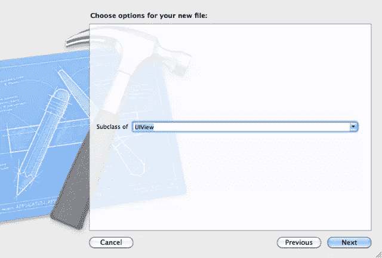](https://www.sitepoint.com/wp-content/uploads/2011/05/Figure9.png)

图 9

UIView 是默认值，所以我们可能只需按“下一步”即可。如果不是当前值，您可以直接输入 UIView，几个字符后文本输入会自动完成。

一旦我们定义了我们想要的类的类型，然后我们指定类名，如图 10 所示。

[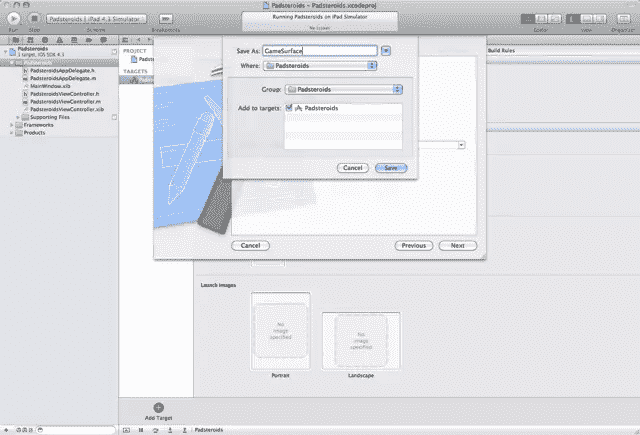](https://www.sitepoint.com/wp-content/uploads/2011/05/Figure10.png)

图 10

将这个类命名为“游戏表面”，然后点击“保存”。对话框将消失，您将看到两个新文件添加到项目中；“GameSurface.h”和“GameSurface.m ”,如图 11 所示。

[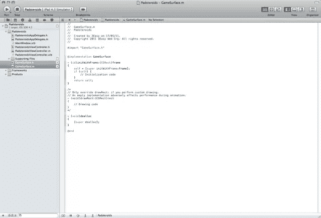](https://www.sitepoint.com/wp-content/uploads/2011/05/Figure11.png)

图 11

目前，我们将让这些文件保持原样。我们稍后将回到它们，并用绘图机制实现它们。现在，我们可以在调整“PadsteroidsViewController.xib”文件时引用它们。

### 将游戏表面添加到视图中

XIB 文件是为 iOS 界面布局控件的便捷方式。它们定义了视图的布局，视图上有什么控件，它们是如何连接的，它们的大小参数，颜色，字体，以及所有这些好的东西。默认情况下，项目创建向导已经创建了两个 XIB 文件。“MainWindow.xib”我们可以放心地忽略，因为它只是主视图的容器。我们将在接下来的几个步骤中修改第二个 XIB，名为“PadsteroidsViewController.xib”。

首先要做的是打开它，如图 12 所示。

[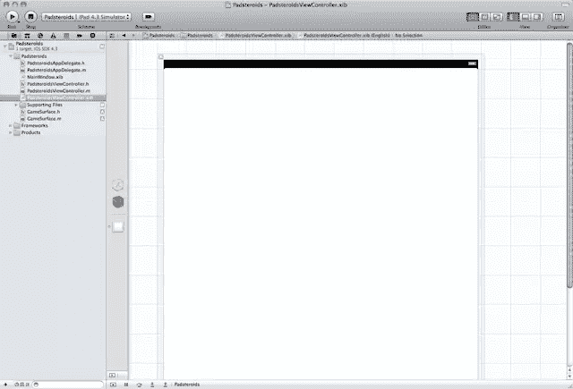](https://www.sitepoint.com/wp-content/uploads/2011/05/Figure12.png)

图 12

正如你所看到的，这带来了第二个非常细的列，有相当大的图标，显示了 XIB 文件的内容，然后是由网格表示的布局区域。因为我们想弄乱主视图，所以让我们通过单击“view”项来选择它。

[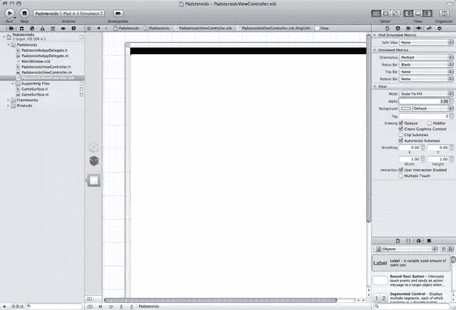](https://www.sitepoint.com/wp-content/uploads/2011/05/Figure13.png)

图 13

显示应该类似于图 13。我们还应该从“视图>实用程序”菜单中选择属性检查器面板。这将打开右侧的面板，其中有许多用于调整颜色、交互性等的控件。需要进行的调整如图 14 所示。

[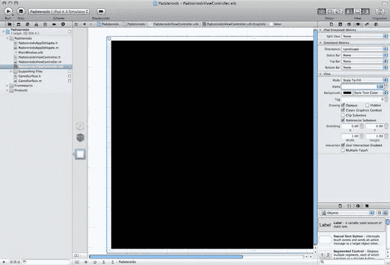](https://www.sitepoint.com/wp-content/uploads/2011/05/Figure14.png)

图 14

背景需要改为“深色文本”，“方向”改为“横向”，“状态栏”改为“无”。这将使背景变黑，并正确定向。我们还需要通过点击尺寸检查图标或使用“视图>实用程序>尺寸检查器”菜单来查看尺寸参数。您可以在图 15 中看到正确的规模选择。

[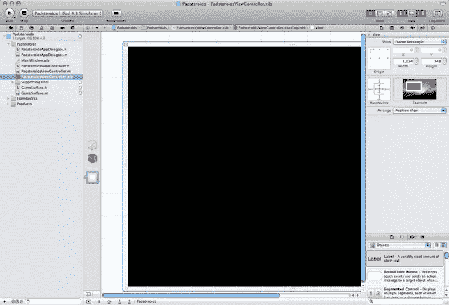](https://www.sitepoint.com/wp-content/uploads/2011/05/Figure15.png)

图 15

视图大小是 iOS 界面布局的一个非常好的方面。中间的两个箭头是“弹簧”。如果它们是纯红色，则表明当父视图改变大小时，该视图将在水平和垂直方向上增大或缩小。箱子周围的工字钢是“支柱”。如果这些是实心的，则视图被锁定到相应的一侧。如果没有，那么视图会随着父容器的调整而移动。编辑器旁边的示例区域展示了一个小电影，展示了给定当前设置后控件将如何工作。

接下来要做的是将游戏表面视图添加到主视图中。看向面板底部的对象区域。向下滚动，直到找到如图 16 所示的视图项。

[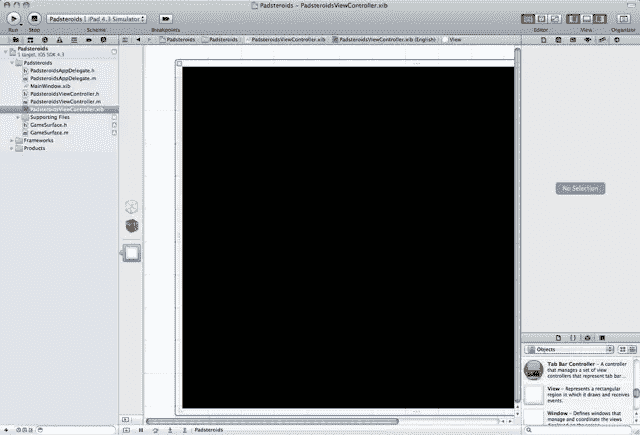](https://www.sitepoint.com/wp-content/uploads/2011/05/Figure16.png)

图 16

现在把它从面板上拖到主视图上。尝试移动它，使左上角位于父对象的左上角，如图 17 所示。

[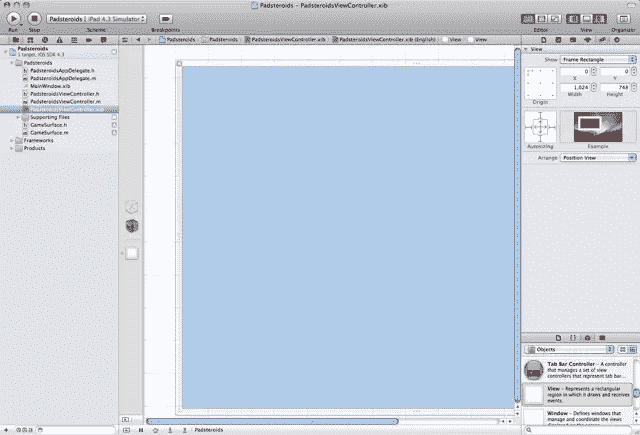](https://www.sitepoint.com/wp-content/uploads/2011/05/Figure17.png)

图 17

如果你做得不完全正确，不要太担心。你可以在尺寸检查器中调整它。现在编辑新视图的 Class 属性，读作“GameSurface ”,如图 18 所示。这是在“身份检查器”中，您可以通过列顶部的图标或“视图>实用程序>大小检查器”菜单调出。

[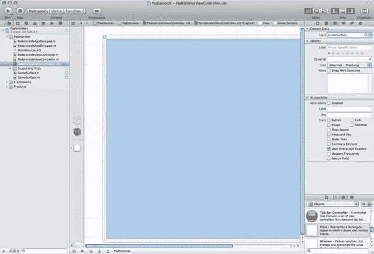](https://www.sitepoint.com/wp-content/uploads/2011/05/Figure18.png)

图 18

输入会自动完成，所以当你开始输入“游戏”时，它会自动填充剩下的部分。当你有了正确的名称来锁定视图类型时，只需按回车键。

还有一些调整要做。进入属性检查器，将模式设置为重绘，将背景设置为深色文本。还要确保“用户交互”被禁用。用户将能够与游戏互动，只是不是通过触摸这个视图。我们稍后会添加一些控件。

正确的设置如图 19 所示。

[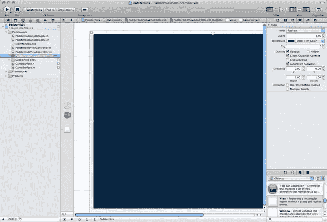](https://www.sitepoint.com/wp-content/uploads/2011/05/Figure19.png)

图 19

现在，前往尺寸检查器，确保左上角的坐标是 X 的 0 和 Y 的 0，宽度是 1024，高度是 748。还要确保所有的弹簧和支柱都被启用，如图 20 所示。这些都是默认值，所以你应该没问题，但它值得仔细检查。

[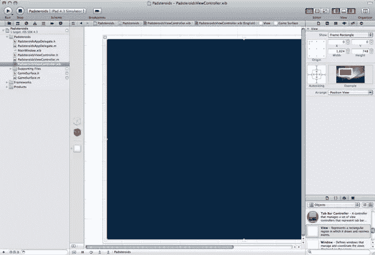](https://www.sitepoint.com/wp-content/uploads/2011/05/Figure20.png)

图 20

现在我们有了一个游戏界面，让我们再次启动应用程序，看看我们有什么。我们应该有一个完美的黑屏，如图 21 所示。

[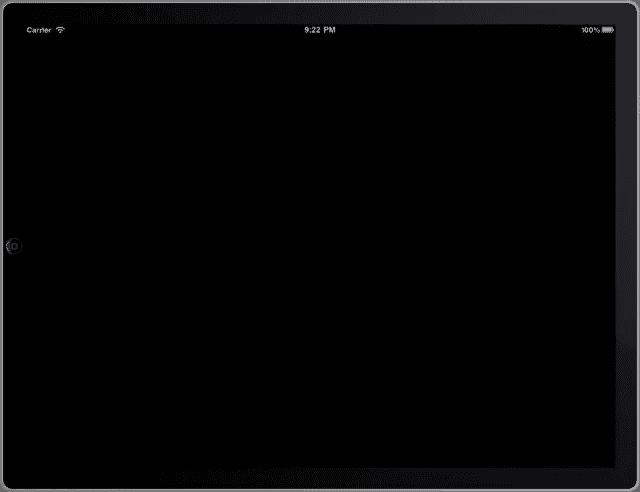](https://www.sitepoint.com/wp-content/uploads/2011/05/Figure21.png)

图 21

到目前为止，一直是点击这个，拖放那个。现在真正有趣的部分开始了。我们要写一些目标 C 代码。

### 游戏界面编码

现在我们开始用 Objective-C 处理图形和编程。打开 GameSurface.h 文件，添加清单 1 所示的成员变量。

**清单 1。GameSurface.h**

```
#import &lt;UIKit/UIKit.h&gt;

@interface GameSurface : UIView {
    CGPoint shipLocation;
    double shipDirection;
}

@end
```

CGPoint 结构维护玩家飞船的位置。双精度值代表船面对的方向。

现在，要绘制船只，请转到 GameSurface.m 文件，进行清单 2 所示的修改。

**清单 2。GameSurface.m**

```
#import &quot;GameSurface.h&quot;

@implementation GameSurface

- (id)initWithFrame:(CGRect)frame
{
    self = [super initWithFrame:frame];
    if (self) {
        shipLocation.x = 0;
        shipLocation.y = 0;
        shipDirection = 0;
    }
    return self;
}

- (void)drawRect:(CGRect)rect
{
    CGContextRef context = UIGraphicsGetCurrentContext();
    CGContextSetFillColorWithColor(context, [UIColor redColor].CGColor);

    CGContextTranslateCTM( context, ( self.bounds.size.width / 2 ) + shipLocation.x, ( self.bounds.size.height / 2 ) + shipLocation.y );

    CGContextSaveGState(context);
    CGContextRotateCTM(context, shipDirection * 0.0174532925 );

    CGContextMoveToPoint(context, 0.0, -15.0);
    CGContextAddLineToPoint(context, 15.0, 30.0);
    CGContextAddLineToPoint(context, 0.0, 15.0);
    CGContextAddLineToPoint(context, -15.0, 30.0);
    CGContextAddLineToPoint(context, 0.0, -15.0);
    CGContextFillPath(context);

    CGContextRestoreGState(context);
}

- (void)dealloc
{
    [super dealloc];
}

@end
```

这里有三种方法；`initWithFrame`，它是构造函数，`drawRect`，它绘制图形，`dealloc`，它是析构函数。`initWithFrame`代码简单地将坐标设置为 0，0，这是屏幕的中心。为了简单起见，飞船坐标都是相对于屏幕中心的。船从 0 度角开始向上。

方法是真正有趣的地方。所有的工作都是通过核心图形库(CG)完成的。它从获取绘图的上下文开始。然后，它使用平移和旋转将中心点移动到屏幕的中间，并启用旋转。然后，代码通过使用 *move-to* 和 *line-to* 函数创建一条路径来绘制船只。最后，它用在函数顶部定义的红色填充颜色填充路径。

在这段代码中，您可以看到 Objective-C 编程的本质。这些方法都是 Objective-C 语法。但是核心的图形调用都是传统的 C 语言，Objective-C 是建立在 C 语言之上的，所以如果你懂 C 语言，那么你需要学习的就是有趣的方括号调用和增加目标功能的类定义扩展。

客观-简单还是直观，不是真的。但是当你掌握了窍门之后，你甚至可能会喜欢上它。此外，考虑到苹果在移动领域的市场份额，不学习这些工具毫无意义，不管它们乍一看有多奇怪。

那么，这个项目现在是什么样的呢？让我们把它发动起来看看。如果一切正常，我们应该得到类似于图 22 中的屏幕截图。

[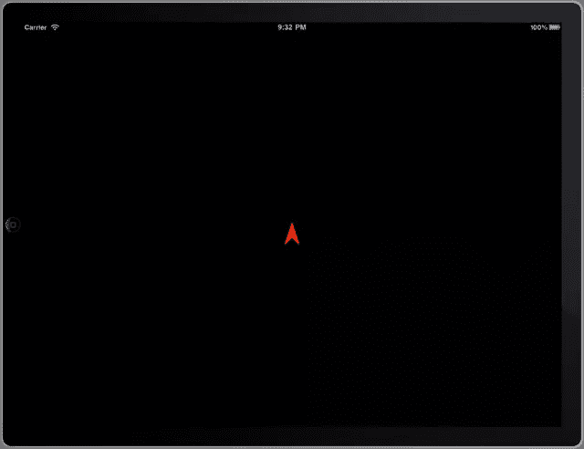](https://www.sitepoint.com/wp-content/uploads/2011/05/Figure22.png)

图 22

当然，这还不是一款令人惊叹的电子游戏。但是一步一步地教你玩电子游戏需要一点时间。

### 到目前为止发生了什么，接下来会发生什么

到目前为止我们学到的其实还挺多的。我们已经学习了如何创建一个应用程序，如何定义新的类，如何使用界面构建器，如何进行一些基本的 Objective-C 编码，以及如何在视图上绘制图形。

这个 Padsteroids 系列的下一篇文章将开始增加交互性，以及增加小行星的额外视图，这些小行星将作为你以前的太空冒险家的目标。

## 分享这篇文章