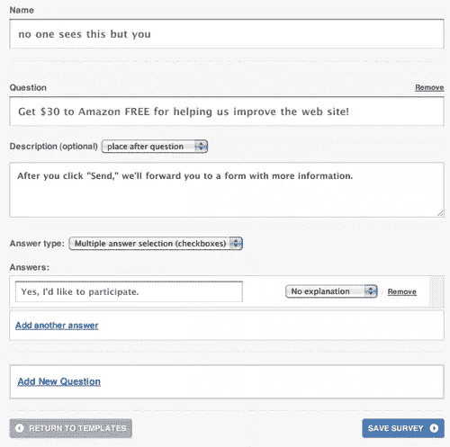
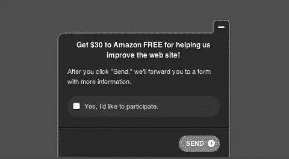
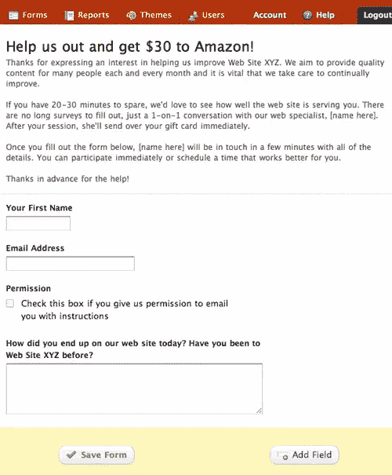
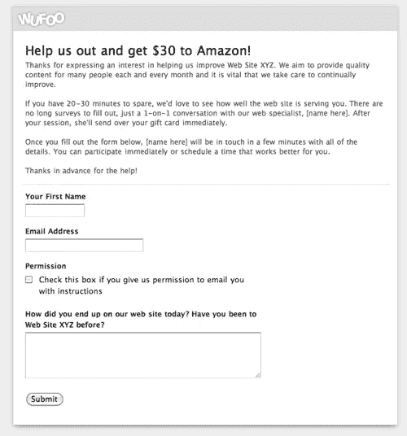
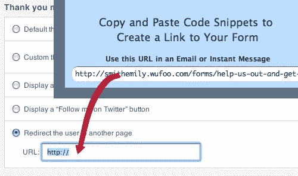
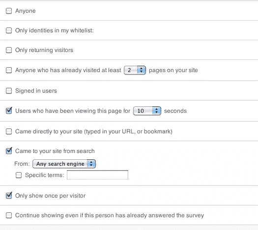
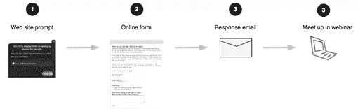

# 用户访谈和对网站访问者的测试

> 原文：<https://www.sitepoint.com/users-interviews-and-tests-site-visitors/>

实验室中高度严格的可用性测试有其存在的理由，但不在本文中。

如果你现在就想见到正在使用你的网站的人，问他们问题，看他们使用这个网站，那么这篇文章就是给你的。使用这个简单的过程，廉价和免费的现有网络工具，你可以与你的网站访问者交谈。

以下是如何做到这一点:

## 第一步:邀请他们参与

你需要一种方法来邀请你网站上的人参与进来。最重要的部分是，它在不惹人生气的情况下抓住了注意力，用激励来引导，并迅速让他们进入第二步，在那里你可以解释更多。你只是在激起我的兴趣。

为此我使用了 KISSInsights，这是一个用于收集 KISSMetrics 人员的网站反馈的简洁的小产品(我与他们没有任何关系，但我喜欢他们的产品)。你不能用免费账户定制提示，所以你必须在运行你的活动时支付 29 美元/月。

要自定义提示，请按如下方式设置:

设置 KISSInsights 提示

确保选择一个你可以轻松实现的激励。更多的金钱价值并不总是等同于最好的回应率——我用这种方法获得的最大成功并没有花费我的客户任何实际的金钱，因为这是一种观众高度重视的数字产品。因此，以激励开始，友好地寻求帮助，礼貌地请求他们允许进入下一步。

完成调整后，它看起来会像这样:

KISSInsights 提示示例

该提示将从页面底部向上滑动。请确保不要激活它，因为点击“发送”在这一点上不会做任何事情。

## 第二步:获取更多信息

第二步是给他们更多的解释，然后使用一个表格询问他们的姓名、电子邮件地址、联系他们的许可以及任何其他你想用来过滤结果的问题。

坦率地说出你对他们的要求将有助于你找到合适的参与者。另外，人们有权知道他们注册的目的。另一方面，简洁也很重要，因为你只有很小的窗口来增加他们的参与度，否则就会完全失去。保持你的表格字段最小化，只问你真正需要知道的。

我使用一个名为 [Wufoo](http://www.wufoo.com "Wufoo Form Builder") 的产品来创建一个简单的表单，以面向参与者(同样，我与 Wufoo 没有关系)。对于大多数项目来说，免费账户应该足够了。

你可以很容易地调整你的表格的标题，让它上面有你的标志，我总是这样做的品牌连续性。您的表单草稿可能是这样的:

Wufoo 表单生成器

以下是网站访问者点击 KISSInsights 提示符后看到的发布表单:

您可以用自己的徽标替换 Wufoo 徽标

## 第三步:写邮件

上线前的最后一项工作是编写您的电子邮件模板。您将使用这封电子邮件回复那些填写表格的人，感谢他们，并向他们提供说明和电话会议信息。

如果你还没有电话会议服务，有很多可供选择。如果这是一个可用性测试，你需要一个可以看到对方屏幕的测试。我使用 GoToMeeting，但是在谷歌上搜索“网络会议”会引导你找到很多其他的(尝试“免费网络会议”来获得一些免费选项)。使用电话会议服务保护了每个人的隐私，因为你永远不必分享电话号码，它也使其他国家的人更容易参加。

这是邮件的基本结构:

*   衷心感谢他们。你会惊讶有多少人不怕麻烦地帮助你。
*   如果你在做可用性测试，而不仅仅是用户访谈，说明你需要在通话中查看他们的屏幕，以及为什么。向他们保证你无法控制他们的机器，他们有能力随时控制你看到的东西。
*   留下一个位置，你可以在那里粘贴电话会议的链接和号码，让他们知道你会在 10 分钟内等他们。提及您将在电话会议上等待 10-15 分钟，然后向其他参与者开放机会，这可能会有所帮助。做好被放鸽子的准备。

准备好您的电子邮件模板，以便在上线时复制并粘贴到您的电子邮件客户端。

## 第四步:让它活起来

现在您需要将 KISSInsights 连接到表单，以便当他们在步骤 1 中单击“发送”时，表单将被加载。

你可以这样做，在 KISSInsights 的“配置”下的重定向字段中粘贴你的表单 URL。

KISSInsights 会给你一些代码，你需要把它们复制到你的网站上，所以继续这样做吧。确保您将 KISSInsights 提示设置为手动激活，以便您可以随意打开和关闭整个过程。

在“配置”菜单下有很多其他选项，你可以随意修改。您可以很好地控制谁在什么时候看到提示。

KISSInsights 的一些配置选项

好了，现在你可以激活了！根据流量、激励、受众、网站材料、时间和其他因素，你可能会在一段时间内看不到回复，也可能会立即收到回复。你不希望回复越来越多，所以当你收到几个回复时，就停止提示，在你接受更多回复之前处理这些回复。

回顾一下，流程是这样的:

把所有的放在一起

一旦参与者填写完表格，您就发送电子邮件并安排 10 分钟后召开 web 会议。这给了他们足够的时间去洗手间或喝一杯，并允许缓慢的电子邮件传输。它也给你时间来设置你需要的任何录音软件(只是确保在你开始录音之前请求许可)。

你成功了！在这一点上，你成功地与陌生人交谈，看着他们使用你的网站，并且学到了你可能不会学到的东西。

## 分享这篇文章