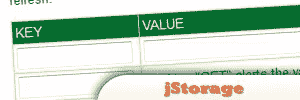
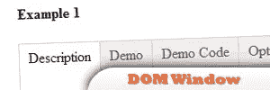
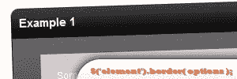
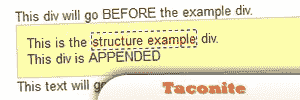
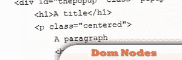
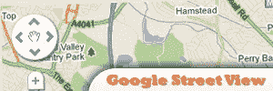

# 10 个 jQuery DOM 插件

> 原文：<https://www.sitepoint.com/10-jquery-dom-plugins/>

10 个非常棒的 jQuery DOM 修改插件，帮助您轻松操作网页 HTML 和媒体元素。jQuery 窗口、数据和 css 模块中的 DOM 插件。

## [1。j 存储](http://www.jstorage.info/)

[来源](http://www.jstorage.info/)

 

## [2。jQuery 折叠器](http://www.aakashweb.com/resources/pages/demos/jquery-collapser/)

[来源](http://www.aakashweb.com/resources/pages/demos/jquery-collapser/)

 

## [3。DOM 窗口](http://swip.codylindley.com/DOMWindowDemo.html)

[来源](http://swip.codylindley.com/DOMWindowDemo.html)

## 4\. domsearch.js

## 5.元素.边框

 

## [6。jQuery Taconite](http://jquery.malsup.com/taconite/#examples)

[来源](http://jquery.malsup.com/taconite/#examples)

 

## [7 号。液体](http://dohpaz.com/flydom/)

[来源](http://dohpaz.com/flydom/)

 

## [8。DOM 节点](http://www.sylvain-mathieu.com/jquery/plugins/create-dom-nodes)

[来源](http://www.sylvain-mathieu.com/jquery/plugins/create-dom-nodes)

## 9.谷歌街景

## 元素 10 .动画

## 分享这篇文章