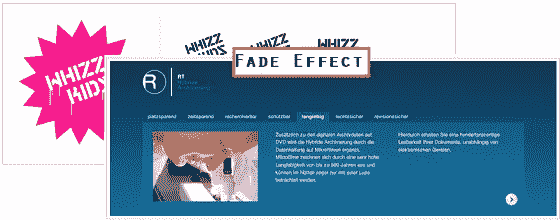

# jquery innerfade image slider

> 原文：<https://www.sitepoint.com/jquery-innerfade-image-slider/>

大家好，我偶然发现了一个非常酷的 jQuery 插件，叫做 innerfade。它基本上旋转存储在列表中的元素，可以是文本、图像、链接等等。这可以与任何容器标签一起使用，如 divs 或 uls、包含 div 的 id、ul 等。

[来源](http://medienfreunde.com/lab/innerfade/)

## 分享这篇文章