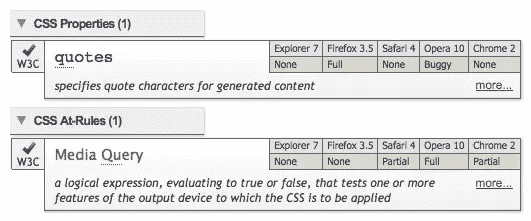
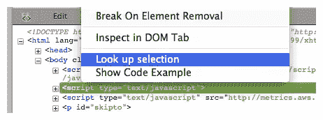
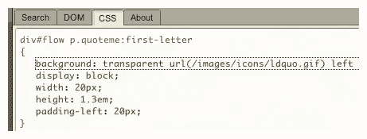

# CodeBurner for Everyone v1.6 版

> 原文：<https://www.sitepoint.com/codeburner-for-everyone-v16/>

我很高兴地宣布 code burner 1.6 版的发布，这是我们面向 web 开发人员的流行参考工具。这个新版本是对所有五个版本的**重大更新，为每个人都带来了新的或改进的东西！**

这比计划的时间要长一点，这主要是因为火狐 4 所需的[变化的程度；这反过来意味着对 Firebug 的修改，所有这些实现起来相当耗时*【总是借口，嗯！]*](https://developer.mozilla.org/En/Updating_extensions_for_Firefox_4.0)

但是我们一直等到所有的五个版本都准备好了，才发布它们，这样每个人都会有相同的版本和相同的更新时间表。所有用户都被鼓励升级 ，并利用许多新功能和改进。

## 1.6 版的新增功能

所有版本最重要的变化是**更新了浏览器兼容性信息**，最新数据来自[网站参考](https://reference.sitepoint.com/)。现在的结果包括支持*谷歌 Chrome* ，以及最新的普通版本*火狐*、 *Safari* 、 *Opera* 和 *IE* :

**来自 CodeBurner 主搜索界面的结果样本。**

### 所有最新的浏览器

这个版本的 CodeBurner 还扩展了它自己的浏览器/环境支持:

For the [Firebug extension](https://getfirebug.com/ "CodeBurner for Firebug")

to Firefox 4.0.x and Firebug 1.7.0

For the [Firefox add-on](https://www.sitepoint.com/browser-devtools-secrets-start-up-network-and-performance/ "CodeBurner for Firefox")

to Firefox 4.0.x or Flock 2.6.x

For the [Opera widget](https://getfirebug.com/ "CodeBurner for Opera Widgets")

to Opera 11.x

For the [Mac OS X Dashboard widget](https://www.sitepoint.com/browser-devtools-secrets-start-up-network-and-performance/ "CodeBurner for Mac OS X Dashboard")

to Mac OS X 10.6

For the [Adobe AIR application](https://getfirebug.com/ "CodeBurner for Adobe AIR")

Adobe AIR 2.5

### 更好的 CSS 检查

所有五个版本的另一个新特性是在特殊搜索中增加了 at-rules。当检查页面的 <abbr title="Document Object Model">DOM</abbr> (从 Firebug 中的 <abbr title="HyperText Markup Language">HTML</abbr> 面板，或者其他版本中的 <abbr title="Document Object Model">DOM</abbr> 标签)时，“特殊搜索”为您提供关于应用于所选元素的所有属性、特性、选择器和 at 规则的信息:

**在 Firebug 的 HTML 面板中特殊搜索选中的元素。**

对于 Opera、Dashboard 和 AIR 来说，这是通过对 CSS utilities 捆绑版本的更新**实现的，它在 <abbr title="Cascading Style Sheets">CSS</abbr> 视图中提供了更全面、更准确的数据。 [CSSUtilities 库](http://www.brothercake.com/site/resources/scripts/cssutilities/)为 <abbr title="Cascading Style Sheets">CSS</abbr> 视图提供了动力，显示关于样式表、它们的规则和属性的信息，以及它们如何应用于 <abbr title="Document Object Model">DOM</abbr> 视图元素:**

**CodeBurner 中的 CSS 视图为 Dashboard。**

### 还有一堆其他的东西！

根据流行的要求，对于 Opera 和 Dashboard 小部件，**小部件窗口现在可以调整大小**，并记住您在会话之间设置的大小。

最后，如你所料，有一大堆针对不同平台的小更新、漏洞修复和调整。不胜枚举，但可以举几个例子:

*   对于 [Firebug 扩展](https://getfirebug.com/ "CodeBurner for Firebug") , **修复了一个布局错误**，当代码示例侧面板关闭时查看参考面板时，有时会折叠搜索表单 ***→ [more](https://getfirebug.com/ "What's new in CodeBurner for Firebug")*** 下的结果表
*   对于 [Firefox 插件](https://www.sitepoint.com/browser-devtools-secrets-start-up-network-and-performance/ "CodeBurner for Firefox") , **修复了特殊搜索**中的一个 bug，来自系统样式表的选择器被包含在“适用于此元素的选择器”**→[更多](https://www.sitepoint.com/browser-devtools-secrets-start-up-network-and-performance/ "What's new in CodeBurner for Firefox")** 列表中
*   对于 [Opera widget](https://www.sitepoint.com/browser-devtools-secrets-start-up-network-and-performance/ "CodeBurner for Opera Widgets") , **修复了窗口**中搜索区域复选框的渲染故障，这样你可以更清楚地看到它们是否被选中**→[更多](https://www.sitepoint.com/browser-devtools-secrets-start-up-network-and-performance/ "What's new in CodeBurner for Opera Widgets")**
*   对于 [Mac OS X Dashboard widget](https://www.sitepoint.com/browser-devtools-secrets-start-up-network-and-performance/ "CodeBurner for Mac OS X Dashboard") ，**对结果表**的布局进行了改进，例如标题和摘要有了更多的空间并且更容易阅读 ***→ [更多](https://www.sitepoint.com/browser-devtools-secrets-start-up-network-and-performance/ "What's new in CodeBurner for Mac OS X Dashboard")***
*   对于 [Adobe AIR 应用程序](https://www.sitepoint.com/browser-devtools-secrets-start-up-network-and-performance/ "CodeBurner for Adobe AIR")，**对“关于”窗格**布局的改进，比如你可以一眼看出你运行的是哪个版本的应用程序 ***→ [更多](https://www.sitepoint.com/browser-devtools-secrets-start-up-network-and-performance/ "What's new in CodeBurner for Adobe AIR")***

## 你怎么想呢?

在 CodeBurner <abbr title="Head-Quarters">总部</abbr>这里，我们渴望听到您的反馈！**你想看看有什么新功能吗？**有没有你不需要的现有功能，或者你希望对其有更多的控制？我们希望 CodeBurner 尽可能成为最好的参考工具，所以请让我们知道我们可以做些什么来改进它。

## 分享这篇文章