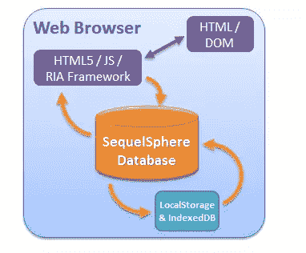

# 十大 jQuery 数据库插件

> 原文：<https://www.sitepoint.com/top-10-jquery-database-plugins/>

10 jQuery Database Plugins to help you connect to your databases and manipulate your data. Dealing with Database is not an easy task especially if you’re a beginner or just starting to get along with the web programming world. These plugins that we have collected is for you to understand and help educate on what are the possible things that jQuery can help you with doing such tasks.

**2013 年 9 月 29 日更新:**添加了 jQuery SequelSphere 插件

## [1。jQuery 集合](http://jsguy.com/?p=55)

如果您有一个小的数据记录集，并且您希望您的用户经常与之交互。也许你想让这个更容易管理；这个插件将帮助你解决这个问题。

来源

 

## [2。动态数据库菜单](http://dynamicjqueryme.sourceforge.net/)

这将向你展示如何在 jQuery 菜单中放置 sql 函数。

来源

 

## [3。MySQL 数据库搜索](http://www.reynoldsftw.com/2009/03/live-mysql-database-search-with-jquery/)

减少每次击键后的数据量。

来源

 

## [4。插入新的数据库记录](http://stephenwalther.com/blog/archive/2010/03/26/using-jquery-to-insert-a-new-database-record.aspx)

使用 jQuery 的强大功能向数据库中插入新记录。

来源

 

## [5。jQuery 客户端数据库](http://plugins.jquery.com/project/jqueryclientdb)

对于小型和不需要任何服务器端脚本。

来源

 

## [6。ImPagePopulate](http://grasshopperpebbles.com/ajax/jquery-plugin-impagepopulate/)

从数据库中检索数据并将其填充到网页上是一项非常繁琐的任务。

来源

 

## 7 .[。表 2CSV](http://plugins.jquery.com/project/table2csv)

这提供了 html 表格到 csv 字符串的转换。

来源

 

## [8。数据库字段的拖放重新排序](http://www.wiseguysonly.com/2008/12/07/drag-and-drop-reordering-of-database-fields-sortables-with-jquery/)

显示数据库中的项目列表，这些项目可以通过拖放操作实时重新排序。

来源

使用 jQuery 的 ajax 函数创建一个使用 JSP 执行数据库连接的功能性登录页面。

来源

 

## 10。数据库的 jQuery 树

[来源](http://www.kensodev.com/2009/05/22/using-jquery-tree-for-database-data/)

## jQuery SequelSphere 插件

SequelSphere 为最常见的 RIA 框架(如 jQuery、Ext JS、YUI 等)提供了“连接器”。)，但它真正的强大之处在于灵活和动态的查询结果，这使得它很容易与任何 RIA 框架集成。

 
[来源](http://www.sequelsphere.com/)

## 分享这篇文章