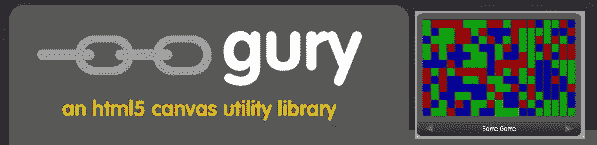
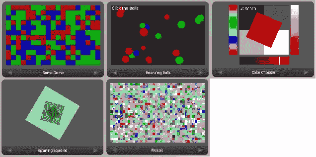

# jQuery HTML5 画布插件 gury

> 原文：<https://www.sitepoint.com/jquery-html5-canvas-plugin-gury/>



嗨，伙计们，我偶然发现了一个非常酷的 html5 canvas 实用程序库，它使用 jQuery to 和 html5 创建了一些带有新 canvas 元素的很棒的动画效果。用 flash 的日子结束了！

[演示](http://guryjs.org/) [API 核心库](https://github.com/rsandor/gury/wiki/API:-Core-Gury)

## 特征



1.  **。画布**–画布的样式/动作
2.  **地点(节点)/。place(selector)**–轻松添加到画布元素
3.  **。size(width，height)**–画布的大小
4.  **。背景(颜色)**–背景颜色
5.  **。register(canvas)**–允许将效果赋予同一页面上的多个画布
6.  **。CTX**–图形上下文

## 用法示例

```
$("my_canvas").size(200, 200).background('black').add(function(ctx) {
  ctx.fillStyle = "red"
  ctx.fillRect(10, 10, 180, 180);
}).draw();
```

## 分享这篇文章