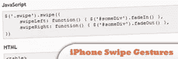
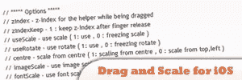
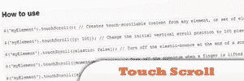
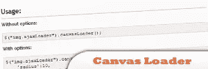
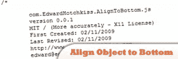

# 10 个非常棒的 jQuery 移动插件

> 原文：<https://www.sitepoint.com/10-jquery-mobile-plugins/>

Here are some awesome jQuery Mobile plugins for you. They are optimized for mobile websites and allow you to perform features such as mobile swipe touch, mobile device detection, mobile browser check, mobile image galleries, mobile drag n drop, mobile touch scroll, mobile ajax calls, mobile css tweaks and more! Enjoy!

移动相关帖子:

*   [**50 jQuery 移动开发技巧**](http://www.jquery4u.com/mobile/50-jquery-mobile-development/)
*   [10 款 jQuery iPhone 风格插件](http://www.jquery4u.com/mobile/10-jquery-iphone-style-plugins/)
*   [10 个免费移动图标集](http://www.jquery4u.com/mobile/10-free-mobile-application-development-icon-sets/)
*   [10 个移动演示网站](http://www.jquery4u.com/mobile/10-jquery-mobile-demo-websites/)

## [1。jQuery SwipeGallery](http://plugins.jquery.com/project/swipeGallery)

针对移动网站优化，支持滑动手势。它是一个轻量级插件，允许通过编写几行 HTML 代码，比如一个无序的图像列表，就可以创建一个图库。

[来源](http://plugins.jquery.com/project/swipeGallery)

## [2。iOS 的拖动和缩放](http://plugins.jquery.com/project/dragNscale)

dragNscale 插件通过在移动平台上触摸和挤压，使选定的元素可拖动、可缩放、可旋转。

来源

## [3。触摸滚动–在 iOS 服务上启用内嵌可滚动内容](http://plugins.jquery.com/project/touch-scroll)

jQuery 插件提供了一种内联滚动内容的方式。它模仿 iOS 设备(iPhone、iPod touch 和 iPad)上的滚动行为来解决“位置:固定在 mobile Safari 中不起作用。这个插件只适用于垂直滚动的内容。它被设计成轻量级和高效的，仅用于此目的。

来源

## [4。继续阅读](http://plugins.jquery.com/project/keepreading)

“继续阅读”插件可用于当页面包含折叠下方的内容时，在屏幕的右下角显示一个小标签。这对于移动浏览器非常有用，因为您可能希望在一个页面上显示一个长表单，以减少网络访问。该标签将提醒用户需要滚动才能查看附加内容。一旦用户滚动页面,“更多内容”标签就会在视图之外显示出来。

来源

## [5。高级浏览器检查](http://plugins.jquery.com/project/advbrowsercheck)

此插件进行全面的浏览器检查(iPhone、iPad、iPod/移动设备/触摸设备支持/操作系统、浏览器名称和版本/插件和 ActiveX 检查/HTML5 支持/CSS3 支持)

[来源](http://plugins.jquery.com/project/advbrowsercheck)

## [6。jQuery 画布加载器](http://plugins.jquery.com/project/canvas-loader)

使用 canvas 元素创建典型 ajax 加载图像的替代方案。可用于替换现有图像，或者您可以创建一个自定义图像来替换页面上的任何元素。这个插件在不支持动画 gif 的浏览器中很有用，比如 Android 的 WebKit。警告:这个插件没有在很多浏览器中测试过，但是它可以在移动 Safari 和 Android 浏览器上运行。

[来源](http://plugins.jquery.com/project/canvas-loader)

## [7。jQuery 移动设备拖放](http://plugins.jquery.com/project/mobiledraganddrop)

这个项目背后的想法是创建一个拖放的例子，它可以在普通的桌面浏览器上工作，但也支持移动设备。这个项目旨在设计一个支持移动设备的拖放式界面。准确地说，大多数移动设备“劫持”了 web 浏览器上的拖动操作，以提供滚动功能，让您的拖放项目静态地停留在页面上。

来源

## [8。将对象底部对齐](http://plugins.jquery.com/project/AlignToBottom)

使用设置的间隔，将对象底部对齐，我们考虑到 iPhone 兼容性。

来源

## [9。jQuery iPhone 滑动手势](http://plugins.jquery.com/project/swipe)

iPhone 和 iPod Touch 滑动手势支持使用 Safari JavaScript 实现 onTouchStart、onTouchMove、onTouchEnd 和 onTouchCancel。该插件使用 Mobile Safari 的内置触摸事件来允许将滑动事件绑定到任何 DOM 元素。当检测到手势时，您可以覆盖 swipeLeft 和 swipeRight defaults 函数来创建您自己的自定义过程。

来源

## 10。iPhone 捏手势

使用 Safari JavaScript 事件的 iPhone 和 iPod Touch 捏手势支持。一个新插件(目前正在开发中)允许将收缩事件绑定到任何 DOM 元素。

来源

请注意，这些插件针对 iPhone、iPod、iPad、Sansung Galaxy S、Andriod 和其他流行的移动设备进行了优化。

## 分享这篇文章