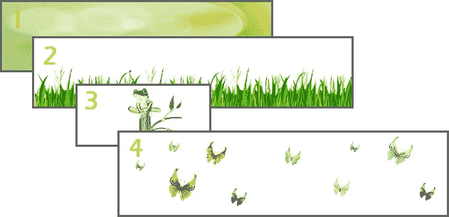
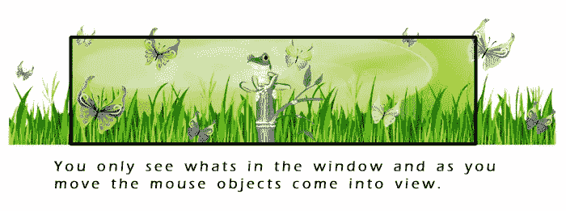

# jQuery 视差教程–动画标题背景

> 原文：<https://www.sitepoint.com/jquery-parallax-tutorial/>

我想我们都同意，当有人访问你的网站时，视差效应可以让你惊叹不已。所以，我想给你看一个真实的 jQuery 视差例子。在本教程中，我将详细解释如何使用 jQuery 创建你自己的视差背景效果，来管理你可以用于标题背景的横幅的动画效果。

**更新:视差插件演示现在在 jQuery 1.6.4+** 上工作。我已经更新了这篇文章、演示和新的下载包，以包含新版本 jQuery 的工作功能。快乐的并行！

[下载](https://github.com/sdeering/jquery-parallax-effect)

## 图像

您将需要视差横幅的背景图像。我选择了 4 张图片来保持简单。我选择了以下 4 张图片(注意图片 2，3，4 是透明的 png):

1.  **图像层 1:** 主背景——绿色矢量背景
2.  **图像层 2:** 叠加图像——青蛙
3.  **图像层 3:** 叠加图像——草地
4.  **图像层 4:** 叠加图像——蝴蝶



这里有几个网站可以免费获得矢量背景图片:
[http://www.freevectordownload.com/Free_Vector_Banners.asp](http://www.freevectordownload.com/Free_Vector_Banners.asp)
[http://www.vectorportal.com/](http://www.vectorportal.com/)
[http://www.vectorjungle.com/](http://www.vectorjungle.com/)
[http://www.vectorjunky.com/](http://www.vectorjunky.com/)
[http://www.vecteezy.com/](http://www.vecteezy.com/)

**注意:**要编辑矢量文件，你需要一个编辑器，如 Adobe Illustrator/Photoshop。

## 代码

你将需要 [jparallax 插件](https://github.com/stephband/jparallax)，jquery.event.frame 和最新版本的 jQuery——包括在你的源代码中。jparrallax.js 插件可能已经包含 jquery.event.frame.js 方法，如果是这样，您可以将其从下面的 includes 中删除。

```
<script type="text/javascript" src="js/jquery-1.6.4.min.js"></script>
<script type="text/javascript" src="js/jquery.jparallax.min.js"></script>
<script type="text/javascript" src="js/jquery.event.frame.js"></script>
```

现在，我们使用 body 标签中的以下标记结构将图像添加到 html 代码中:

```
<div id="parallax" class="clear">
	<div class="parallax-layer" style="width:1200px; height:250px;">
		
	</div>
	<div class="parallax-layer" style="width:500px; height:250px;">
		
	</div>
   <div class="parallax-layer" style="width:1200px; height:300px;">
		
   </div>
</div>
```

然后你添加 jQuery 代码来初始化你的头部标签中的 parallax 插件:

还要添加视差所需的 css 样式:

```
#parallax {
   position:relative; overflow:hidden; width:950px; height:250px;
   background-image:url('background.jpg');
}
.parallax-viewport {
    position: relative;     /* relative, absolute, fixed */
    overflow: hidden;
}
.parallax-layer {
    position: absolute;
}
```

## 收尾工作



平行元素的子元素成为层，并自动被赋予位置:绝对；为了开始移动它们，但是平行元素本身需要位置:相对的；或者位置:绝对；或者层将相对于文档而不是视口移动。溢出:隐藏；停止在视口边界外显示层，宽度和高度应设置为防止视口塌陷。

**提示:**调整图层尺寸，获得你想要的动画速度。与背景层相比，图像越小，鼠标悬停时移动速度越快。青蛙只能左右移动，这是通过与窗口(背景元素)具有相同的高度但宽度较小来实现的。蝴蝶的作用正好相反，当鼠标上下移动时，蝴蝶也跟着移动。

差不多就是这样。希望你在创建自己的 jQuery 动画视差横幅时玩得开心！

## 分享这篇文章