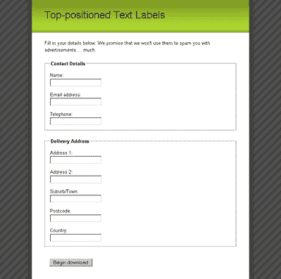
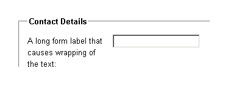
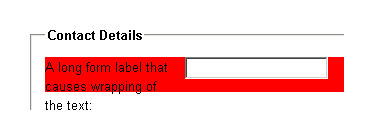
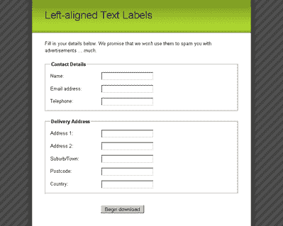
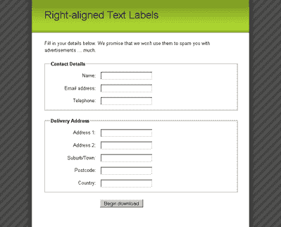

# 使用 CSS 文章的花式表单设计

> 原文：<https://www.sitepoint.com/fancy-form-design-css-3/>

**使用顶端文本标签**

将标签放置在表单元素的顶部可能是最容易实现的布局，因为我们只需要告诉`[label](https://reference.sitepoint.com/html/label/)`占据其父元素的整个宽度。

因为我们的表单元素/标签在有序列表项(块元素)中，所以每一对都会自然地换行，如图 9 所示。我们所要做的就是将表单元素和标签放到不同的行上。

这个练习很容易通过将`[label](https://reference.sitepoint.com/html/label/)`元素变成块元素来完成，这样它们将占据一整行:

```
label {  
display: block;  
}
```

这是一个简单的变化，但是它使表单更加整洁，如图 9 所示。


*图 9:文本标签位于每个表单元素顶部的示例表单*

GA_googleFillSlot(“Articles_6_300x250”);

**左对齐文本标签**

当我们在表单元素的左侧创建一列文本标签时，我们需要做的不仅仅是将它们放在顶部。一旦我们开始浮动元素，所有的地狱打破松散！

为了将标签放置在表单元素旁边，我们将`[float](https://reference.sitepoint.com/css/float)`元素放在左边，并给它们一个明确的`[width](https://reference.sitepoint.com/css/width)`:

```
label {  
float: left;  
width: 10em;  
margin-right: 1em;  
}
```

我们还对每个`[label](https://reference.sitepoint.com/html/label/)`应用了一点点`[margin-right](https://reference.sitepoint.com/css/margin-right)`，这样`[label](https://reference.sitepoint.com/html/label/)`的文本永远不会紧靠表单元素。我们必须在浮动元素上定义一个显式的`[width](https://reference.sitepoint.com/css/width)`,这样所有的表单元素将排列成一个整齐的垂直列。我们应用的确切宽度将取决于表单标签的长度。如果可能的话，最长的表单标签应该不换行，但是不应该有太大的间隙，以至于最小的标签看起来像是没有连接到它的表单元素。在后一种情况下，可以让`[label](https://reference.sitepoint.com/html/label)`的宽度小于最长的`[label](https://reference.sitepoint.com/html/label/)`，因为文本无论如何都会自然换行，如图 10 所示。


*图 10:浮动标签中的文字自动换行*

然而，一旦我们浮动了`[label](https://reference.sitepoint.com/html/label/)`，我们就遇到了它所包含的列表项的问题——列表项将不会扩展以匹配被浮动元素的高度。这个问题在图 11 中非常明显，这里我们对列表项应用了一个`[background-color](https://reference.sitepoint.com/css/background-color/)`。


*图 11: `[li](https://reference.sitepoint.com/html/li)`包含浮动的`[label](https://reference.sitepoint.com/html/label/)`不展开以匹配`[label](https://reference.sitepoint.com/html/label/)`的高度*

确保父级包含其浮动子级的一个无标记解决方案是也浮动父级，所以这就是我们要做的:

```
left-aligned-labels.css (excerpt)  
fieldset li {  
float: left;  
clear: left;  
width: 100%;  
padding-bottom: 1em;  
}
```

如果列表项是浮动的，它将包含所有浮动的子元素，但是它的`[width](https://reference.sitepoint.com/css/width)`必须设置为`100%`，因为浮动的元素试图收缩到最小的宽度。将列表项的`[width](https://reference.sitepoint.com/css/width)`设置为`100%`意味着它的行为仍然像一个非浮动的块元素。我们还在其中加入了一个`clear :left`属性声明，以确保我们不会在`[form](https://reference.sitepoint.com/html/form)`元素周围发现任何不必要的列表项浮动。意味着列表项将总是出现在任何先前的左浮动元素的下面，而不是在它们的旁边。

然而，一旦我们浮动了列表项，我们会在`[fieldset](https://reference.sitepoint.com/html/fieldset)`上发现同样不需要的行为——它不会扩展到包含浮动的列表项。所以，我们必须让`[fieldset](https://reference.sitepoint.com/html/fieldset)`浮动。这是我们之前从`[fieldset](https://reference.sitepoint.com/html/fieldset)`中移除`[padding](https://reference.sitepoint.com/css/padding)`的主要原因——当我们将`[width](https://reference.sitepoint.com/css/width)`设置为`100%`时，任何`[padding](https://reference.sitepoint.com/css/padding)`都会抛出我们的尺寸:

```
left-aligned-labels.css (excerpt)  
fieldset {  
float: left;  
clear: left;  
width: 100%;  
margin: 0 0 1.5em 0;  
padding: 0;  
}
```

这种浮动的疯狂会在哪里结束？保持冷静。它在这里结束，提交`[fieldset](https://reference.sitepoint.com/html/fieldset)`。因为它是表单中的最后一个`[fieldset](https://reference.sitepoint.com/html/fieldset)`，并且因为它不像其他`[fieldset](https://reference.sitepoint.com/html/fieldset)`那样需要太多特殊的 CSS 样式，我们可以永远关闭浮动行为:

```
left-aligned-labels.css (excerpt)  
fieldset.submit {  
float: none;  
width: auto;  
border: 0 none #FFF;  
padding-left: 12em;  
}
```

通过关闭浮动并将`[width](https://reference.sitepoint.com/css/width)`设置回`auto`，最终提交`[fieldset](https://reference.sitepoint.com/html/fieldset)`成为一个清除所有其他浮动的普通块元素。这意味着表单将增长到包含所有的`[fieldset](https://reference.sitepoint.com/html/fieldset)`元素，我们又回到了文档的正常流程中。

submit `[fieldset](https://reference.sitepoint.com/html/fieldset)`中没有任何元素是浮动的，但是我们希望按钮与所有其他表单元素对齐。为了实现这个结果，我们将`[padding](https://reference.sitepoint.com/css/padding)`应用到`[fieldset](https://reference.sitepoint.com/html/fieldset)`本身，这个动作推动提交按钮来排列所有的文本字段。最好让按钮与表单元素对齐，因为它形成了一个直接的线性路径，当用户完成表单时，他或她的眼睛可以跟随这个路径。

在所有这些浮动之后，我们现在有了图 5.12——一个带有表单标签列和表单元素列的表单。


*图 12:标签元素组织在左对齐列中的示例表单*

**右对齐文本标签**

随着所有困难的安全浮动，将`[input](https://reference.sitepoint.com/html/input)`标签向右对齐变得轻而易举；只需在`[label](https://reference.sitepoint.com/html/label/)`元素上设置文本对齐，就可以得到如图 5.13 所示的表单:

```
right-aligned-labels.css (excerpt)  
label {  
float: left;  
width: 10em;  
margin-right: 1em;  
text-align: right;  
}
```


*图 13:`[label](https://reference.sitepoint.com/html/label/)`元素组织在右对齐列*中的示例表单

我们完事了。现在您可以选择最适合您的页面的表单布局，只需更改一点 CSS！

***应用`[fieldset](https://reference.sitepoint.com/html/fieldset)`和`[legend](https://reference.sitepoint.com/html/legend)`样式***

实际上很少看到`[fieldset](https://reference.sitepoint.com/html/fieldset)`以默认的浏览器风格显示。出于某种原因，人们不喜欢它们的外观，我必须承认这些边框和`[legend](https://reference.sitepoint.com/html/legend)`元素不适合很多页面设计。`[legend](https://reference.sitepoint.com/html/legend)`元素是最难设计的 HTML 元素之一，但是你可以使用一些技巧来驯服它们，并且有一些很好的方法来区分使用 CSS 的`[fieldset](https://reference.sitepoint.com/html/fieldset)`元素。

为`[fieldset](https://reference.sitepoint.com/html/fieldset)`元素提供背景色有助于区分`[form](https://reference.sitepoint.com/html/form)`内容和普通内容，并将用户的注意力集中在`[form](https://reference.sitepoint.com/html/form)`字段本身。但是，这并不仅仅是指定一个`[background-color](https://reference.sitepoint.com/css/background-color)`那么简单。

**Go to page:** [1](/fancy-form-design-css) | [2](/fancy-form-design-css-2/) | [3](/fancy-form-design-css-3/) | [4](/fancy-form-design-css-4/) | [5](/fancy-form-design-css-5/) | [6](/fancy-form-design-css-6/) | [7](/fancy-form-design-css-7/)

## 分享这篇文章