# 使用 Adobe Dreamweaver 管理您的 Adobe Business Catalyst 网站

> 原文：<https://www.sitepoint.com/managing-your-adobe-business-catalyst-website-with-adobe-dreamweaver/>

在[之前的文章](https://www.sitepoint.com/blog/)中，我们已经使用 [Adobe Business Catalyst](https://www.sitepoint.com/blog/) 利用其基于网络的工具来建立和扩展在线业务。您可以构建模板、创建页面、管理内容、构建营销活动、构建在线商店、使用表单收集数据以及构建数据驱动的应用程序。基于网络的工具可以让你在任何可以上网的地方灵活地开展在线业务。

在本文中，我们将了解如何使用 [Adobe Dreamweaver](https://www.sitepoint.com/blog/) 作为完全集成的开发环境，与您的 Business Catalyst 帐户中的模板、文件和内容同步。

在本文中，我们将假设我们虚构的客户舞蹈学校想要响应学生对网站上关于他们可以在家做的练习的内容的请求。我们将使用 Dreamweaver 和 Business Catalyst 来构建一个新的 Web 应用程序，并将其集成到站点中。

首先要做的是进行设置，然后规划网站的增强功能。

**设置**

如果您还没有 Dreamweaver，本教程应该是对集成开发环境所能提供的基本功能的一个很好的介绍。除了代码编辑器，还有通过 FTP 将本地文件与远程服务器同步的工具、模板管理工具，以及管理布局、演示和交互功能所需的 CSS 和 JavaScript 支持。

点击此处下载 Dreamweaver [的完整功能试用版。在您注册并安装 Dreamweaver 后，让我们将其连接到您的 Adobe Business Catalyst 帐户。](https://www.sitepoint.com/blog/)

Adobe 为 Dreamweaver CS4 和 CS5 编写了一个扩展来连接到 Business Catalyst。首先在这里下载扩展[。](https://www.sitepoint.com/blog/)

将文件保存在本地，双击该文件以启动 Adobe 的扩展管理器实用程序。接受免责声明，Adobe extension manager 将显示 Business Catalyst 已成功安装。

退出扩展管理器并启动 Dreamweaver，如果默认情况下没有打开，则进入**窗口> Business Catalyst** 打开右侧面板。

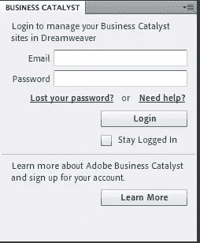

输入您的 Business Catalyst 帐户凭据并登录。该面板将会显示链接到您帐户的网站。

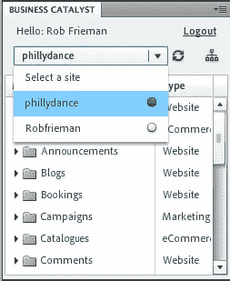

第一次选择站点时，会要求您定义站点，以便您的本地环境可以同步到服务器。资源和文件将被下载到您的本地环境中，并将设置 ftp 设置，以便在您对站点进行更改时，可以从 Dreamweaver 上载它们。

按照提示提供您的登录信息和您想要使用的本地根文件夹，然后会要求您确认是否要下载整个网站—单击 **OK** ，您将看到资产正在下载。

下载完所有站点资产后，您将在 Business Catalyst 面板中看到您的模块，在**文件**面板中看到您的文件和资产:

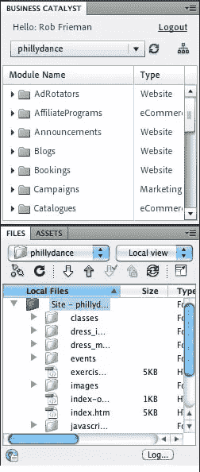

现在，扩展已经安装并配置为与您的远程站点一起工作，让我们来看看您可以从 Dreamweaver 中执行的一些任务。

**计划您的增强功能**

好了，现在工具都设置好了，我们来想想我们要做什么。我总是相信从目的开始，所以让我们简单地陈述我们想要的:学生应该能够查看关于他们可以在家里做的练习的内容；内容应该可以从网站上的任何地方访问，可以由我们或我们的客户扩展和维护(所以这意味着没有静态的 html 页面)。

该项目将分为几个部分:

*   更改模板以向导航添加新的内容部分
*   创建保存练习列表的页面
*   创建 Web 应用程序来管理内容和设计演示
*   将 Web 应用程序模块添加到新页面

Adobe Dreamweaver 和 Business Catalyst 一起将减少执行该项目的一些工作量。最重要的是，这意味着我们不需要编写定制的应用程序代码或直接对数据库进行任何更改——我们可以让工具来处理管道，我们可以专注于为我们的客户提供价值。

**管理模板**

我们首先要看的是模板。如果你以前使用过 Dreamweaver，你会知道它为你的网站管理模板提供了强大的支持。Business Catalyst 扩展使您可以使用现有模板或通过 Dreamweaver 创建新模板，在本地测试它们并上传它们以将其发布到您的站点。

如果您在 Business Catalyst 窗格中导航到 **Templates** 目录并双击您的一个模板，默认情况下，您可以在 **Design** 视图中看到您的模板，该视图是页面的渲染视图，显示您的模板内容以及任何模块或内容标签。

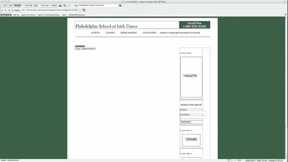

当你点击窗口顶部的 **Split** 选项卡时，你会在左边看到代码，在右边看到渲染视图。

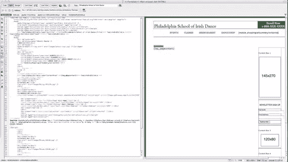

双击呈现页面的一个区域，光标将会跳到页面上的那个点，这样就可以很容易地编辑模板。当您编辑模板时，页面的任何部分都可以被修改，正如您稍后将看到的，使用模板的页面有一些方便的限制，以确保您只更改页面的可编辑部分。

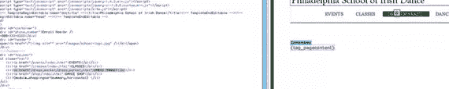

我们已经决定，第一个任务将是扩展公共导航来访问新的部分。因此，我将对顶部导航中的链接集进行更改，添加名为“练习”的新部分。

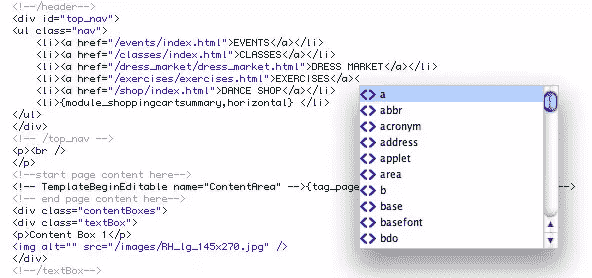

默认情况下，Dreamweaver 通过在您键入时提示代码来加快开发速度。该行为可以根据您的喜好进行调整。我将向模板添加一个新链接，并保存更改。当我保存时，系统提示我是否要更新使用此模板的文件。

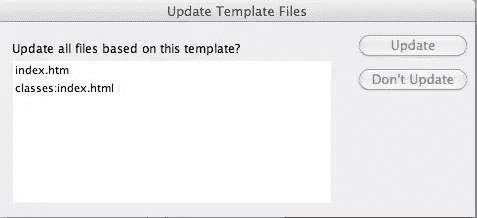

我将点击**更新**，系统将通知我它已成功完成任务。

好了，让我们回顾一下:我安装了使 Dreamweaver 能够与我的 Business Catalyst 帐户集成的扩展，我将本地环境与服务器上的远程文件同步，打开我的一个模板，添加新的导航元素并保存更改。

当我查看远程站点时，还没有应用任何更改。

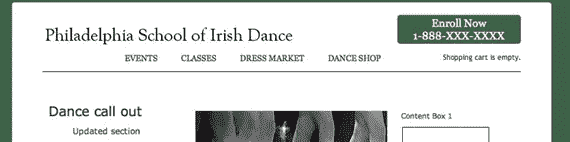

我如何将这些更改发送到服务器？我已经配置了 FTP 设置，现在我只需要用本地更改同步远程服务器上的文件。

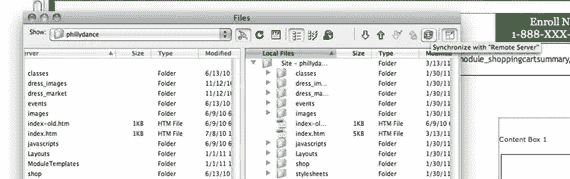

在这个视图中，我移除了我的**文件**窗格，并将其打开以显示本地和远程文件系统。

使用按钮同步两个环境。

为了安全起见，单击按钮后，使用**预览**功能，Dreamweaver 会向您显示将受到影响的文件。

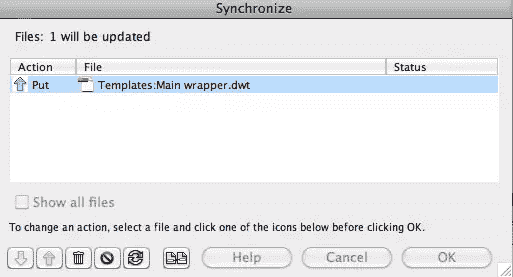

如果我去了网站，我可以看到在网站的主要部分使用的模板已经进行了更改。

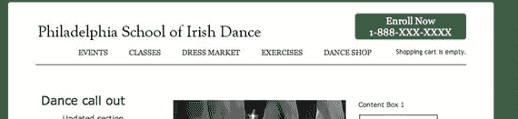
**创建新页面**

使用像 Dreamweaver 这样的开发环境的一大好处是，您可以快速创建新内容。您可以基于模板轻松创建新页面，添加内容，预览页面外观，并将其上传到 Business Catalyst。

进入**文件>新建**然后从模板中选择**页面，在列表中选择您的 Business Catalyst 站点，并选择模板用途。模态向您显示模板的预览，这样您可以确定它就是您想要的。点击**创建**。**

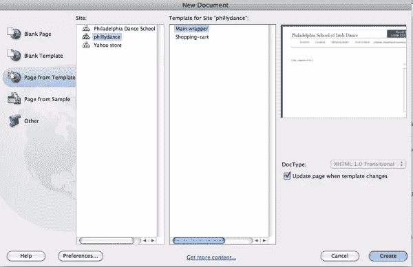

当您切换到**分割**视图时，您可以在左侧**代码**窗格中看到您的代码，并在**设计**窗格中看到可编辑的渲染视图。您的 Business Catalyst 模板已经定义了一个可编辑的**内容区域**，Dreamweaver 限制您只能编辑该代码部分的内容。

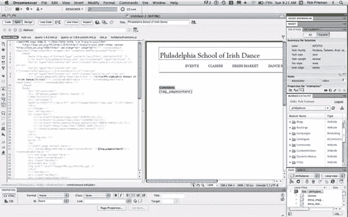

您将在代码视图中看到，您在模板中指定的**内容区域**显示在新文件的注释`<!--InstanceBeginEditable name=”ContentArea” -->`和`<!--InstanceEndEditable-->`中。

Dreamweaver 显示整个页面，就像模板显示内容一样，但只在传输到 Business Catalyst 的文件中写入内容区域。我将使用现有的 CSS 调用添加一个标题和一些文本来创建一个简单的页面。

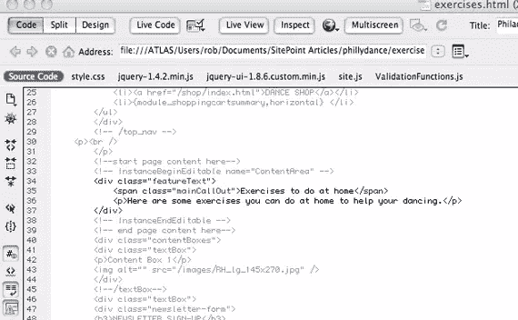

当您在代码视图中创建内容时，**设计**视图会自动更新。您也可以直接在**设计**视图中添加内容。在**设计**模式中，你可以`Command +Option +Click`在渲染页面的一部分上，查看渲染该部分屏幕的代码 CSS 规则和 HTML 模板。

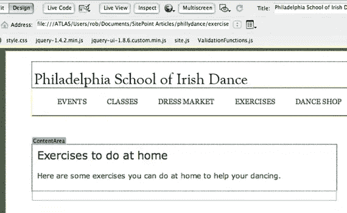

您可以点击进入**实时**查看模式，查看使用 webkit 呈现的页面。这是一个有用的步骤，可以在与远程服务器同步之前再次检查您的更改。

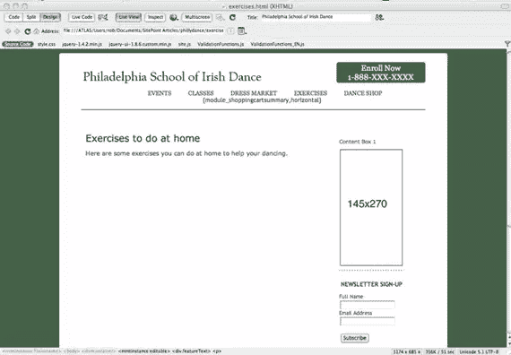

添加完内容后，保存文件，然后同步到远程服务器。如果你进入**网页**，在基于网络版本的 Business Catalyst 中打开页面，你会看到只有页面的一部分会呈现在`{tag_pagecontent}`标签中。您可以联机进行并保存进一步的编辑，然后针对您的本地环境再次将文件与 Dreamweaver 同步。

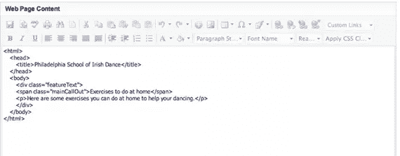

好了，现在我们有了一个新的部分和一个页面。我想在我的网站上添加一个新的**网络应用**，它将允许我或我的客户更新一组关于舞者可以在家做的练习的内容。

**创建新的网络应用**

如果您还记得其他文章，Web 应用程序是数据驱动的应用程序，它允许您定义收集的数据字段，然后控制显示记录列表的所有细节，以及您设计的内容的详细页面。使用 Business Catalyst 可以快速轻松地创建 Web 应用程序，并且不需要您编写代码，但是它们可以让您非常精细地控制数据元素和最终呈现的外观。

创建 Web 应用在[上一篇文章](https://www.sitepoint.com/introduction-to-adobe-business-catalyst-part-3/)中有一些详细的介绍，但是我们在这里将简单介绍一下基础知识。我们将使用 Business Catalyst 创建 Web 应用程序，然后使用 Dreamweaver 将模块添加到我们刚刚创建的页面中。

像我们做的其他事情一样，一个 Web 应用程序从一个计划开始。我们希望在网站上有一个显示练习列表的部分。我们的一个学生点击列表中的一个链接，他们应该会看到一个页面，包括解释这个练习的图片和文字。他们可以回到练习列表，点击其他链接学习其他练习。我们已经创建了部分和登陆页面，但是我们需要创建**列表**和**细节**页面来实现。

在 Business Catalyst 中，转到**模块>网络应用**并创建一个新的**网络应用**。

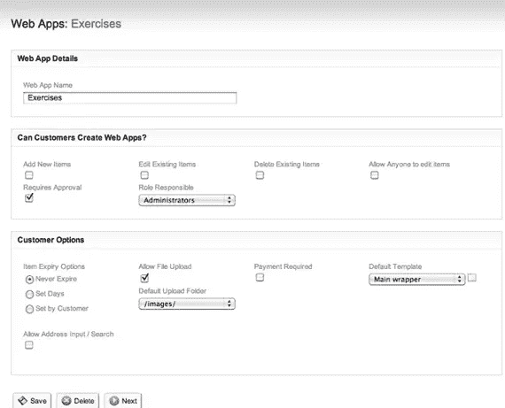

你要做的第一件事是定义你想要的字段——在这种情况下，我会保持简单，为**练习**、**图像**和**指令**添加一个字段。

请记住，Business Catalyst 已经具备处理用户生成内容(包括图片上传)的基础功能，并且您可以定义哪些用户能够在您的 Web 应用程序中创建新页面。我们不会在本文中深入讨论所有细节。对于这个演示，我关心的主要步骤是，一旦定义了字段，我需要定义**列表**和**细节**页面模板的外观。

在**细节**代码中，我将用`div`包装 web 应用程序标签，并调用 CSS 样式来呈现内容。这就完成了我们建立 web 应用程序的结构和外观所需要做的工作。我不打算在本文中回顾它，但是我们也可以使用 Business Catalyst 来设置数据输入页面并限制对特定用户角色的访问。出于我们的目的，我只是直接使用**管理**屏幕中的支架在 web 应用程序中创建了一些内容。

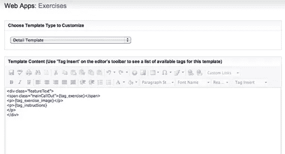
**向页面添加 Web App 模块**

现在我们已经定义了 Web 应用程序，让我们返回到 Dreamweaver，打开 exercises.html 文件，并将模块添加到页面中。在 Business Catalyst 窗格中，向下滚动到 **WebApps** 部分。点击箭头展开列表，然后双击 **Web Apps** 模块。

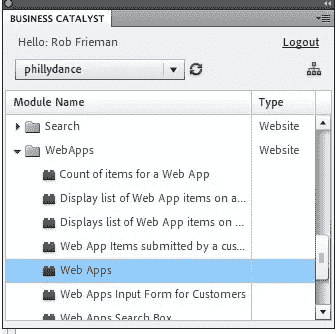

系统会提示您选择要添加到页面的应用程序。您将看到您创建的 Web 应用程序-在这种情况下，您可以看到我们在上一节教程中创建的**服装列表**，以及新的**练习**应用程序。选择你的应用，点击**下一步**。

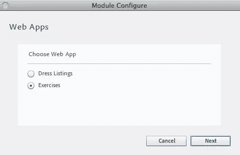

选择要添加到页面的模块类型。因为我想要所有记录的列表，我将选择**所有项目**并点击**下一个**。

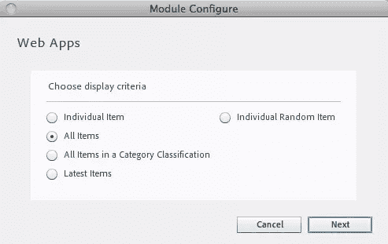

最后一步是单击 **Insert** ，模块标签将被插入到您的页面中。

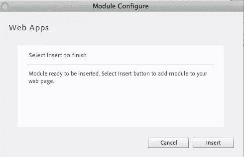

你可以在你的 HTML 中看到`{module_webapps,...}`标签，你可以把它包装成你想要的任何样式。

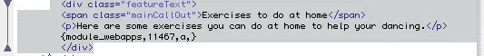

保存对文件的更改，并与远程服务器同步。当您转到已发布的网站时，您可以看到包含列表的新页面:

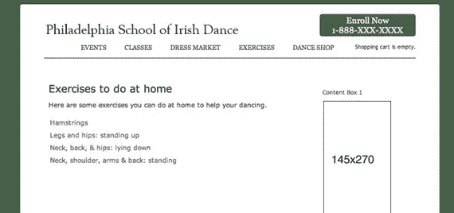

通过点击链接，您可以进入**详细信息**页面:

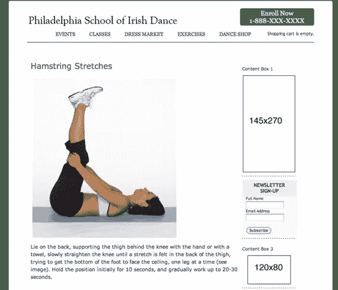
**总结**

让我们回顾一下 Business Catalyst 和 Dreamweaver 带来的一些底层功能:您所要做的就是向桌面提供您的设计技能和想象力，这些工具可以让您非常精细地控制底层字段结构和数据驱动应用程序的前端设计。

只需将模块添加到我们创建的页面上，链接就构建在您的页面上，页面使用您设计的模板呈现，内容基于您和您的客户想要的结构。

Adobe Dreamweaver 是一个非常强大的用于创作网站和 web 应用程序的集成开发环境，我们只是触及了该产品的皮毛。 [Adobe Business Catalyst](https://www.sitepoint.com/blog/) 让您建立和扩展在线业务，而不必承担应用程序和数据库开发的费用和精力。

他们一起可以让你的设计店为你的客户提供优秀的解决方案。

让我知道你的想法！

现在你可以[进行我们编辑的小测验](https://www.sitepoint.com/quiz/adobebusinesscatalyst/managing-your-adobe-business-catalyst-website-with-adobe-dreamweaver/)来看看你从这篇文章中吸收了多少。

**note:**SitePoint Content Partner

本教程是在 Adobe 的支持下完成的。我们与 Adobe 合作，由 SitePoint 独立编写，努力共同开发对您最有用和最相关的内容。

## 分享这篇文章