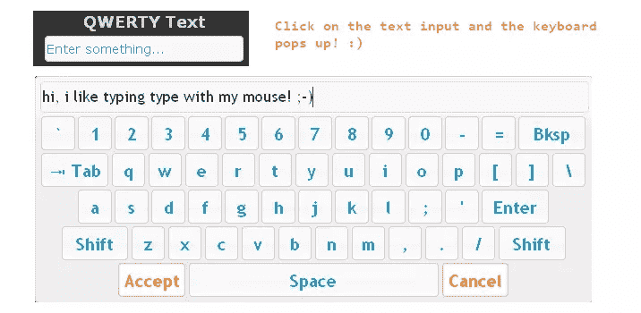

# jQuery 屏幕键盘插件

> 原文：<https://www.sitepoint.com/jquery-screen-keyboard-plugin/>

## 这个移到这里: [jQuery 屏幕键盘](http://www.jquery4u.com/user-interface/jquery-on-screen-keyboard/)



大家好，我偶然发现了一个非常酷的屏幕键盘插件，它使用 jQuery 在用户点击输入字段时在屏幕上显示键盘。它是完全可定制的，你可以改变按键的布局和配色方案。它有点像 windows 辅助键盘，可以用来增强网站的可用性。

如何使用。

1.  下载插件
2.  使用 demo.js 文件作为创建键盘的基础
3.  根据您的键盘布局调整设置(参见下面的代码)
4.  定制 CSS 代码以适合你的网站

[下载页面](https://github.com/Mottie/Keyboard)
[现场试玩](http://mottie.github.com/Keyboard/)

## jQuery 代码

```
$(document).ready(function(){
	// standard keyboard layout
	$('.qwerty').keyboard({ layout: 'qwerty' });

	//control for num keys
	$('#num').keyboard({
layout: 'num',
		restrictInput : true, // Prevent keys not in the displayed keyboard from being typed in
		preventPaste : true, // prevent ctrl-v and right click
		autoAccept : true
});

});
```

```
//code to setup
// Extension demos
$(function() {

	// Set up typing simulator extension on all keyboards
	$('.ui-keyboard-input').addTyping();

});
```

如何从一个简单的超链接加载键盘

```
// *** Hidden input example ***
// click on a link - add focus to hidden input
$('.hiddenInput').click(function(){
	$('#hidden').trigger('focus');
	return false;
});
// Initialize keyboard script on hidden input
// set "position.of" to the same link as above
$('#hidden').keyboard({
layout: 'qwerty',
	position : {
		of : $('.hiddenInput'),
		my : 'center top',
		at : 'center top'
	}
});
```

## 分享这篇文章