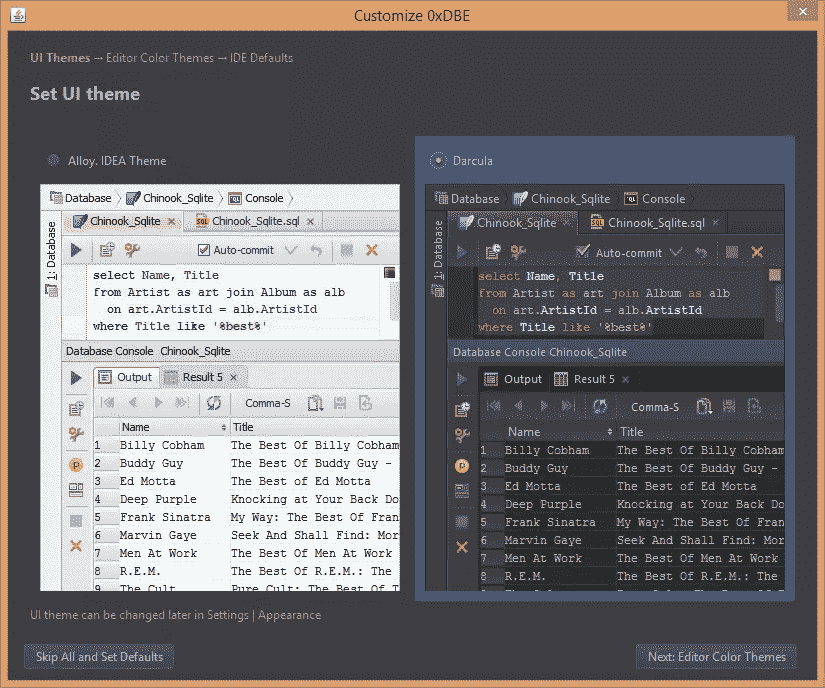
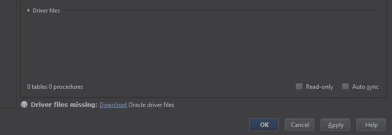
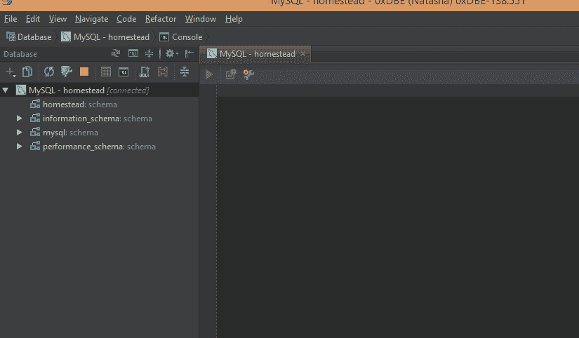
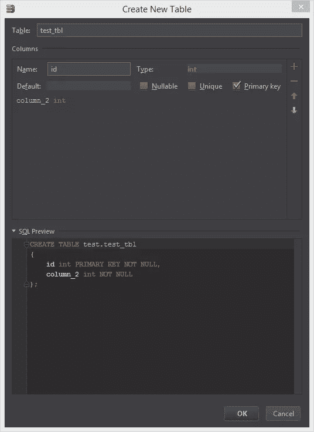

# 0xDBE:初看

> 原文：<https://www.sitepoint.com/0xdbe-first-look/>

0xDBE 是一个新的数据库管理工具，旨在使原本极其贫瘠的环境恢复正常。当然，还有其他工具，但它们都经常表现不佳——无论是在稳定性方面，还是在功能方面。

0xDBE 是 Jetbrains 试图让它正确。不要让这个名字迷惑了你——它不是最终的。DBE 代表“数据库环境”,而 0x 只是对其十六进制表示的一个讽刺。在这篇文章中，我将看看 EAP 版本——请注意，一切仍在变化，Jetbrains 仍在收集反馈和功能请求(在[问题跟踪器](http://youtrack.jetbrains.com/issues/DBE)中已经超过 400 个！)在他们发布第一个正式版本之前。

注意，我将把这个工具作为 Workbench / PhpMyAdmin 转换工具来使用，因此在这个问题上可能不完全客观。然而，第一印象帖子的意义并不在于客观。我将使用该工具执行一些非常基本的任务，并在某种程度上将其与主要竞争对手 Workbench 进行比较。还要注意，我将在本例中测试的 EAP 是版本 138.551。

## 支持的数据库引擎

0xDBE 将在版本 1 中支持所有主要的 SQL 引擎——这本身就是一个里程碑，没有多少数据库管理工具可以夸耀。最初，支持将仅限于:MySQL、PostgreSQL、Oracle、Sybase、DB2、SQLite、SQL Server、HyperSQL、Apache Derby、ODBC 和 H2，同时也计划在未来版本中支持 NoSQL。

你可以在他们精心设计的[功能](http://www.jetbrains.com/dbe/features/)页面上阅读他们的功能，并配有动画 gif 来引导你——我不会在这里重复他们的内容。相反，我将在我的一个样本数据库上试用 DBE，看看它的总体感觉如何。

### 第一眼

运行该应用程序会产生与所有 JetBrains 产品相同的体验——一致性对他们来说是关键，他们所有的产品都基于 IntelliJ 平台，这使得实现起来相当容易。很快，我们被问及是否要将一些旧的设置导入到新的应用程序中，之后我们可以选择一个主题。习惯了 PHPStorm 上的 Darcula 主题，我选择了那个，尽管之后一切都是可变的。

下一步提供了编辑器窗口样式的选择，在此基础上，我再次选择 Darcula，这时它最终向我提供了首选 SQL 方言的选择。该工具支持各种各样的数据库引擎，因此在处理数据库时需要询问我的默认偏好——例如，Oracle 毕竟与 MySQL 有些不同。对于自动检测和通用 SQL 使用，您可以将它设置为“Generic ”,但在这种情况下，我选择了 MySQL，因为这是我现在要使用的数据库。

我连接的默认数据源是 Laravel Homestead 默认 MySQL 连接。根据 Homestead 文档，用户名/密码组合是 homestead/secret，我要连接的端口是 33060。让我们试一试。

### 司机

当您进入“新数据源”菜单并选择“MySQL”时，您将能够输入连接参数，但您将无法启动连接。这是因为 MySQL 驱动程序还没有安装到 0xDBE 中——为了保持轻便和快速，该工具会去掉不必要的驱动程序，直到需要它们的时候。安装它们非常简单，只需单击“缺少驱动程序”警告旁边的下载链接:

这使得 0xDBE 从一开始就比竞争对手更快。通过防止——而不是减少——膨胀，他们确保您只使用您绝对需要的东西，同时允许您只需单击一下就可以轻松获得必要的附加组件。

### 创建数据库

验证完连接参数后，我在单击 OK 后返回到主窗口，并得到了 VM 上存在的数据库列表。令人失望的是，我没有通过左侧栏创建新模式的选项，只能使用编辑器来完成。

JetBrains 表示，在这方面还有很多需要改进的地方，增加这个选项肯定是在管道中。其他一些常见但目前缺失的功能包括用户管理和权限，但都在计划之中。

我们已经注意到一些 SQL 命令的超快速自动完成——没有什么是我们不习惯的其他 JetBrains 工具。将自动完成速度与 Workbench 进行比较，0xDBE 远远落后于它。不过，我们将会看到它在实际填充的数据库上的表现。

### 创建表格

表格创建对话框令人失望。虽然很高兴看到查询在我面前形成，但它缺少常见的选项，如“unsigned”、“auto increment”和其他选项，例如 Workbench 中的选项:

由于该工具的通用性，这些功能目前还不存在——为了支持尽可能多的引擎，它必须将这些功能减少到最小的公分母。一旦 0xDBE 可以成功地从底层数据源获得表的上下文，这些特性将被添加。

可悲的是，也没有像 Workbench 那样的可视化模型构建器——撇开该应用程序的不稳定性和过时性不谈，模型构建器是我见过的最有用的数据库设计工具之一，我经常使用它。然而，JetBrains 确实表示他们打算在 1.0 中发布一些可视化工具，在以后的版本中发布其他工具——所以他们肯定在路线图上。

### 在真实数据库上测试

为了正确测试 IDE 的功能，我决定导入一个废弃的旧数据库备份，这是我在以前的工作中发现的。解压缩后，它变成了相当大的 1.3GB，对于一个相当大的用例来说应该足够了。

不幸的是，没有办法直接通过 IDE 导入 SQL 备份，所以我不得不求助于命令行。

导入数据后，我尝试在 FK 链接表中执行一些查询，重点放在行数最多的表上。我发现，虽然结果出现得快如闪电，但它们缺少一些我想知道的信息。例如，在任何地方都找不到总行数——您需要单独计数才能得到。

## 最初印象

虽然自动完成真的非常快，并且能够自动格式化查询以使其看起来更好是无价之宝，但这些都只是装饰性的功能，并不能弥补功能的缺乏。它的一些突出之处是易于导出——您可以直接从上下文菜单将任何结果集复制到 SQL、CSV、TSV、XML 或 JSON 文件，甚至是 HTML 表格。在编写查询时出现内联错误*是所有 SQL 编辑器都没有的，在尝试执行之前得到错误警告可以节省大量时间。还有跨**的所有**实例重命名表列的能力——从注释到外键，一次全部，在所有用途中——也节省了大量时间。表格编辑器非常好用，直接对数据进行修改时非常直观。*

然而，如果你来自 Workbench 这样的工具，这个工具可能还不是你的正确选择。它目前看起来像是一个万金油，但这意味着什么都不精通，虽然我确实看到了这个工具的潜力，但我对它的发展方向持怀疑态度。由于试图覆盖太多的领域，它似乎在所有 SQL 引擎(以及未来的所有 NoSQL 引擎)中扩展得太薄了。这看起来可能会减慢进度——尽管 JetBrains 说他们喜欢一个好的挑战，并且不会放弃修复 SQL 管理环境的想法，不管乍看起来多么令人生畏。

我还不会在我的项目中使用这个工具，但是我一定会密切关注它，并彻底测试所有未来的 EAP，至少从 MySQL 和 PostreSQL 端开始。你呢？你给 EAP 一个机会了吗？你觉得怎么样？

## 分享这篇文章