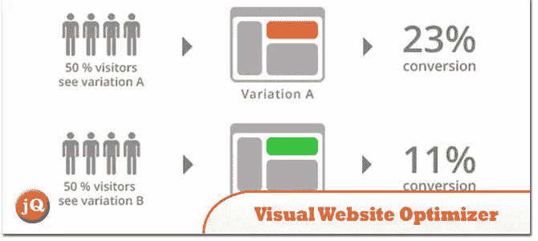
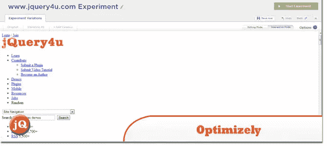
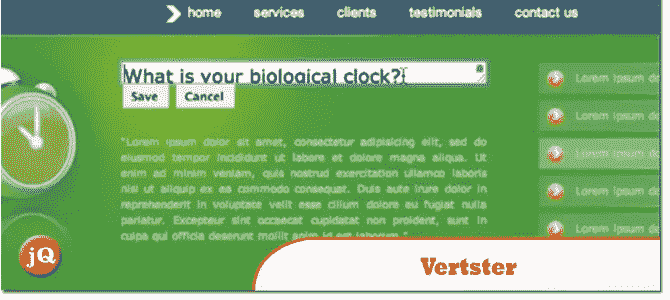
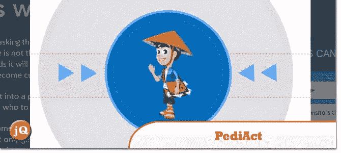
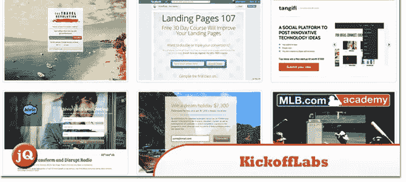
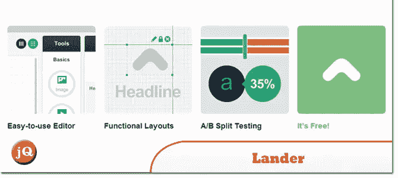
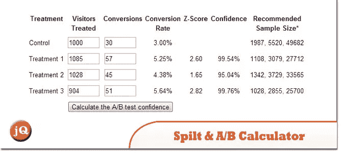

# 10 A/B 测试和多变量在线工具

> 原文：<https://www.sitepoint.com/10-ab-testing-mutivariate-online-tools/>

在本帖中，我们给你收集了 **10 个 A/B 测试&多变量在线工具**，你会发现这对你下一步的网站优化策略非常有用。一个简单的过程来测试你的网页版本，并确定哪些产生积极的结果。其中大多数都是易于使用的测试套件，提供 A/B、多元和分割 URL 测试。尽情享受吧！

## 1.增长巨人-最大化转化率的 A/B 测试

不断优化您的网站，并通过 Growth Giant 获得最大转化率。

 
[源+演示](http://www.growthgiant.com/)

## 2.可视化网站优化器

一个易于使用的 A/B 测试工具，允许营销专业人员使用点击式编辑器创建不同版本的网站和登录页面(不需要 HTML 知识！)

 
[源+演示](http://visualwebsiteoptimizer.com/)

## 3.优化地

Optimizely 充当您的按需技术团队，利用技术将您的创造性更改转化为即时生成和部署的代码。

 
[源+演示](https://www.optimizely.com/)

## 4.韦尔特斯特

比竞争对手快 50 倍。没有页面标记。没有要安装的服务器。清晰的竞争性定价。美国支持团队。

 
[源+演示](http://www.vertster.com/)

## 5.儿科医生

分析您的网站访问者的行为细节，并根据其他客户的历史记录，估计每月能为您带来多少电子邮件商机。

 
[源+演示](http://padiact.com/)

## 6.打开

构建一个高转化率的登录页面，然后只需点击一下就可以发布到网络上——所有这些都不需要任何 HTML 知识。

 
[源+演示](http://unbounce.com/)

## 7.KickoffLabs

不需要编码经验。轻松 CMS。发送点击付费和电子邮件流量到优化的网页。

 
[源+演示](http://www.kickofflabs.com/)

## 8.着陆器

让您使用简单的分步流程，为您的社交媒体、电子邮件和在线营销活动创建漂亮的登录页面。

 
[源+演示](http://www.landerapp.com/)

## 9.分割和 A/B 测试置信度计算器

我创造了这个计算器，因为我在网上找到的所有计算器都不包含背后的数学。

 
[源+演示](http://www.abtester.com/calculator/)

## 10.个性化

为实时访客细分和网站个性化提供市场上最先进的 SaaS 平台。

 
[源+演示](http://en.personyze.com/)

## 分享这篇文章