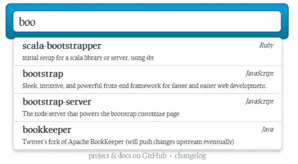
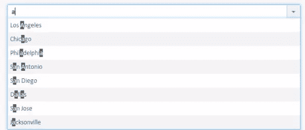
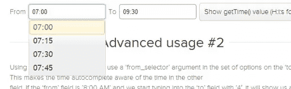
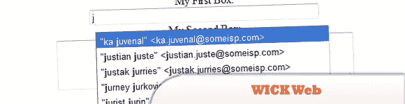
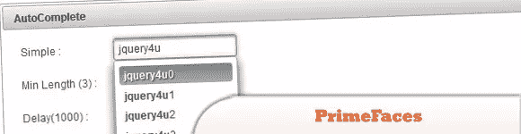
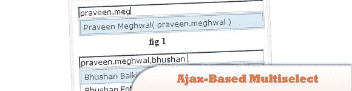
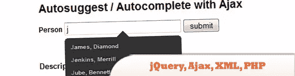
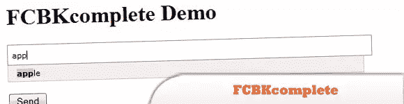
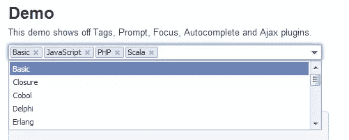

# 10 个 Ajax/jQuery 自动完成教程/插件

> 原文：<https://www.sitepoint.com/10-ajaxjquery-autocomplete-tutorial-examples/>

今天，我们将与您分享我们的最佳 **Ajax 和 jQuery 自动完成和自动建议**教程和插件，并附有示例。如今，人们想要即时搜索，为此，像谷歌这样的搜索引擎正在这样做。尽情享受吧！

**相关帖子:**

*   [**10 jQuery 搜索脚本**](http://www.jquery4u.com/plugins/10-jquery-search-scripts/)
*   [**jQuery AutoForm 脚本简易表单自动完成**](http://www.jquery4u.com/forms/jquery-autoform/)

**2013 年 6 月 21 日更新:**新增 typahead.js，Magicsuggest，TimeDropdowns。
**2013 年 9 月 29 日更新:**新增 textextjs

## typahead.js 自动完成

一个快速且功能齐全的自动完成库。
 
[源+演示](http://twitter.github.io/typeahead.js/)

## Magicsuggest 自动完成

高度灵活的自动建议组合框在引导主题线。
 
[源+演示](http://nicolasbize.github.io/magicsuggest/)

## TimeDropdowns 自动完成

更好的时间下拉范围:jQuery 时间自动完成。
 
[源+演示](http://7shifts.com/blog/better-time-drop-downs-jquery-timeautocomplete/)

* * *

## 1.具有自动完成功能的 Ajax 驱动的 JavaScript 组合框

dhtmlxCombo 是一个具有自动完成功能的跨浏览器 JavaScript 组合框。它扩展了基本的选择框功能，并提供了在用户在文本字段中键入时显示建议的能力。

  
[源+演示](http://dhtmlx.com/docs/products/dhtmlxCombo/)

## 2.雅虎和谷歌建议 jQuery 搜索框

在这篇文章中学习如何创建雅虎谷歌建议搜索框。

  
[源+演示](http://abhisanoujam.blogspot.in/2009/03/yahoo-and-google-suggestions.html)

## 3.WICK Web 输入完成工具包

一个不断发展的框架，利用 JavaScript、DOM 和 CSS 等 web 标准，在本地和远程数据源的帮助下，促进表单 UI 元素中的文本输入。这个框架努力保持低调，保持表单的语义和可访问性。

  
[来源](http://wick.sourceforge.net/)
[演示](http://wick.sourceforge.net/wick_sample/)

## 4.PrimeFaces: jQuery 自动完成

PrimeFaces jQuery AutoComplete 的多重选择特性是一个很受欢迎的请求，在 3.1 中，我们决定引入它。最初的实现是基于一个简单的输入文本和逗号分隔的值，但它不符合 PrimeFaces 的酷标准，所以我们决定实现它脸书风格。

  
[来源](http://www.primefaces.org/documentation.html)
[演示](http://www.primefaces.org/showcase-labs/ui/autocompleteHome.jsf)

## 5.ASP.Net 中基于 Ajax 的多选 jQuery 自动完成控件

这里，我们将使用 jQuery UI 自动完成控件。为了使用 AJAX 获取数据，这里我们将尝试 ASP。对简单的 ASP.NET 页面使用处理程序是，如果我们将使用 ASPX 页面，那么它将经历页面的所有阶段(接近 1o ),而处理程序比 ASPX 页面更快。

  
[源+演示](http://shivasoft.in/blog/microsoft/net/ajax-based-multiselect-jquery-autocomplete-control-in-asp-net/)

## 6.使用 jQuery、Ajax、XML、PHP 自动建议/自动完成

jQuery Autocomplete 类向文本字段添加一个建议值的下拉菜单。用户可以直接单击建议将其输入到字段中，或者使用上下箭头键浏览列表，使用 tab 键选择一个值。建议列表的值将以 XML 形式提供(通过 PHP 脚本或类似方式)。

  
[来源](http://www.brandspankingnew.net/archive/2006/08/ajax_auto-suggest_auto-complete.html)
[演示](http://www.brandspankingnew.net/specials/ajax_autosuggest/ajax_autosuggest_autocomplete.html)

## 7.FCBKcomplete v 2.8.4

花式脸书样的动态输入与自动完成和预增值。如果你有任何意见或要求，请张贴出来，我会尽量在即将到来的版本中包括所有要求的功能。

  
[来源](http://www.emposha.com/javascript/fcbkcomplete.html)
[演示](http://www.emposha.com/demo/fcbkcomplete_2/)

## 8.一个奇特的 Apple.com 风格的 jQuery 搜索建议

请务必查看演示(或访问 Apple.com ),看看这个可怕的效果工作。这个例子使用了几种技术:MySQL(用于数据库)，HTML/CSS 用于样式化，PHP 用于检索数据，jQuery 用于 AJAX 请求。

  
[来源](http://www.marcofolio.net/webdesign/a_fancy_apple.com-style_search_suggestion.html)
[演示](http://qpoit.com/marcofolio_demo/apple_search/)

## 9.使用 jQuery 的 AJAX 搜索建议

为了重新创建搜索建议特性，我们将使用 jQuery 和少量 PHP 来查询服务器上的搜索词。为了允许这两个脚本进行通信，我们将利用 AJAX——将包含搜索词的字符串从 jQuery 传递给 PHP。

  
[来源](http://www.ianlunn.co.uk/blog/code-tutorials/ajax-search-suggest-wearehunted/)
[演示](http://www.ianlunn.co.uk/demos/ajax-search-suggest-wearehunted/)

## 10.易于使用的 jQuery-Ajax 自动建议插件

这个 jQuery Ajax autosuggest 插件具有通常的功能，但有一点额外的灵活性:多个实例，传递自定义参数，返回 id 和值，键盘控制，以及其他一些……几乎任何您需要的 autosuggest 插件的功能都可以通过内置选项实现！

  
[来源](http://discussion.oslund.ca/2011/01/a-simple-jquery-ajax-autosuggest-plugin/)
[演示](http://oslund.ca/demos/ausu/)

## 11.jQuery 文本插件

TextExt 是 jQuery 的一个插件，旨在提供标签输入和自动完成等功能。

 
[源+演示](http://textextjs.com/)

## 分享这篇文章