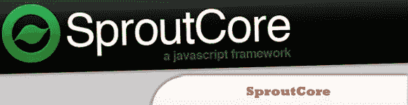
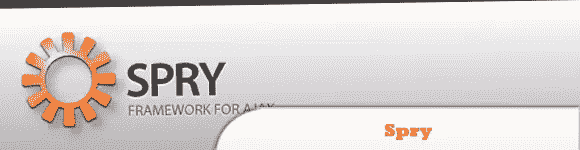
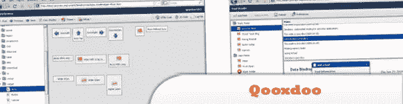
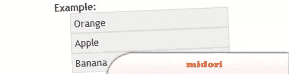
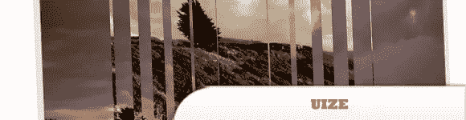
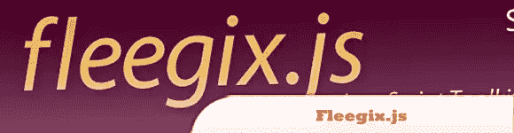
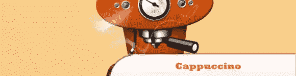
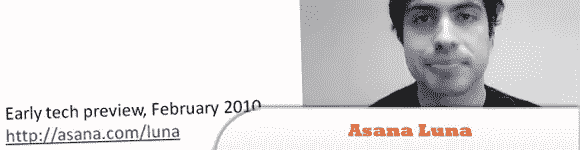
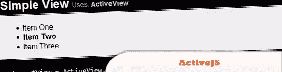
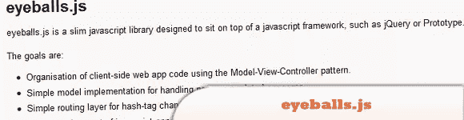

# 10 种可选的 JavaScript 框架(第一部分)

> 原文：<https://www.sitepoint.com/10-alternative-capable-javascript-frameworks/>

对于寻找新的或**替代 js 框架/库**的更有冒险精神的开发人员来说——除了流行的框架之外，还有一些优秀的框架值得一试，但在这之前，您可能想先看看我们的第一套“有前途的”JavaScript 框架。最后 10 名将在明天的邮报上。在那之前，好好享受吧！

## 1.SproutCore

通过强调将桌面应用程序功能带到 web 上的使用来区分自己。它有大量易于遵循的指南，可以让你快速入门，它自己的谷歌小组可以回答你的问题，并与其他 SproutCore 开发者互动。

  
[源+演示](http://www.sproutcore.com/)

## 2.敏捷的

就是 Adobe 的 Ajax 框架。Spry 的众多与众不同的特性之一是它与 Adobe 产品(如 Dreamweaver、Flash 和 AIR)的紧密集成。

  
[来源](http://labs.adobe.com/technologies/spry/)
[演示](http://labs.adobe.com/technologies/spry/demos/formsvalidation/)

## 3.qooxdoo

是一个 Ajax 应用程序框架，使用面向对象的 JavaScript。这是一个允许你使用 JavaScript 构建 web 应用程序的框架，而不用担心 HTML、CSS 和 DOM。

  
[来源](http://qooxdoo.org/)
[演示](http://demo.qooxdoo.org/current/demobrowser/)

## 4.midori

是一个轻量级的 JavaScript 框架。在未压缩状态下，它只有 45 KB(相比之下——jQuery 在压缩状态下是 54KB)。提供了 JavaScript 框架中常见的功能，比如跨浏览器 Ajax 功能、使用 CSS 选择器(相对于 midori 特有的语法)匹配 DOM 中的元素的能力以及动画效果。

  
[来源](http://www.midorijs.com/)
[演示](http://www.midorijs.com/midoriDragDrop.html)

## 5.UIZE(读作“你的眼睛”)

是另一个 JavaScript 框架，强调创建完整的富互联网应用程序(RIA ),而不是网页上的基本效果和小部件/组件。它已经配备了“现成的”小部件，如日期选择器、表格排序器、进度条和颜色选择器。

  
[来源](http://www.uize.com/)
[演示](http://www.uize.com/examples/slideshow-with-wipes.html)

## 6\. Fleegix.js

有一个优秀的“事件系统”,可以帮助你监听、操作和触发 DOM 事件(比如 mouseover、onclick 等)。).

  
[源+演示](http://js.fleegix.org/)

## 7.卡普契诺咖啡

是一个开源框架，它使构建在 web 浏览器中运行的桌面级应用程序变得容易。

  
[来源](http://cappuccino.org/)
[演示](http://cappuccino.org/learn/demos/)

## 8.Asana Luna

这个框架有很多细节，包括演进的 MVC 架构、pubsub、缓存、路由和认证。

  
[源+演示](http://asana.com/luna/)

## 9.ActiveJS

是一个 JavaScript 应用程序框架，它提供了基于本地和 REST 的数据建模和纯 DOM 视图构造，支持后退按钮和历史记录，以及框架不可知论和缺乏外部依赖性。

  
[来源](http://www.activejs.org/)
[演示](http://activejs.org/samples/simple_view.html)

## 10.眼球. js

是一个小巧的 JavaScript 库，旨在建立在 JavaScript 框架之上，如 jQuery 或 Prototype。

  
[源+演示](https://github.com/paulca/eyeballs.js)

## 分享这篇文章