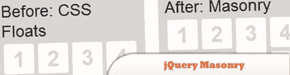
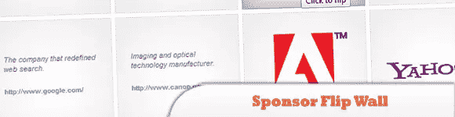
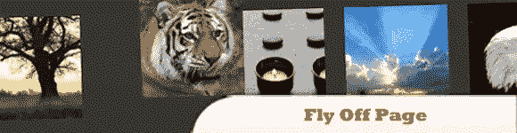
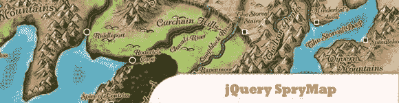
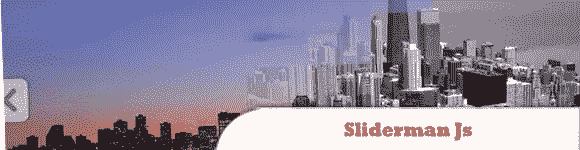
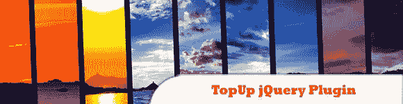
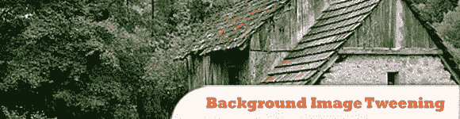
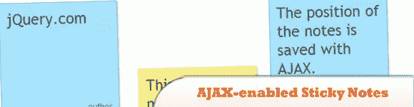
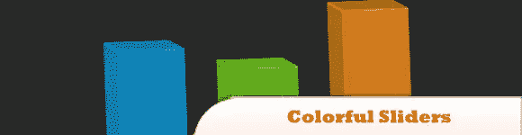
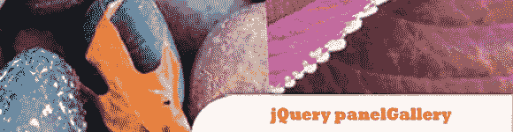

# 10 个非常吸引人的 jQuery 小部件

> 原文：<https://www.sitepoint.com/10-attractive-jquery-widgets/>

10 个有用且非常吸引人的 jQuery 小部件和插件，它们可以做各种事情。在这篇文章中，我收集了 10 个非常吸引人的 jQuery 小部件,包括智能图库、文本增强器、snicky notes、图像补间等等。尽情享受吧！

相关帖子:

*   [**10 jQuery 小部件**](http://www.jquery4u.com/widgets/10-jquery-widgets/)
*   [**10 个令人惊叹的 jQuery Widgets**](http://www.jquery4u.com/widgets/10-amazing-jquery-widgets/)

## 1.jQuery 砌体

jQuery 的一个布局插件。可以把它想象成 CSS 浮动的另一面。浮动是先水平后垂直排列元素，而砌筑是根据网格先垂直后水平排列元素。

[来源](http://masonry.desandro.com/)

## 2.用 jQuery 和 CSS 发起翻转墙

一个在网格中展示数据的有吸引力的插件。网格中的缩略图翻转过来，点击它们会显示更多信息。

[来源](http://tutorialzine.com/2010/03/sponsor-wall-flip-jquery-css/)

## 3.使用 jQuery 快速离开页面

它将选择元素，并使它们以随机或预定义的方向飞离页面。可定制的选项包括(动画的)持续时间、方向、补间(扩展动画)和保留空间，允许您保留、忽略或动画显示指定元素曾经占用的空间。

[来源](http://james.padolsey.com/javascript/new-jquery-plugin-fly-off-page/)

## 4.jQuery SpryMap

一个超级轻量级、无依赖性的 JavaScript 小部件，可以将任何 HTML 元素变成类似谷歌地图的点击和拖动窗口。

[来源](http://candrews.net/blog/2010/10/introducing-sprymap/)

## 5.Sliderman Js

用于滑动图像的独立 JavaScript 库。Sliderman.js 的主要特点是多种独特的效果可以组合在一起。

[来源](http://www.devtrix.net/sliderman/)

## 6.TopUp jQuery 插件

TopUp 提供以下优势:
> TopUp 完全免费，也可用于商业用途
>需要时自动校正大小和位置
> TopUp 可与原型一起使用
>跨浏览器兼容性
>精美的布局、动画和转场

[来源](http://gettopup.com/)

## 7.使用 jQuery 进行背景图像补间

一个小巧且易于使用的不引人注目的元素背景转换器，它可以保持你的 DOM 整洁和你的过渡平滑。

[来源](http://soxer.mutsu.org/offshots/bgImageTween)

## 8.使用 PHP 和 jQuery 的支持 AJAX 的便笺

一个支持 AJAX 的便笺管理系统。它将使访问者能够创建带有实时预览的笔记，并在屏幕上移动它们。

[来源](http://tutorialzine.com/2010/01/sticky-notes-ajax-php-jquery/)

## 9.带有 jQuery 和 CSS3 的彩色滑块

在本教程中，我们使用 jQuery 和 CSS3 带来的新转换特性来创建三维动态滑块效果。这里介绍的技术——用于创建滑块和 CSS 动态可调整大小的条，可以一起使用或部分使用，以支持各种 jQuery 优点。

[来源](http://tutorialzine.com/2010/03/colorful-sliders-jquery-css3/)

## 10.jQuery 面板库

一个免费的 jQuery 插件，在 Creative Commons Attribution 2.5 许可证下发布，这意味着您可以出于任何目的自由使用和修改它。

[来源](http://www.catchmyfame.com/2009/08/13/jquery-panel-gallery-1-1-plugin-released/)

## 分享这篇文章