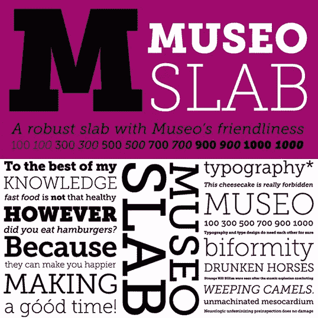
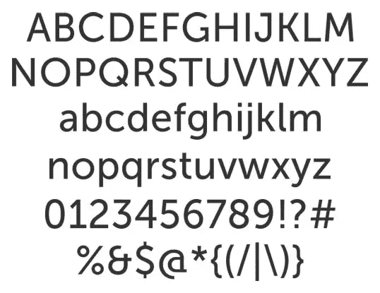
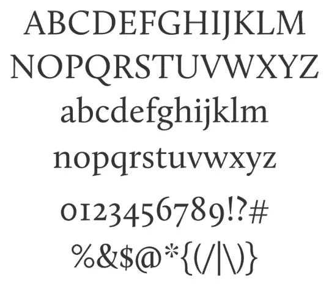
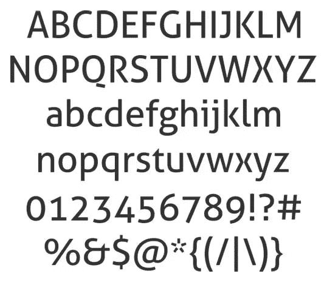
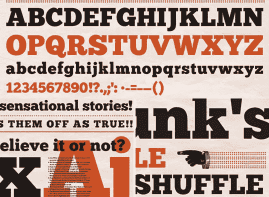
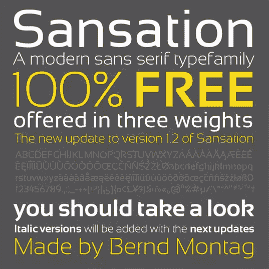
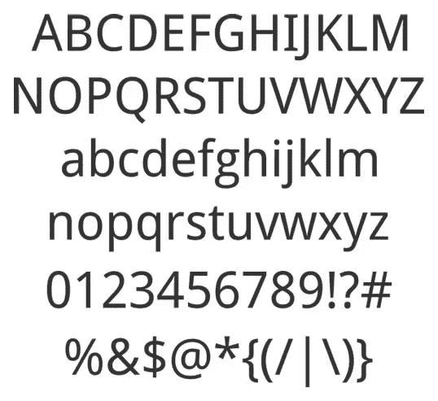
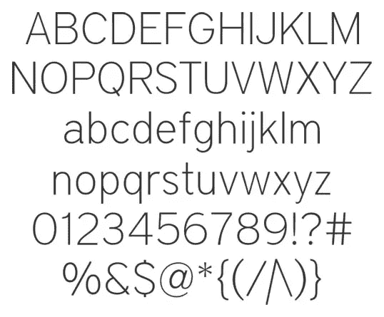

# 你可以免费获得 10 种很棒的网络字体

> 原文：<https://www.sitepoint.com/10-awesome-webfonts-you-can-get-for-free/>

在 Proxima Nova 和 Adele，每个人都在装饰自己的网站，因为像 Typekit 这样的服务使网络字体易于使用，标准的网络安全设置看起来越来越过时。但是，如果你不想为这样的服务投入经常性的资金，或者你的客户不想为他们网站的开发增加额外的费用，该怎么办呢？这不再是一个问题——有很多好看的网络字体可以免费获得。

当然，从网络字体运动的两个经典开始…

### 博物馆板

### 无博物馆

### 卡鲁纳

### 阿勒

### ChunkFive

### 珊莎

### 棒球场

### 贝巴斯新来的

### 机器人无

### 区域瘦

## 分享这篇文章