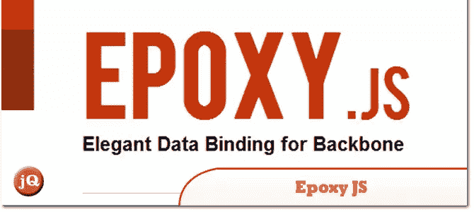
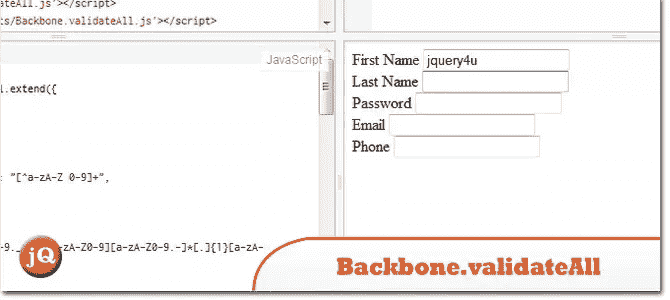
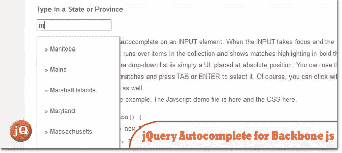
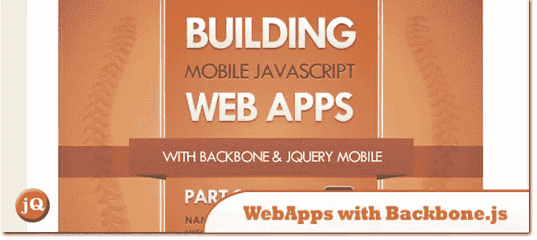
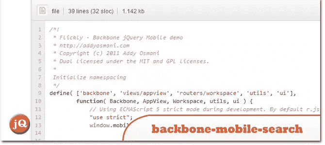
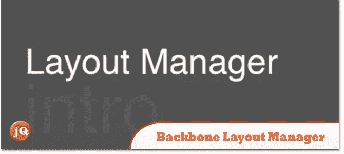
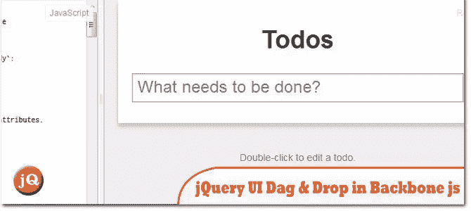
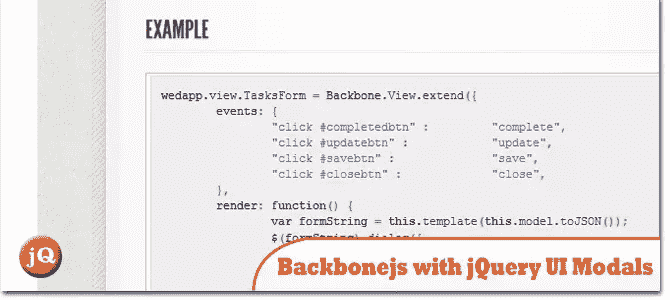
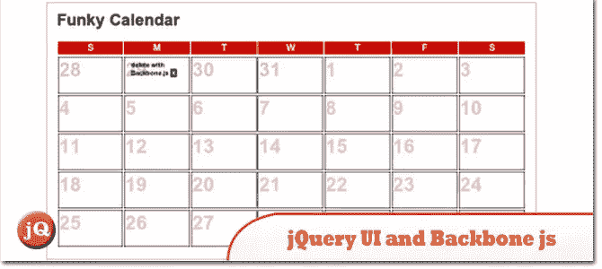
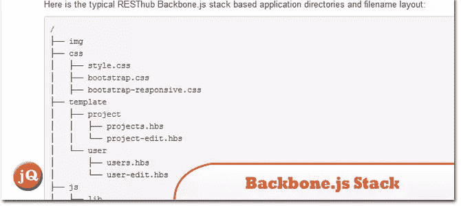

# 10 Backbone.js 和 jQuery 有用的插件/文章

> 原文：<https://www.sitepoint.com/10-backbone-js-plugins/>

今天的帖子有一些 **backbone.js 有用的链接/资源**让你开始一个新的 backbone 项目！享受吧。

## 1.Epoxy.js

一个优雅且可扩展的 Backbone.js 数据绑定库；它为 Backbone 的模型和视图组件提供了功能丰富的扩展，旨在将视图元素直接挂钩到数据模型。
 
[来源](http://epoxyjs.org/)

## 2.主干网

提供一个选项，仅验证当前正在设置或保存的模型属性
 
[源](https://github.com/gfranko/Backbone.validateAll#readme) [演示](https://jsfiddle.net/PjKtx/)

## 3.主干 JS 的 jQuery 自动完成插件

上周，我花时间编写了一个自动完成小部件，它使用模型的主干集合来支持它。
 
[源+演示](http://www.planbox.com/blog/news/updates/jquery-autocomplete-plugin-for-backbone-js.html)

## 4.用 Backbone.js & jQuery 构建移动 JavaScript WebApps:第一部分

在第 1 部分中，我将全面介绍 Backbone 0.5.2 的模型、视图、集合和路由器，并带您了解正确命名 Backbone 应用程序的选项。
 
[来源](http://addyosmani.com/blog/building-mobile-javascript-webapps-with-backbone-js-jquery-part-i/)

## 5.主干网-移动-搜索-轻灵移动

一个完整的 Backbone.js + jQuery 移动样例 app，使用 AMD 进行模块分离，Require.js 进行依赖管理+模板外部化，下划线进行模板化。
 
[来源](https://github.com/addyosmani/backbone-mobile-search#readme) [演示](https://github.com/RainerAtSpirit/backbone-mobile-search/blob/e0aeafec70e29107cd7a94ddddcf9c9d77dd798f/app/app.js)

## 6.backbone.layoutmanager v0.6.6

为装配带有主干视图的布局提供逻辑结构。为无痛集成而设计的适应性和可配置性。
 
[源+演示](http://documentup.com/tbranyen/backbone.layoutmanager/)

## 7.主干 JS 应用程序中的 jQuery UI 拖放

backbone to do list 应用程序在这个带注释的分屏源文件中得到了很好的记录，这对我帮助很大。
 
[来源](http://jonahlyn.heroku.com/blog/2011/12/02/backbone-drag-and-drop) [演示](https://jsfiddle.net/jonahlyn/xYP4F/)

## 8.将 backbone.js 与 jQuery UI 模型一起使用

这对于分离你的代码来说是非常好的，也是一个非常好的代码结构，但是当你试图控制弹出窗口时，这可能是一个难题。
 
[源+演示](http://backbonefu.com/2011/08/using-backbone-js-with-jquery-ui-modals/)

## 9.jQuery UI 和 Backbone.js

在使用我的小 Backbone.js 日历应用程序做任何事情之前，我希望能够添加新的约会/日历事件。我一直在通过 CouchDB 后端做这件事，它已经有点老了。
 
[来源](http://japhr.blogspot.com.au/2011/09/jquery-ui-and-backbonejs.html)

## 10.Backbone.js 堆栈

提供用于构建企业级 HTML5 应用程序的客户端完整堆栈和指南。它可以用于任何服务器后端:Ruby、PHP、NodeJS、JEE、Spring、Grails…

[Source](http://resthub.org/backbone-stack.html)

## 分享这篇文章