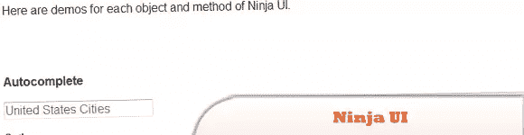
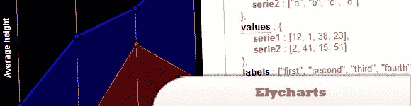
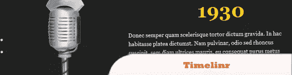
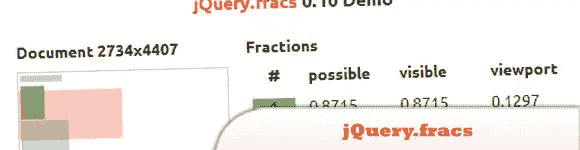
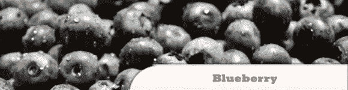
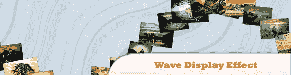
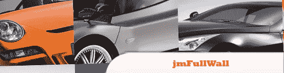

# 10 个令人惊叹的 jQuery 插件

> 原文：<https://www.sitepoint.com/10-breathtaking-jquery-plugins/>

jQuery 包含事件管理、动画和 Ajax 交互，用于增强 web 开发。在本帖中，我们展示了一些令人惊叹的 jQuery 插件,它们应该能吸引任何网站访问者的眼球。玩得开心！

相关帖子:

*   **移动 Web 应用开发者的 10 个新框架**
***   [**2011 年 9 月的 10 个新 jQuery 插件**](http://www.jquery4u.com/plugins/jquery-september-2011/)**

 **## 1.忍者 UI

一个 jQuery 插件，能够高效、低调地实现漂亮的 web 界面对象。

  
[源+演示](http://ninjaui.com/)

## 2.Elycharts

是一个纯 JavaScript 图表库，易于使用，完全可定制。它帮助你在你的网页或 web 应用程序上创建好看的交互式图表，有很多有用的特性:图例和标签支持、鼠标跟踪、工具提示、模板、动画等等。

  
[来源](http://elycharts.com/)
[演示](http://elycharts.com/examples)

## 3.Timelinr

是一个简单的 jQuery 插件，可以帮助你给枯燥的时间线赋予更多的生命。它支持水平和垂直布局，您可以参数化大多数属性:速度、透明度等。

  
[来源](http://www.csslab.cl/2011/08/18/jquery-timelinr/)
[演示](http://www.csslab.cl/ejemplos/timelinr/latest/horizontal.html)

## 4.发牢骚. js

提供特殊的工具提示，没有通常的北/东/南/西定位的限制。一个牢骚可以围绕一个给定的元素旋转任何角度，所有 360 度。

  
[源+演示](http://jamescryer.github.com/grumble.js/)

## 5.jQuery 弱者

确定当前在视窗中的 HTML 元素的比例，以及它在整个视窗中所占的比例和可能可见的区域的比例。

  
[来源](http://larsjung.de/fracs/)
[演示](http://larsjung.de/fracs/demo/)

## 6.Mobiscroll

是一款滚轮用户控件，针对触摸屏进行了优化，可轻松输入日期和/或时间。该控件可以很容易地定制，以支持任何自定义值，甚至可以用作本地选择控件(下拉列表)的直观替代。

  
[来源](http://mobiscroll.com/)
[演示](http://demo.mobiscroll.com/)

## 7.蓝莓

是一个实验性的开源 jQuery image slider 插件，它是专门为流畅的 web 布局而编写的。

  
[源+演示](http://marktyrrell.com/labs/blueberry/)

## 8.皮卡丘

是一个轻量级的 jQuery 幻灯片插件，允许使用传送带和灯箱轻松呈现照片！

  
[源+演示](http://www.pikachoose.com/)

## 9.用 jQuery 实现波形显示效果

这个插件可以让你以一种独特的形式显示图像和内容——波形。这个想法是最初有一些较小的缩略图旋转，并放置在正弦曲线的形状。

  
[来源](http://tympanus.net/codrops/2011/10/17/wave-display-effect/)
[演示](http://tympanus.net/Development/WaveDisplayEffect/)

## 10.jmFullWall

是一个 jQuery 插件，用于创建令人印象深刻的作品集。

  
[来源](http://www.moretech.it/demo/plugins/jmFullWall/index.html)
[演示](http://www.moretech.it/demo/plugins/jmFullWall/demo02.html)

## 分享这篇文章**