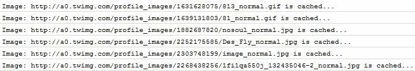
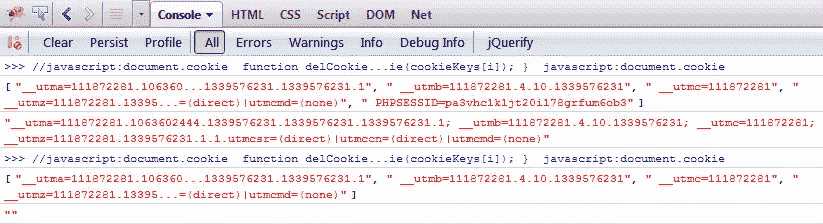

# 10 个大胆的快速 jQuery 片段

> 原文：<https://www.sitepoint.com/10-cheeky-jquery-snippets/>

```
h3 {
padding-top:25px !important;
padding-bottom:5px !important;
}
```

这是大约 10 个厚脸皮的 jQuery 片段的集合。我相信你会发现它们很有用，好好享受吧！

## 快速启动 jQuery 代码片段！

### 1.使所有图像变成灰度

这个快捷的函数和代码片段使用 HTML5 canvas 和 jQuery 将页面上的所有图像从彩色变成灰色。


```
// Grayscale image using HTML5 canvas method
function grayscale(src){
    var canvas = document.createElement('canvas');
    var ctx = canvas.getContext('2d');
    var imgObj = new Image();
    imgObj.src = src;
    canvas.width = imgObj.width;
    canvas.height = imgObj.height; 
    ctx.drawImage(imgObj, 0, 0); 
    var imgPixels = ctx.getImageData(0, 0, canvas.width, canvas.height);
    for(var y = 0; y < imgPixels.height; y++){
        for(var x = 0; x < imgPixels.width; x++){
            var i = (y * 4) * imgPixels.width + x * 4;
            var avg = (imgPixels.data[i] + imgPixels.data[i + 1] + imgPixels.data[i + 2]) / 3;
            imgPixels.data[i] = avg; 
            imgPixels.data[i + 1] = avg; 
            imgPixels.data[i + 2] = avg;
        }
    }
    ctx.putImageData(imgPixels, 0, 0, 0, 0, imgPixels.width, imgPixels.height);
    return canvas.toDataURL();
}

//Make all images on page Greyscale!
$('img').each(function(){
    var el = $(this);
    el.css({"position":"absolute"}).wrap("<div class='img_wrapper' style='display: inline-block'>").clone().addClass('img_grayscale').css({"position":"absolute","z-index":"998","opacity":"0"}).insertBefore(el).queue(function()
    {
        var el = $(this);
        el.parent().css({"width":this.width,"height":this.height});
        el.dequeue();
    });
    this.src = grayscale(this.src);
});
```

### 2.使用对象文字语法创建元素

在 DOM 元素上设置属性时，这不是通常的做法，太无礼了！

```
$("",
{
    id: "test",
    name: "test",
    class: "test-class",
    css: {
        width: "100px",
        height: "100px",
        backgroundColor: "#fff"
    }
});
```

### 3.告诉 IE6 用户升级他们的浏览器

很好地告诉 IE6 Noobs 升级他们的浏览器，只需在你的开始 body 标签中添加这些代码。这是他们所看到的:

> 你的浏览器已经过时了！ [升级到不同的浏览器](http://browsehappy.com/)或者[安装谷歌 Chrome 框架](http://www.google.com/chromeframe/?redirect=true)来体验这个网站。

```
<!--[if lt IE 7]><p class=chromeframe>Your browser is ancient! <a href="http://browsehappy.com/">Upgrade to a different browser</a> or <a href="http://www.google.com/chromeframe/?redirect=true">install Google Chrome Frame</a> to experience this site.</p>< ![endif]-->
```

### 4.使用 jQuery 缩短与 bit.ly 的链接

感谢 James Cridland 提供了这个厚脸皮的网址缩写代码片段。你需要一个 bit.ly api 密匙来使用这个，但是不要担心这是一个完全免费的服务。

```
function get_short_link($url) 
{
  $bitly_login="yourloginname";
  $bitly_apikey="yourapikey";
  $api_call = file_get_contents("http://api.bit.ly/shorten?version=2.0.1&longUrl=".$url."&login=".$bitly_login."&apiKey=".$bitly_apikey);
  $bitlyinfo=json_decode(utf8_encode($api_call),true);
  if ($bitlyinfo['errorCode']==0) 
  {
      return $bitlyinfo['results'][urldecode($url)]['shortUrl'];
  } 
  else 
  {
      return false;
  }
}

//Usage: get_short_link("http://jquery4u.com");
```

### 5.快速格式化货币

这个厚脸皮的小片段以简单的方式解决了复杂的显示货币问题，这也适用于跨浏览器！

```
function formatCurrency(num) {
    num = isNaN(num) || num === '' || num === null ? 0.00 : num;
    return parseFloat(num).toFixed(2);
}
```

### 6.快速缓存图像

这个代码片段在浏览器中缓存一个图像，然后删除它，这样当它被加载到 DOM 中时，它就不会显示那些难看的丢失图像小红叉。多么厚颜无耻！



```
//cache the user img
$('img').hide().appendTo('body').one('load', function() {
   console.log('Image: '+$(this).attr('src')+' is cached...');
   $(this).remove();
});
```

### 7.视频对象的 z 索引修复

如果您对视频元素的 z 索引有问题，您可以添加一个 wmode 参数。使用这个厚脸皮的小片段来修复 z 索引问题！你可以用“透明”代替“不透明”,但后者渲染强度较低。


```
//specific object
$('#videocontainerid object').prepend('<param name="wmode" value="opaque"/>');

//all objects
$('object').prepend('<param name="wmode" value="opaque"/>');
```

### 8.获取元素的最后一个类

这个代码片段获取一个 DOM 元素的最后一个类，所以如果你有一个 class =“class 1，class2，class3”的 DOM 元素，它将返回“class3”。酷吗？

```
var lastElClass = $(element).attr("class").split("").slice(-1);
```

### 9.使用 JavaScript 删除浏览器 Cookies

这个函数/代码片段的集合帮助你使用 JavaScript 删除所有浏览器 cookies！是的，使用 JavaScript，多么厚颜无耻！



 `//浏览器 cookie 存储在 JavaScript 这里:
javascript:document.cookie

//函数删除 cookie(更改失效日期)
函数 delCookie(名称)
{
document . cookie = name+' =；expires =协调世界时 2001 年 8 月 2 日星期四 20 时 47 分 11 秒；path=/'
}

//获取每个 cookie 名称的密钥的函数
函数 getCookieKeys()
{
//单独的密钥/值对
var cookies = document . cookie . split("；")，
index，keys =[]；
for(I = 0；我 10 岁。建议一个！厚脸皮？` 

## `分享这篇文章`