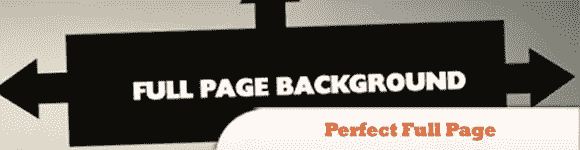
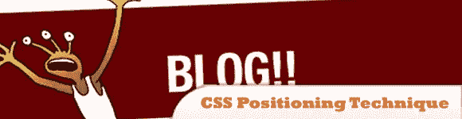
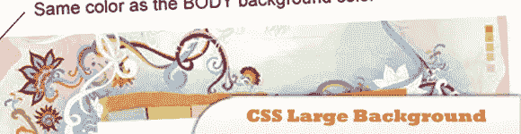
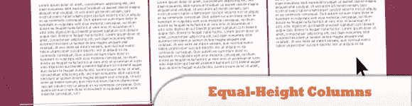
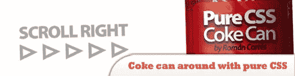
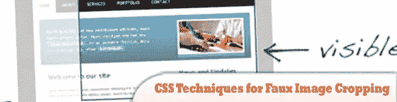
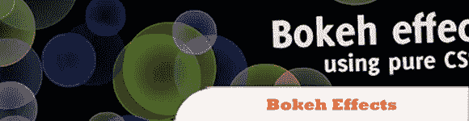
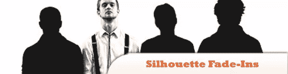
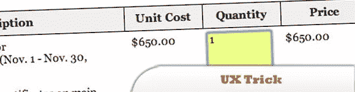
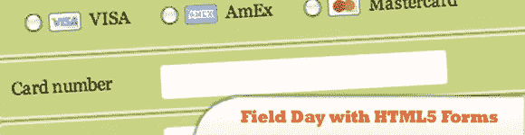

# 10 个有用的编码技巧、技术和想法

> 原文：<https://www.sitepoint.com/10-coding-techniques/>

在本帖中，我们将概述**有用的 CSS/jQuery 编码技巧、技术、诀窍和视觉效果的想法**、布局和 web 表单设计，以帮助您找到解决您正在处理或将来必须处理的问题的方法。玩得开心！

相关帖子:

*   [**10 个 jQuery 开发者小技巧提升你**](http://www.jquery4u.com/articles/jquery-developer-good-practice/)
*   [**在 Notepad++中使用 jQuery 开发的 10 个技巧**](http://www.jquery4u.com/utilities/tips-developing-jquery-notepad/)
*   [**掌握 Firebug 控制台的 10 个技巧**](http://www.jquery4u.com/utilities/firebug-console-tips/)

## 1.完美的整页背景图像

这种技术允许图像填满页面，没有空白。图像根据需要缩放并保持其比例，而不会触发滚动条。

[来源](http://css-tricks.com/3458-perfect-full-page-background-image/)

## 2.一个不错的小 CSS 定位技术

这里，我们有一个基本的无序列表(ul ),带有左浮动的图像，其中文本不在图像下换行。当然，这种技术可以部署在其他实例中。

[来源](http://five.gregorywood.co.uk/index.php?/blog/article/a-nice-little-css-positioning-technique)

## 3.如何:CSS 大背景

一个包含各种 CSS 例子的教程，介绍如何使用单幅图像或两幅图像创建一个大背景。

[来源](http://webdesignerwall.com/tutorials/how-to-css-large-background)

## 4.创建等高列的四种方法

本文讨论了创建在所有主流浏览器(包括 IE6)中都能工作的等高列的方法。所有这些方法都显示了如何创建三列布局。

[来源](http://buildinternet.com/2009/07/four-methods-to-create-equal-height-columns/)

## 5.用纯 CSS 滚动一个可乐罐

Roman CORTés 最近对 CSS 技巧很感兴趣。他刚刚制作了一个滚动的可乐罐，使用背景附件、背景位置和一些其他技巧来实现这一效果。这里不需要花哨的 CSS3！

[来源](http://www.romancortes.com/blog/pure-css-coke-can/)

## 6.3 种简单快速的 CSS 技术，用于仿图像裁剪

本教程总结了三种快速简单的 CSS 技术，用于只显示图像的一部分。如果您想将图像保持在一定的大小(例如，新闻部分中的缩略图)，这些技术会很有帮助。能够使用 CSS 来控制显示图像的哪一部分是很棒的。

## 7.CSS3 和 jQuery 的散景效果

这个教程教你如何用 CSS 3 重新创建散景效果。在 jQuery 的帮助下，我们可以为效果添加一些颜色、大小和位置的随机性。

## 8.剪影淡入

为了实现中的效果，首先我们需要一个轮廓作为背景图像的 DIV。然后，我们在该 DIV 中放入四张图片，大小完全相同，每个乐队成员都突出显示。默认情况下，这些图像是隐藏的。然后，您绝对将四个区域放置在 DIV 的顶部；这些是翻转链接区域。使用 jQuery，我们对它们应用悬停事件，在适当的图像中淡入淡出。

[来源](http://css-tricks.com/4972-silhouette-fadeins/)

## 9.UX 技巧:将表单数据显示为表格数据
这是一个提升表单用户体验的小技巧。它将可编辑的表单数据显示为可读的表格数据。

## 10.尽情使用 HTML5 表单

下面看看如何使用一些高级 CSS 和最新的 CSS3 技术来设计一个漂亮的 HTML5 表单。读完这篇文章后，你一定会想重新设计你的表单。

[来源](http://24ways.org/2009/have-a-field-day-with-html5-forms)

## 分享这篇文章