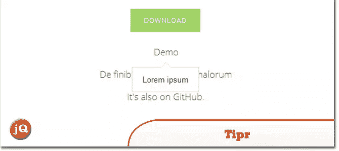
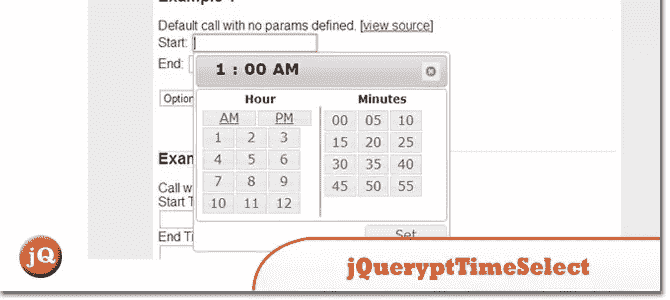
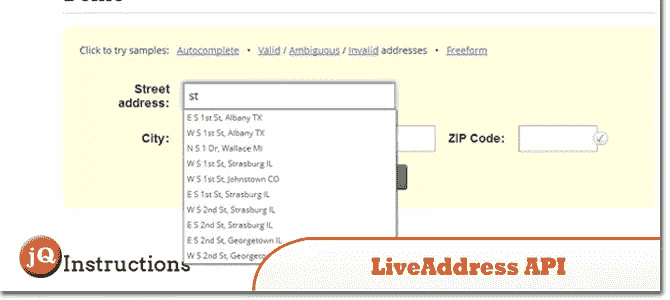
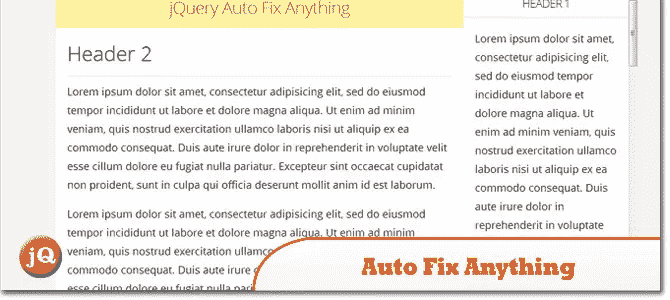

# 10 个新的酷随机 jQuery 插件:2013 年 12 月版

> 原文：<https://www.sitepoint.com/10-cool-random-jquery-plugins-2/>

你好。这里是(是的更多！)的 **10 个新的酷炫随机 jQuery 插件**。看看他们！享受；)

## 1.Tipr

Tipr 是一个小而简单的 jQuery 工具提示插件。

 
[源+演示](http://www.tipue.com/tipr/)

## 2.jQuery.ptTimeSelect

它被称为 agaist 输入字段，为每个匹配的元素附加一个时间选择小部件。当每个元素被聚焦时，将显示一个时间选择弹出窗口，用户可以在其中定义时间。

 
[源+演示](http://pttimeselect.sourceforge.net/example/index.html)

## 3.LiveAddress API jQuery 插件

验证和标准化网站表单上的地址

 
[源+演示](http://smartystreets.com/kb/liveaddress-api/website-forms)

## 4.动态查询

这是一个简单的插件，增加了平滑的拖动滚动和逐渐减速到容器。

 
[源+演示](http://davetayls.me/jquery.kinetic/)

## 5.云缩放 3.1 版

一个流行的飞出式 jQuery 图像缩放插件，在许多知名零售网站上使用。

 
[源+演示](http://www.starplugins.com/cloudzoom)

## 6.新闻框–jQuery 内容滑块和查看器

一个响应式 jQuery 插件，允许你对多条新闻进行分组，并按日期排序。完全响应，适应任何屏幕和容器。

 
[来源](http://codecanyon.net/item/news-box-jquery-contents-slider-and-viewer/6348100?ref=sdeering) [演示](http://www.projects.lcweb.it/news-box-jquery-plugin?lc_preview)

## 7.jQuery 的 AwsmProgressBar

jQuery 的一个一体化文件插件，可以让您创建一个令人惊叹的进度条。超过十三个选项和五种方法允许定制进度条，以满足您的需求。它适用于 CSS3 动画和所有主流浏览器。

 
[来源](http://codecanyon.net/item/awsmprogressbar-for-jquery/2598901?ref=sdeering) [演示](http://codecanyon.net/item/awsmprogressbar-for-jquery/full_screen_preview/2598901)

## 8.Uber Menu——WordPress 巨型菜单插件

一个用户友好的，高度可定制的，反应灵敏的大菜单插件。它与 WordPress 3 菜单系统一起开箱即用，使它易于上手，但功能强大到足以创建高度定制和创造性的大型菜单配置。

 
[来源](http://codecanyon.net/item/ubermenu-wordpress-mega-menu-plugin/154703?ref=sdeering) [演示](http://codecanyon.net/item/ubermenu-wordpress-mega-menu-plugin/full_screen_preview/154703)

## 9.大脚野人。参见 SASQUATCH

一个增强脚注功能的 jQuery 插件…

 
[来源](http://cmsauve.com/labs/bigfoot/) [演示](http://cmsauve.com/labs/bigfoot/)

## 10.自动修复任何东西。

这个小插件可以让你通过一个 JS 调用自动定位你网站上的任何容器

 
[来源](https://github.com/peachananr/autofix_anything) [演示](http://www.thepetedesign.com/demos/autofix_demo.html)

## 分享这篇文章